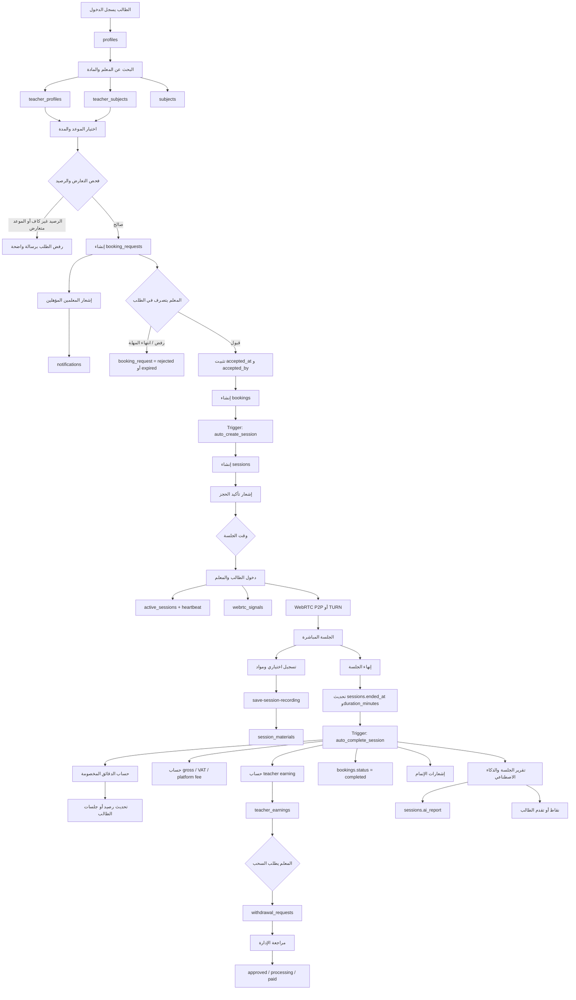
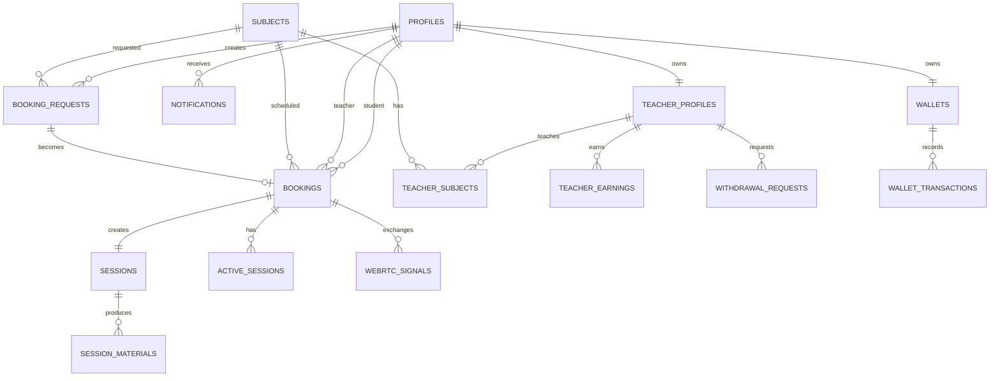
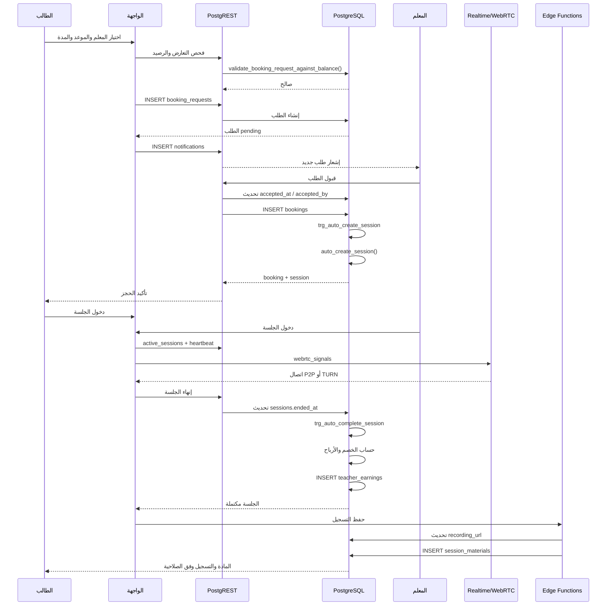

# المخطط الهندسي لدورة حياة الحجز

## 1. الهدف والنطاق

يوضح هذا المستند دورة الحجز في منصة **أجيال المعرفة** من لحظة بحث الطالب عن معلم وحتى:

- قبول أو رفض طلب الحجز.
- إنشاء الحجز والجلسة.
- دخول الطالب والمعلم إلى الجلسة.
- تشغيل WebRTC والتسجيل.
- إنهاء الجلسة وحساب الخصم والأرباح.
- إنشاء مواد الجلسة.
- طلب سحب أرباح المعلم.
- الإشعارات والتدقيق والمراقبة.

المصدر الحقيقي للحالة المالية وحالة الحجز هو **PostgreSQL وRLS وTriggers وRPCs**، وليس حالة React المحلية وحدها.

---

## 2. المخطط العام



---

## 3. دورة الحياة الزمنية

### المرحلة 0 — شروط ما قبل الحجز

يجب أن تتوفر الشروط التالية قبل قبول الطلب:

1. الطالب authenticated وله سجل في `profiles`.
2. المعلم معتمد ومتاح في `teacher_profiles`.
3. المعلم مرتبط بالمادة في `teacher_subjects`.
4. المادة موجودة في `subjects`.
5. الموعد لا يتعارض مع حجز مؤكد قائم.
6. المدة والسعر محسوبان بشكل متسق.
7. رصيد الطالب أو اشتراكه يغطي الالتزام المطلوب.

> يجب إعادة فحص هذه الشروط داخل قاعدة البيانات عند الإدخال، لأن فحص React وحده لا يمنع السباق بين طلبين متزامنين.

### المرحلة 1 — إنشاء طلب الحجز

ينشئ الطالب طلباً في `booking_requests`.

أهم الحقول:

| الحقل | الاستخدام |
|---|---|
| `id` | هوية طلب الحجز |
| `student_id` | الطالب صاحب الطلب |
| `subject_id` | المادة المطلوبة |
| `scheduled_at` | وقت الحصة |
| `duration_minutes` | مدة الحصة |
| `price` | السعر المحسوب |
| `teaching_stage` | المرحلة التعليمية |
| `group_id` | تجميع عدة مواعيد في طلب منطقي واحد |
| `status` | حالة الطلب |
| `expires_at` | انتهاء صلاحية الطلب |
| `accepted_at` | وقت القبول |
| `accepted_by` | المعلم الذي قبل الطلب |

الحالات المنطقية المتوقعة:

```text
pending → accepted
pending → rejected
pending → expired
pending → cancelled
```

لا يتحول الطلب إلى حجز مؤكد لمجرد إدخاله؛ القبول هو الحد الفاصل بين الطلب والالتزام النهائي.

### المرحلة 2 — إشعار المعلمين

بعد إنشاء الطلب، تحدد الواجهة أو المنطق الخلفي المعلمين المؤهلين بناءً على:

- المادة.
- المرحلة التعليمية.
- اعتماد المعلم.
- التوافر.
- عدم وجود تعارض زمني.

ثم تنشئ إشعارات في `notifications`.

يجب ألا يؤدي فشل إنشاء إشعار إلى إنشاء حجز وهمي أو إلى تغيير حالة الطلب إلى مؤكد.

### المرحلة 3 — قبول المعلم

عند قبول المعلم:

1. يعاد التحقق من أن الطلب ما زال `pending`.
2. يعاد فحص التعارض الزمني.
3. يعاد فحص الرصيد أو صلاحية الاشتراك.
4. يكتب `accepted_at`.
5. يكتب `accepted_by`.
6. ينشأ سجل في `bookings`.

هذه العملية يجب أن تكون ذرية قدر الإمكان، حتى لا يقبل معلمان نفس الطلب أو ينشأ حجزان لنفس الموعد.

### المرحلة 4 — إنشاء الحجز المؤكد

جدول `bookings` هو سجل الالتزام النهائي بين الطالب والمعلم.

أهم الحقول:

| الحقل | الاستخدام |
|---|---|
| `id` | هوية الحجز |
| `student_id` | الطالب |
| `teacher_id` | المعلم |
| `subject_id` | المادة |
| `scheduled_at` | الموعد المؤكد |
| `duration_minutes` | المدة |
| `price` | قيمة الحجز |
| `status` | `pending`, `confirmed`, `completed`, `cancelled` |
| `session_status` | حالة الجلسة التشغيلية |
| `subscription_id` | الاشتراك المستخدم إن وجد |
| `used_subscription` | هل تم استهلاك اشتراك |
| `meeting_link` | رابط أو معرف غرفة الجلسة |
| `cancellation_reason` | سبب الإلغاء |
| `cancelled_by` | من نفذ الإلغاء |

المخطط الأساسي للحالة:

```text
pending → confirmed → completed
pending → cancelled
confirmed → cancelled
```

### المرحلة 5 — إنشاء الجلسة

عند إنشاء سجل `bookings` المؤكد يعمل Trigger:

```text
trg_auto_create_session
    └── auto_create_session()
        └── ينشئ sessions.booking_id
```

جدول `sessions` يفصل بين **الحجز التجاري** و**تنفيذ الجلسة فعلياً**.

أهم الحقول:

| الحقل | الاستخدام |
|---|---|
| `id` | هوية الجلسة |
| `booking_id` | الحجز المرتبط |
| `room_id` | معرف غرفة WebRTC |
| `started_at` | بداية الجلسة |
| `ended_at` | نهاية الجلسة |
| `duration_minutes` | المدة الفعلية |
| `deducted_minutes` | الدقائق التي تم خصمها |
| `short_session` | هل الجلسة قصيرة |
| `recording_url` | رابط التسجيل |
| `gross_amount` | القيمة الإجمالية |
| `vat_amount` | الضريبة |
| `platform_fee` | عمولة المنصة |
| `teacher_earning` | مستحق المعلم |
| `net_amount` | الصافي |
| `ai_report` | التقرير اللاحق |

### المرحلة 6 — دخول أطراف الجلسة

عند دخول الطالب أو المعلم:

#### `active_sessions`

يمثل اتصال المستخدم الحالي:

| الحقل | الاستخدام |
|---|---|
| `booking_id` | الحجز |
| `user_id` | المستخدم |
| `device_id` | الجهاز |
| `is_connected` | حالة الاتصال |
| `last_heartbeat` | آخر نبضة |
| `disconnected_at` | وقت الانقطاع |

يعتبر الاتصال نشطاً عندما يكون `last_heartbeat` حديثاً وفق سياسة الجلسة.

#### `webrtc_signals`

يخزن رسائل الإشارة اللازمة لإنشاء اتصال WebRTC:

| الحقل | الاستخدام |
|---|---|
| `booking_id` | الجلسة التجارية |
| `sender_id` | مرسل الإشارة |
| `signal_type` | offer / answer / candidate وغيرها |
| `payload` | بيانات الإشارة |

هذه الرسائل ليست الفيديو نفسه؛ الفيديو ينتقل عبر WebRTC P2P أو TURN.

### المرحلة 7 — تنفيذ الجلسة

المسار التشغيلي:

```text
sessions.started_at
    ↓
active_sessions heartbeat
    ↓
webrtc_signals / TURN عند الحاجة
    ↓
الجلسة المباشرة
    ↓
sessions.ended_at
```

قواعد مهمة:

- لا يتم خصم مدة كاملة قبل توفر مدة فعلية قابلة للاعتماد.
- يجب إغلاق اتصال `active_sessions` عند الانقطاع النهائي.
- يجب تنظيف الاتصالات القديمة بواسطة `cleanup_stale_active_sessions()`.
- يجب عدم اعتبار فتح صفحة الجلسة وحده جلسة مكتملة.

### المرحلة 8 — التسجيل والمواد

بعد التسجيل:

1. ترفع الخدمة التسجيل إلى التخزين.
2. تنفذ `save-session-recording`.
3. يحدث `sessions.recording_url`.
4. ينشأ أو يحدث `session_materials`.

أهم حقول `session_materials`:

| الحقل | الاستخدام |
|---|---|
| `session_id` | الجلسة |
| `student_id` | الطالب |
| `teacher_id` | المعلم |
| `recording_url` | رابط التسجيل |
| `duration_minutes` | مدة المادة |
| `attachments` | مرفقات |
| `whiteboard_data` | محتوى السبورة |
| `expires_at` | انتهاء صلاحية الوصول |
| `is_deleted` | الحذف المنطقي |

### المرحلة 9 — إنهاء الجلسة والتسوية المالية

عند نهاية الجلسة يحدث `sessions` ثم يعمل Trigger:

```text
trg_auto_complete_session
    └── auto_complete_session()
```

يحسب النظام:

```text
المدة الفعلية
    → الدقائق المخصومة
    → القيمة الإجمالية
    → VAT
    → عمولة المنصة
    → أساس المعلم
    → صافي أرباح المعلم
    → تحديث حالة الحجز إلى completed
```

ويجب أن يكون هذا الحساب مصدر الحقيقة المالي، لا حساباً منفصلاً في React.

### المرحلة 10 — أرباح المعلم والسحب

ينشأ سجل `teacher_earnings` بعد اكتمال الجلسة أو عند تسوية الأرباح.

أهم الحقول:

| الحقل | الاستخدام |
|---|---|
| `teacher_id` | المعلم |
| `amount` | المبلغ المستحق |
| `gross_amount` | الإجمالي |
| `teacher_base_amount` | أساس حساب المعلم |
| `platform_fee` | عمولة المنصة |
| `vat_amount` | الضريبة |
| `hours` / `minutes_snapshot` | لقطة المدة |
| `total_sessions_snapshot` | لقطة عدد الجلسات |
| `month` | فترة التسوية |
| `status` | حالة الأرباح |

عند طلب السحب ينشأ `withdrawal_requests`:

```text
requested → approved → processing → paid
requested → rejected
```

ويجب أن يمنع `get_teacher_earnings_breakdown(teacher_id)` احتساب المبالغ التي دخلت بالفعل في طلبات سحب معلقة أو مدفوعة حسب قواعد المنصة.

---

## 4. الجداول مرتبة حسب دورة الحجز

| الترتيب | الجدول | المرحلة | العلاقة الأساسية |
|---:|---|---|---|
| 1 | `profiles` | هوية المستخدم والأدوار | الطالب والمعلم والإدارة |
| 2 | `teacher_profiles` | ملف المعلم والتوافر | `user_id` |
| 3 | `teacher_subjects` | المواد التي يدرسها المعلم | `teacher_id`, `subject_id` |
| 4 | `subjects` | المادة التعليمية | مرجع من الطلب والحجز |
| 5 | `wallets` | رصيد المستخدم | `user_id` |
| 6 | `wallet_transactions` | سجل حركات الرصيد | `user_id`, `reference_id` |
| 7 | `booking_requests` | طلب قبل القبول | `student_id`, `subject_id` |
| 8 | `notifications` | إشعار الطالب والمعلم | `user_id` |
| 9 | `bookings` | الالتزام النهائي | `student_id`, `teacher_id` |
| 10 | `sessions` | تنفيذ الحصة | `booking_id` |
| 11 | `active_sessions` | الاتصالات الحالية | `booking_id`, `user_id` |
| 12 | `webrtc_signals` | إشارات WebRTC | `booking_id` |
| 13 | `session_materials` | التسجيل والمواد | `session_id` |
| 14 | `teacher_earnings` | أرباح المعلم | `teacher_id` |
| 15 | `withdrawal_requests` | طلب السحب | `teacher_id` |
| 16 | `financial_audit_log` | تدقيق العمليات المالية | الكيان المالي |
| 17 | `admin_audit_log` | تدقيق إجراءات الإدارة | المستخدم والكيان |

---

## 5. مخطط العلاقات



---

## 6. مخطط التتابع للسيناريو الطبيعي



---

## 7. نقاط الحماية من السباق والأخطاء

### قبول مزدوج لنفس الطلب

يجب أن يكون قبول الطلب مشروطاً بأن الحالة ما زالت `pending`. إذا سبق معلم آخر، تفشل العملية الثانية بدون إنشاء `bookings` إضافي.

### حجزان في نفس الموعد

يجب فحص التعارض داخل Transaction أو RPC، وليس في الواجهة فقط. فحص الواجهة مفيد للتجربة، لكنه لا يكفي للحماية.

### تكرار Trigger

`auto_create_session` و`auto_complete_session` يجب أن يكونا idempotent:

- لا ينشئ `auto_create_session` جلستين لنفس `booking_id`.
- لا ينشئ `auto_complete_session` أرباحاً مكررة إذا أعيد تحديث الجلسة.

### انقطاع المستخدم

يجب التعامل مع:

- انقطاع المتصفح.
- إغلاق الجهاز.
- انتهاء heartbeat.
- عودة المستخدم من جهاز آخر.
- اتصال TURN بدلاً من P2P.

### فشل التسجيل

فشل رفع التسجيل لا يجب أن يلغي إتمام الجلسة أو يعيد خصم الطالب. يسجل الفشل ويعاد الرفع أو يعالج بشكل مستقل.

### فشل الإشعار

الإشعار تابع للحجز وليس شرطاً لسلامة الحجز. يجب ألا يؤدي فشل `notifications` إلى Rollback للالتزام المالي إلا إذا قررت سياسة المنتج ذلك صراحة.

---

## 8. الصلاحيات وRLS

| الكيان | الطالب | المعلم | الإدارة |
|---|---|---|---|
| `booking_requests` | إنشاء طلباته وقراءة حالته | قراءة الطلبات المؤهلة والقبول وفق السياسة | كامل |
| `bookings` | قراءة حجوزاته وإجراءات مسموحة | قراءة حجوزاته وإجراءات الجلسة | كامل |
| `sessions` | قراءة جلساته | قراءة جلساته | كامل |
| `active_sessions` | سجل اتصاله | سجل اتصاله | مراقبة |
| `webrtc_signals` | إشارات حجوزه | إشارات حجوزه | حسب الحاجة |
| `session_materials` | مواد جلساته | مواد جلساته | إدارة |
| `teacher_earnings` | لا وصول | أرباحه فقط | كامل |
| `withdrawal_requests` | لا وصول | طلباته فقط | كامل |
| `wallet_transactions` | حركات محفظته | حسب نوع المحفظة | إدارة |

أي RPC مالي حساس يجب أن يراجع:

- `SECURITY DEFINER`.
- `search_path` الآمن.
- صلاحية المستدعي.
- منع `anon`.
- تسجيل العملية في سجل التدقيق عند الحاجة.

---

## 9. نقاط المراقبة التشغيلية

يجب مراقبة المؤشرات التالية:

1. طلبات `pending` التي تجاوزت `expires_at`.
2. حجوزات `confirmed` بلا `sessions`.
3. جلسات مفتوحة بلا heartbeat حديث.
4. جلسات انتهت بلا `teacher_earnings`.
5. تسجيلات انتهت بدون `session_materials`.
6. حجز مكرر لنفس الطالب والمعلم والوقت.
7. أرباح مكررة لنفس الجلسة.
8. طلبات سحب عالقة في `processing`.
9. تضخم `webrtc_signals`.
10. ارتفاع معدل الجلسات التي تستخدم TURN.

استعلامات فحص منطقية:

```sql
-- حجوزات مؤكدة بلا جلسة
SELECT b.id
FROM bookings b
LEFT JOIN sessions s ON s.booking_id = b.id
WHERE b.status = 'confirmed'
  AND s.id IS NULL;

-- جلسات منتهية بلا أرباح معلم
SELECT s.id, s.booking_id
FROM sessions s
LEFT JOIN teacher_earnings te
  ON te.notes ILIKE '%' || s.id::text || '%'
WHERE s.ended_at IS NOT NULL
  AND s.teacher_earning IS NOT NULL
  AND te.id IS NULL;

-- اتصالات قديمة
SELECT *
FROM active_sessions
WHERE is_connected = true
  AND last_heartbeat < now() - interval '30 seconds';
```

> الاستعلامات السابقة للتشخيص، ويجب مواءمة ربط الأرباح مع المفتاح المرجعي الفعلي قبل استخدامها كـJob إصلاح.

---

## 10. سيناريوهات الاختبار الإلزامية

### نجاح كامل

```text
student → booking_request → teacher accepts → booking
→ session → join → end → earnings → material
```

### رفض المعلم

```text
booking_request.pending → rejected
لا booking، لا session، لا خصم مالي
```

### انتهاء الطلب

```text
booking_request.pending + expires_at passed → expired
لا يمكن قبوله بعد انتهاء الصلاحية
```

### رصيد غير كاف

```text
insert booking_request → database rejects
لا يتم إنشاء التزام مالي
```

### تعارض زمني

```text
موعد متداخل مع confirmed booking → reject
```

### قبول مزدوج

```text
teacher A accepts + teacher B accepts concurrently
→ واحد فقط ينجح
```

### جلسة قصيرة

```text
جلسة أقل من الحد الأدنى → short_session
يطبق منطق الخصم الخاص بها
```

### انقطاع WebRTC

```text
heartbeat stops → active_sessions becomes stale
→ cleanup → user can reconnect safely
```

### تكرار نهاية الجلسة

```text
end session request repeated
→ no duplicate earnings
→ no duplicate deduction
```

---

## 11. الخلاصة التنفيذية

الحدود الصحيحة للمسؤوليات هي:

```text
booking_requests
    = نية الطالب قبل الالتزام

bookings
    = الالتزام المؤكد بين الطالب والمعلم

sessions
    = التنفيذ الفعلي للحصة

active_sessions / webrtc_signals
    = طبقة الاتصال اللحظي

session_materials
    = مخرجات الحصة

teacher_earnings / withdrawal_requests
    = التسوية المالية للمعلم
```

والقاعدة الأهم:

> لا تعتبر الحصة مكتملة، ولا تخصم المدة، ولا تنشئ أرباح المعلم اعتماداً على الواجهة. يجب أن تكون هذه النتائج ناتجة من حالة الجلسة في PostgreSQL ومن Trigger/RPC موثوق وقابل للتكرار الآمن.
