# المخطط الهندسي المتكامل لمنظومة الجلسات والحجز والباقات والخصم والأرباح والواجبات

## 1. نطاق الوثيقة

هذه الوثيقة تجمع دورة العمل الكاملة من طرف الطالب وطرف المعلم، كما هي ممثلة في منصة `taealam` وكود React وSupabase PostgreSQL وEdge Functions:

- الحسابات والأدوار والمسارات.
- الباقات والدقائق والرصيد المحجوز.
- اكتشاف المعلمين وجدول التوفر والتسعير.
- طلبات الحجز والقبول والرفض والتعارض.
- الجلسات الفورية والجلسات المجدولة.
- عداد الجلسة ومتى يبدأ ومتى يتوقف.
- إنهاء الجلسة واحتساب مدة التعلم.
- خصم دقائق الطالب.
- احتساب قيمة الجلسة وعمولة المنصة وصافي رصيد المعلم.
- طلب السحب وتسوية الأرباح.
- حفظ تسجيلات الجلسات ومدة الاحتفاظ بها.
- تقارير AI والمواد التعليمية.
- منطق الواجبات والاختبارات والتصحيح الآلي والمراجعة اليدوية.
- قاعدة البيانات والعلاقات وRLS وTriggers وRPCs وRealtime.
- الأحداث والتدفقات بين الواجهة والقاعدة والوظائف الخارجية.
- الفجوات التي يجب إغلاقها قبل الاعتماد الإنتاجي الكامل.

هذه وثيقة تحليل للواقع الحالي، وليست Migration أو خطة تنفيذ تلقائية. لم يتم تعديل الكود أو قاعدة البيانات أثناء إعدادها.

---

## 2. المصادر التي تم تحليلها

### 2.1 الواجهة والمسارات

- `src/App.tsx`
- `src/components/ProtectedRoute.tsx`
- `src/contexts/AuthContext.tsx`
- `src/pages/StudentDashboard.tsx`
- `src/pages/SearchTeacher.tsx`
- `src/pages/Booking.tsx`
- `src/pages/SubscriptionDetails.tsx`
- `src/pages/StudentInvoices.tsx`
- `src/pages/PaymentSuccess.tsx`
- `src/pages/Rating.tsx`
- `src/pages/Chat.tsx`
- `src/pages/LiveSession.tsx`
- `src/pages/StudentAssignments.tsx`
- `src/pages/TeacherDashboard.tsx`
- `src/pages/TeacherAssignments.tsx`
- `src/pages/ReviewSubmission.tsx`

### 2.2 المكونات

- `src/components/student/StudentScheduleTable.tsx`
- `src/components/student/UpcomingSchedule.tsx`
- `src/components/student/PendingBookingRequests.tsx`
- `src/components/student/SubscriptionBalance.tsx`
- `src/components/student/SessionMaterials.tsx`
- `src/components/student/SessionVideoPlayer.tsx`
- `src/components/ScheduledSessionsCalendar.tsx`
- `src/components/teacher/BookingRequests.tsx`
- `src/components/teacher/TeacherScheduleTable.tsx`
- `src/components/teacher/SchedulePricingManager.tsx`
- `src/components/teacher/WithdrawalSection.tsx`
- `src/components/teacher/TeacherSessionMaterials.tsx`
- `src/components/teacher/TeacherSessionReports.tsx`

### 2.3 قاعدة البيانات والوظائف

- جميع migrations ضمن `supabase/migrations/`.
- `auto_create_session`.
- `auto_complete_session`.
- `validate_booking_request_against_balance`.
- `accept_booking_request`.
- `accept_booking_group`.
- `get_teacher_earnings_breakdown`.
- `get_teacher_financial_breakdown`.
- `get_teacher_net_summary`.
- `save-session-recording`.
- `session-report`.
- `grade-assignment`.
- `turn-credentials`.
- `send-notification`.
- `check-subscription`.
- `create-checkout`.

---

## 3. الصورة المعمارية العامة

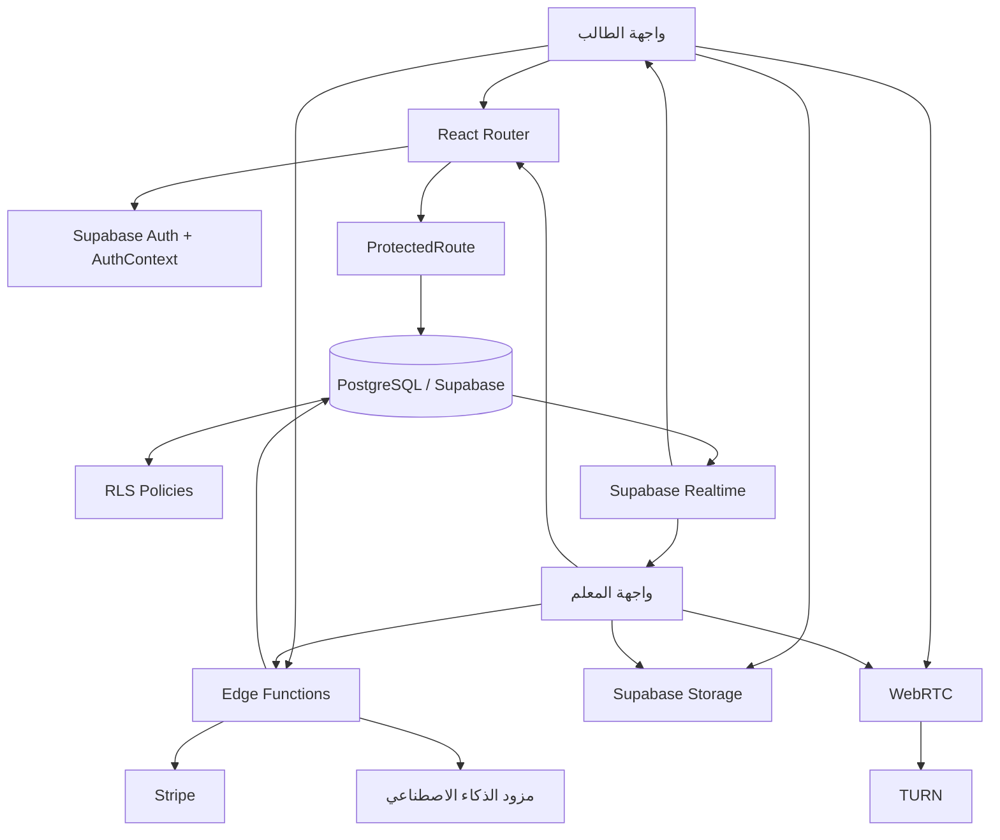

### 3.1 مصادر الحقيقة

| المجال | المصدر النهائي |
|---|---|
| تسجيل الدخول | Supabase Auth |
| الدور | `user_roles` و`AuthContext.roles` |
| بيانات المستخدم | `profiles` |
| الحظر | `user_warnings` |
| تعريف الباقة | `subscription_plans` |
| رصيد الطالب | `user_subscriptions.remaining_minutes` |
| الطلب قبل قبول المعلم | `booking_requests` |
| الحجز النهائي | `bookings` |
| التنفيذ الفعلي للجلسة | `sessions` |
| الحضور داخل الجلسة | `active_sessions` |
| رسائل الجلسة/العلاقة | `chat_messages` |
| التسجيل | `sessions.recording_url` و`session_materials.recording_url` |
| ربح المعلم لكل جلسة | أعمدة `sessions` المالية |
| ملخص السحب | `teacher_earnings` و`withdrawal_requests` وRPCs المالية |
| الواجب | `assignments` |
| تسليم الطالب | `assignment_submissions` |
| الفاتورة | `invoices` |

---

## 4. الأطراف والمسارات

### 4.1 مسارات الطالب

| المسار | الوظيفة |
|---|---|
| `/student` | لوحة الطالب |
| `/search` | البحث عن المعلمين والحجز السريع |
| `/booking` | حجز مباشر أو broadcast |
| `/pricing` | الباقات والدفع |
| `/subscription-details` | تفاصيل الباقة والدقائق والخصومات |
| `/payment-success` | نتيجة الدفع |
| `/invoices` | الفواتير |
| `/session?booking=<id>` | الجلسة الحية |
| `/chat?booking=<id>` | المحادثة |
| `/rating?booking=<id>` | تقييم الجلسة |
| `/student/assignments` | الواجبات والاختبارات |
| `/support` | خدمة العملاء |
| `/profile` | الملف الشخصي |
| `/complete-profile` | إكمال بيانات الطالب |
| `/ai-tutor` | المدرس الذكي |
| `/homework-solver` | حل الواجبات |

### 4.2 مسارات المعلم

| المسار | الوظيفة |
|---|---|
| `/teacher` | لوحة المعلم |
| `/teacher/wallet` | محفظة الاتصال الهاتفي، وليست أرباح التدريس |
| `/teacher/assignments` | إنشاء الواجبات والاختبارات ومراجعة التسليمات |
| `/teacher/assignments/review/:id` | مراجعة تسليم محدد |
| `/session?booking=<id>` | الجلسة الحية نفسها للطرفين |
| `/chat?booking=<id>` | المحادثة مع الطالب |
| `/support` | خدمة العملاء |

### 4.3 حماية المسارات الحالية

`ProtectedRoute` يتحقق من:

1. وجود مستخدم مسجل.
2. انتهاء تحميل AuthContext.
3. عدم وجود `user_warnings.is_banned = true`.

لكن الحماية الحالية لا تفرض دوراً صريحاً داخل Route نفسه. المسار `/student` لا يحتوي بوابة `student` مستقلة، والمسار `/teacher` لا يحتوي بوابة `teacher` مستقلة. يعتمد التطبيق جزئياً على التحويلات وRLS وسلوك المكونات.

هذه فجوة صلاحيات يجب إغلاقها قبل اعتماد الفصل الكامل بين الطرفين.

---

## 5. النموذج المركزي للكيانات

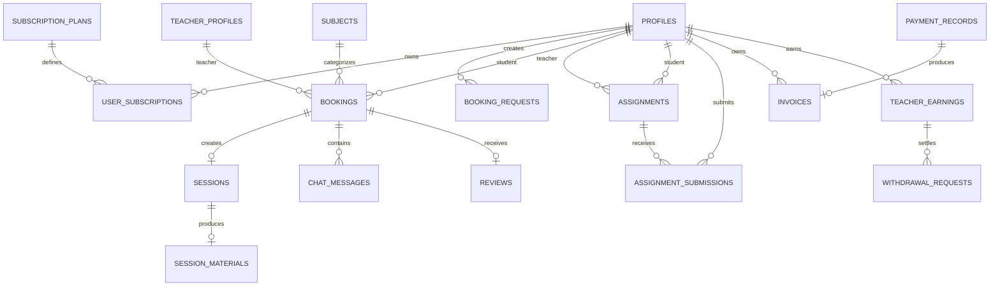

### 5.1 العلاقات المهمة

- اشتراك الطالب قد يكون له أكثر من سجل في `user_subscriptions`.
- الحجز يشير اختيارياً إلى `subscription_id`.
- لكل `booking` جلسة واحدة في `sessions` بسبب `UNIQUE(booking_id)`.
- لكل حجز تقييم واحد بسبب `UNIQUE(booking_id)` في `reviews`.
- لكل جلسة مادة واحدة في `session_materials` بسبب `UNIQUE(session_id)`.
- الطلبات المرتبطة بنفس الإرسال تستخدم `group_id`.
- الواجب قد يوجه لطالب محدد أو يكون عاماً بحسب `student_id`.
- تسليم الواجب يربط الطالب بالواجب، وليس بالجلسة مباشرة.

---

## 6. الباقات ورصيد الطالب

### 6.1 تعريف الباقة

`subscription_plans` يحتوي على:

- `tier`.
- `name_ar`.
- `price`.
- `sessions_count`.
- `session_duration_minutes`.
- `has_ai_tutor`.
- `has_recording`.
- `has_priority_booking`.
- خصائص الباقة الأخرى.

Migration `20260510200000_change_session_base_to_60min.sql` عدلت الباقات القديمة من 45 إلى 60 دقيقة، وMigration `20260510210000_user_subscription_session_duration.sql` أضافت مدة الجلسة المثبتة داخل الاشتراك.

### 6.2 تثبيت مدة الجلسة عند شراء الباقة

`user_subscriptions.session_duration_minutes` يتم نسخه من الباقة عند إنشاء الاشتراك بواسطة:

```text
set_subscription_session_duration()
```

السبب: تغيير تعريف الباقة لاحقاً لا يجب أن يغير مدة الجلسة المحجوزة للمشترك القديم.

### 6.3 رصيد الاشتراك

السجلات الفعالة التي تدخل في الرصيد هي التي تحقق:

```text
user_id = الطالب
is_active = true
remaining_minutes > 0
ends_at > now()
```

في لوحة الطالب يتم جمع جميع الاشتراكات الفعالة:

```text
total_remaining_minutes =
  SUM(user_subscriptions.remaining_minutes)
```

ويجمع أيضاً:

```text
total_sessions_remaining =
  SUM(user_subscriptions.sessions_remaining)
```

### 6.4 الرصيد القابل للحجز

قبل إنشاء طلب حجز، الواجهة تحسب:

```text
الرصيد الأساسي =
  مجموع remaining_minutes في الاشتراكات النشطة

الدقائق المحجوزة في الطلبات =
  مجموع duration_minutes للطلبات المفتوحة أو المقبولة
  ذات الموعد القادم

الدقائق المحجوزة في الحجوزات =
  مجموع duration_minutes للحجوزات pending أو confirmed
  ذات الموعد القادم

الرصيد القابل للحجز =
  max(0, الرصيد الأساسي - الطلبات المحجوزة - الحجوزات المحجوزة)
```

ثم:

```text
max_bookable_slots =
  floor(الرصيد القابل للحجز / مدة الجلسة المثبتة)
```

هذا الحساب في العميل لتحسين التجربة، لكنه ليس ضماناً نهائياً.

### 6.5 تحقق قاعدة البيانات

Trigger:

```text
validate_booking_request_against_balance()
```

يفحص عند إدراج `booking_requests`:

1. وجود `student_id`.
2. مدة الطلب أكبر من صفر.
3. مجموع رصيد الاشتراكات النشطة وغير المنتهية.
4. مجموع الطلبات `open/accepted` القادمة.
5. مجموع الحجوزات `pending/confirmed` القادمة.
6. عدم تجاوز الطلب الجديد للرصيد المتاح.

يجب اعتبار هذا الـTrigger آخر خط دفاع، وليس حساب React.

---

## 7. دورة الباقات والدفع والخصم التجاري

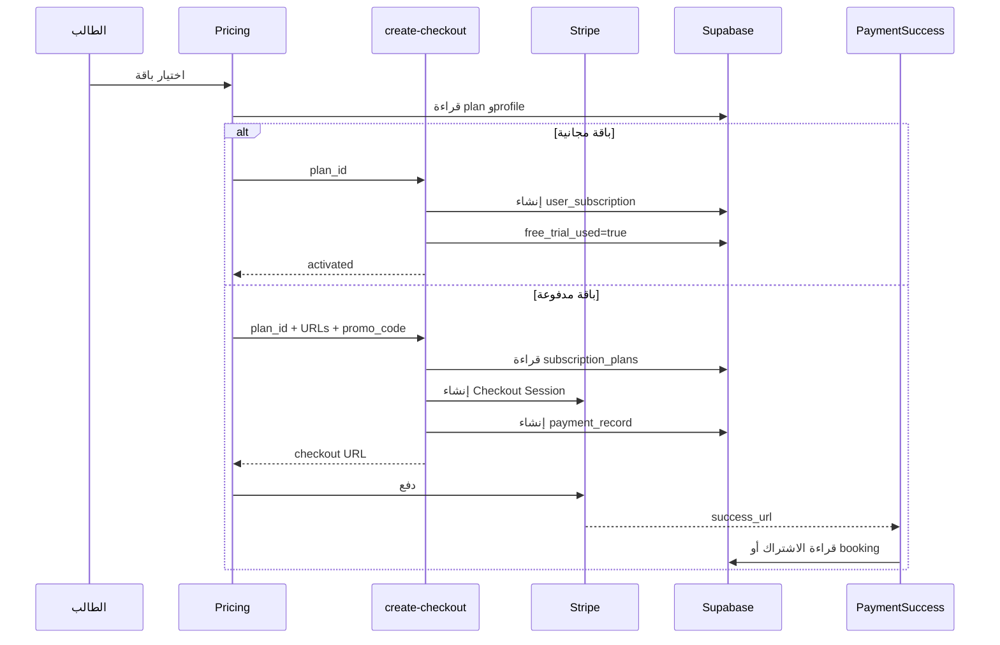

### 7.1 خصم سعر الباقة

`create-checkout` يدعم:

- `plan_id`.
- `success_url`.
- `cancel_url`.
- `promo_code`.

ويقرأ سعر الباقة من قاعدة البيانات، ثم يحول السعر إلى سنتات Stripe:

```text
unit_amount = round(plan.price * 100)
```

إذا وجد `promo_code` صالح، يستخدم Stripe Promotion Code.

### 7.2 الفرق بين الخصومات المالية وخصم الدقائق

هناك ثلاثة أنواع منفصلة يجب عدم خلطها:

| النوع | مكانه | معناه |
|---|---|---|
| خصم Promo | Stripe / Checkout | تخفيض سعر شراء الباقة |
| خصم دقائق الطالب | `user_subscriptions.remaining_minutes` | استهلاك الخدمة بعد جلسة فعلية |
| خصم عمولة المنصة | `sessions.platform_fee` | الفرق بين إجمالي الجلسة وصافي المعلم |

### 7.3 مصدر حقيقة الدفع

`PaymentSuccess` يعرض النتيجة، لكنه ليس بديلاً عن Webhook أو عملية خادم مؤكدة. يجب أن يكون إنشاء/تجديد الاشتراك المحلي idempotent حسب Stripe session/subscription ID.

---

## 8. اكتشاف المعلم وجدوله وتسعيره

### 8.1 بيانات المعلم التي يراها الطالب

من:

- `public_teacher_profiles`.
- `public_profiles`.
- `teacher_subjects`.
- `subjects`.

وتشمل:

- الاسم.
- الصورة.
- النبذة.
- التقييم.
- عدد المراجعات.
- عدد الجلسات.
- السعر بالساعة.
- الأيام المتاحة.
- الوقت من/إلى.
- المواد.
- المراحل التي يدرسها.

### 8.2 بيانات الجدول التي يعدلها المعلم

`SchedulePricingManager` يقرأ ويحدث:

- `available_days`.
- `available_from`.
- `available_to`.
- `bio`.
- `years_experience`.

يجب فصل:

1. جدول التوفر العام للمعلم.
2. السعر الحالي للمعلم.
3. المواعيد المحجوزة فعلياً.

فالجلسة الفورية لا تعتمد بالضرورة على جدول التوفر، بينما الحجز المجدول يعتمد عليه في الواجهة.

---

## 9. دورة طلب الحجز من الطرفين

```mermaid
flowchart LR
    A[الطالب يختار معلم/مادة/وقت] --> B[فحص الملف]
    B --> C[فحص الاشتراك والرصيد]
    C --> D[فحص التعارض في العميل]
    D --> E[INSERT booking_requests]
    E --> F[إشعارات المعلمين]
    F --> G[المعلم يرى الطلب]
    G --> H{قبول؟}
    H -->|رفض| I[rejected/cancelled]
    H -->|قبول| J[accepted_by + accepted_at]
    J --> K[فحص الجلسة النشطة]
    K --> L[فحص رصيد الطالب]
    L --> M[INSERT bookings]
    M --> N[auto_create_session]
    N --> O[الطالب يرى حجزاً مؤكداً]
```

### 9.1 إنشاء الطلب من الطالب

الطالب يمكنه إنشاء:

- طلب مباشر لمعلم معين.
- طلب broadcast لمعلمي المادة المؤهلين.
- عدة طلبات في إرسال واحد باستخدام `group_id`.

الحقول الأساسية:

```text
student_id
subject_id
scheduled_at
duration_minutes
status = open
expires_at
group_id
teaching_stage
```

### 9.2 إشعار المعلمين

في وضع المعلم المحدد:

- يرسل إشعاراً للمعلم المحدد.
- قد ينشئ إشعار first impression عند أول تعامل.

في broadcast:

- يقرأ `teacher_subjects`.
- يضم `teacher_profiles!inner`.
- يقصر النتائج على `is_approved = true`.
- يطابق `teaching_stage` عند وجودها.
- ينشئ إشعاراً لكل معلم مؤهل.

### 9.3 ظهور الطلب عند المعلم

`BookingRequests`:

- يستمع إلى INSERT/UPDATE في `booking_requests`.
- يعرض الطلبات المفتوحة المؤهلة للمعلم.
- يجمع الطلبات حسب `group_id`.
- يجلب اسم الطالب من `public_profiles`.
- يجلب اسم المادة من `subjects`.
- يفحص تعارض الطلب مع حجوزات المعلم.
- يفحص جلسة المعلم النشطة.

### 9.4 رفض الطلب

يستدعي المعلم:

```text
reject_booking_request
```

ويتم تحديث المجموعة أو الطلب إلى الحالة المناسبة. يجب أن يضمن الـRPC أن المعلم يستطيع رفض الطلب المؤهل فقط.

### 9.5 قبول الطلب

مسار القبول الحالي في واجهة المعلم:

1. التأكد من عدم وجود جلسة فورية أو جلسة نشطة للمعلم.
2. قبول الطلب الفردي عبر:

```text
accept_booking_request(_request_id, _teacher_id)
```

3. أو قبول المجموعة عبر:

```text
accept_booking_group(_group_id, _teacher_id)
```

4. قراءة `user_subscriptions` للطالب.
5. التأكد من وجود رصيد كافٍ.
6. بناء `bookingsPayload`.
7. إدراج الحجوزات دفعة واحدة.
8. إرسال إشعار تأكيد للطالب.
9. إرسال رسالة ترحيبية في chat عند أول حجز.
10. إنشاء first impression عند الحاجة.

### 9.6 مشكلة الاتساق الحالية

القبول وتغيير `booking_requests.status` يتم عبر RPC، بينما إدراج `bookings` يتم لاحقاً من الواجهة. هذا يفتح نافذة فشل:

```text
الطلب accepted
   |
   X فشل إدراج booking أو فشل الرصيد
   |
لا يوجد booking نهائي رغم قبول الطلب
```

الحل الصحيح هو RPC واحدة تنفذ:

```text
lock الطلبات
lock subscription rows
فحص الرصيد
فحص التعارض
تحديث الطلبات
إنشاء bookings
إنشاء sessions
commit
```

---

## 10. آلة حالات الحجز

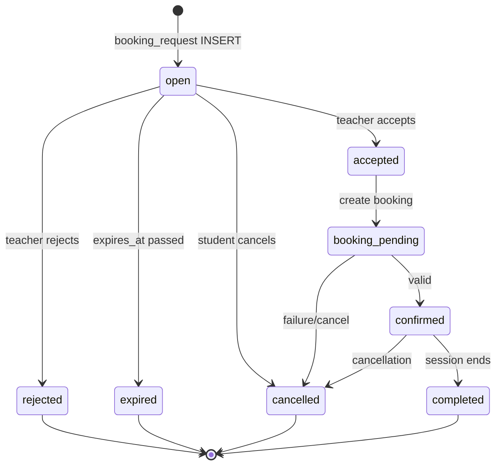

### 10.1 القيم المنطقية

`booking_requests.status`:

```text
open
accepted
rejected
cancelled
expired
```

`bookings.status`:

```text
pending
confirmed
completed
cancelled
```

`bookings.session_status`:

```text
not_started
waiting_acceptance
in_progress
completed
cancelled
rejected
expired
```

يجب أن تكون هذه القيم محكومة بقيود انتقال واضحة، لا مجرد نصوص يمكن للعميل تغييرها عشوائياً.

---

## 11. الجلسة الفورية

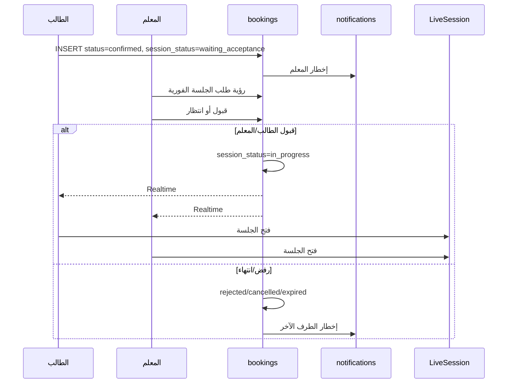

قبل إنشاء جلسة فورية يتم فحص:

- عدم وجود جلسة أخرى نشطة للطالب.
- عدم وجود جلسة `in_progress` للمعلم.
- عدم وجود طلب `waiting_acceptance` للمعلم.
- وجود اشتراك فعال ورصيد يكفي.

الفحص الحالي موزع بين React وقراءات قاعدة البيانات. يجب نقله إلى RPC ذرية.

---

## 12. تشغيل الجلسة والعداد

### 12.1 فتح الجلسة

المسار:

```text
/session?booking=<booking_id>
```

`LiveSession`:

1. يقرأ `booking_id`.
2. يقرأ بيانات الحجز.
3. يحدد هل المستخدم طالب أم معلم.
4. يتحقق من أن المستخدم أحد طرفي الحجز.
5. يقرأ أو ينشئ `sessions`.
6. ينفذ `PreJoinCheck`.
7. يفحص جلسة المستخدم النشطة.
8. يجهز WebRTC وTURN.
9. يجهز chat داخل الجلسة.
10. يبدأ التسجيل عند اكتمال شروط الطرفين.

### 12.2 عداد الجلسة ليس مجرد Timer في الواجهة

العداد المرئي لا يجب أن يعتمد على فتح الصفحة فقط. المنطق الحالي يربطه بشروط منطقية مثل:

```text
meetingStarted
AND bothJoined
AND connectionHealthy
```

المعنى:

- `meetingStarted`: تم بدء الاجتماع.
- `bothJoined`: الطالب والمعلم متصلان.
- `connectionHealthy`: الاتصال صالح للحساب.

### 12.3 مصدر وقت البداية

هناك فرق بين:

1. وقت فتح صفحة الجلسة.
2. وقت اتصال الطالب.
3. وقت اتصال المعلم.
4. وقت بدء الاجتماع.
5. وقت بدء الخصم.

المصدر الصحيح للفوترة يجب أن يكون وقتاً موثقاً في `sessions.started_at` أو وقت بداية خادم موحد، وليس ساعة جهاز الطالب.

### 12.4 الحضور

`active_sessions` يسجل:

- `user_id`.
- `booking_id`.
- `is_connected`.
- `last_heartbeat`.
- `disconnected_at`.
- معلومات الجهاز/التبويب حسب الكود.

التدفق:

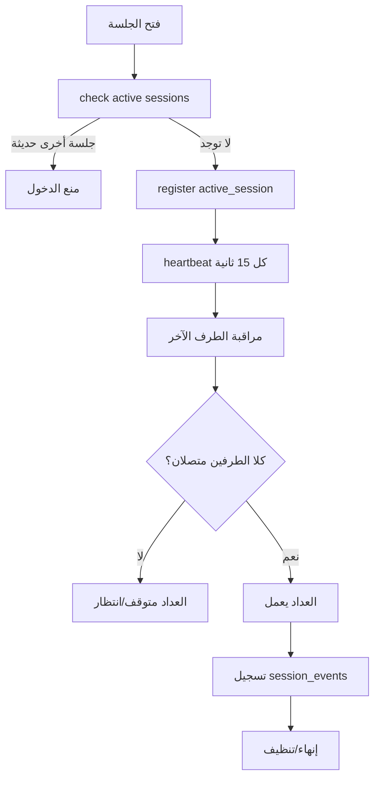

### 12.5 WebRTC

المكونات:

- `useWebRTC`.
- `webrtc_signals`.
- `turn-credentials`.
- PeerConnection.
- DataChannel.

أحداث DataChannel الحالية تشمل:

- `session-end`.
- `timer-start`.
- `hand-raise`.
- whiteboard toggles.
- screen-share state.

### 12.6 واجهة الجلسة

للطالب والمعلم:

- تشغيل/كتم الميكروفون.
- الكاميرا حسب المكون.
- مشاركة الشاشة للمعلم بحسب الواجهة.
- السبورة.
- الدردشة.
- رفع اليد.
- ملء الشاشة.
- معاينة وتنزيل الملفات.
- إنهاء الجلسة.

للمعلم إضافياً:

- التقرير.
- المساعد الذكي داخل الجلسة.

---

## 13. تسجيل الجلسات ومكان الحفظ

### 13.1 أماكن البيانات

```text
sessions.recording_url
        |
        v
session_materials.recording_url
        |
        v
Storage bucket: session-recordings
```

`session_materials` يحتوي عادة على:

- `session_id`.
- `teacher_id`.
- `student_id`.
- `title`.
- `description`.
- `recording_url`.
- `duration_minutes`.
- `expires_at`.
- `is_deleted`.

### 13.2 إنشاء المادة بعد انتهاء الجلسة

Trigger:

```text
auto_create_session_material()
```

يعمل بعد تحديث الجلسة وانتهائها:

1. يتأكد أن الجلسة انتهت الآن.
2. يتجاهل الجلسات القصيرة الأقل من 5 دقائق.
3. يقرأ الحجز.
4. يقرأ اسمي الطالب والمعلم.
5. ينشئ `session_materials`.
6. يستخدم `ON CONFLICT(session_id) DO NOTHING`.
7. يضع `expires_at` افتراضياً بعد 7 أيام.

### 13.3 حفظ التسجيل عبر Edge Function

`save-session-recording` يستقبل:

```json
{
  "booking_id": "...",
  "recording_url": "..."
}
```

ويتحقق من:

1. Bearer token.
2. وجود الحجز.
3. أن المستخدم هو الطالب أو المعلم.
4. وجود `sessions` المرتبطة بالحجز.
5. تحديث `sessions.recording_url`.
6. إذا كانت الجلسة منتهية ومدتها 5 دقائق أو أكثر:
   - يحدث مادة موجودة.
   - أو ينشئ مادة جديدة.
7. يحدد انتهاء المادة بعد 7 أيام من نهاية الجلسة.

### 13.4 التسجيل المجزأ والنسخ الاحتياطية

`LiveSession` يدعم:

- تسجيل يبدأ بعد اتصال الطرفين.
- رفع chunks دورية.
- اسم ملف ثابت للجلسة.
- إعادة المحاولة بعد فشل الشبكة.
- backup محلي.
- محاولة استعادة backup عند العودة.

### 13.5 عرض التسجيل للطالب

`SessionMaterials`:

1. يقرأ مواده التي لم تنتهِ.
2. يقرأ `sessions.ai_report`.
3. يقرأ اسم المادة من `bookings.subjects`.
4. يحول URL التخزين إلى Signed URL.
5. يعرض `SessionVideoPlayer`.
6. يعرض عدد الأيام المتبقية.

### 13.6 عرض التسجيل للمعلم

`TeacherSessionMaterials`:

1. يقرأ المواد الخاصة بالمعلم وغير المنتهية.
2. يقرأ جلسات التقرير.
3. يقرأ أسماء الطلاب.
4. يقرأ المادة.
5. ينشئ Signed URL من bucket.
6. يعرض التسجيل والتقرير.

### 13.7 سياسة الاحتفاظ

الافتراضي الحالي:

```text
expires_at = ended_at + 7 days
```

لكن يجب التحقق من وجود Job يحذف أو يعلّم الملفات المنتهية في Storage، لأن انتهاء السجل في `session_materials` لا يعني حذف الملف الفيزيائي تلقائياً.

### 13.8 خطر الوصول العام

يجب أن تكون القراءة من bucket محمية بـ:

- طرفي الحجز فقط.
- Signed URLs قصيرة العمر.
- عدم الاعتماد على `publicUrl` دائم للتسجيلات الحساسة.

---

## 14. إنهاء الجلسة والخصم والفوترة

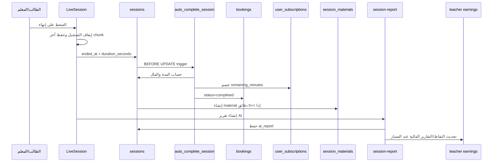

### 14.1 تحديد مدة الجلسة

الـTrigger يستخدم سلسلة أولوية:

```text
إذا duration_seconds > 0:
    duration_minutes = ceil(duration_seconds / 60)
وإلا إذا duration_minutes موجودة:
    استخدمها
وإلا إذا started_at وended_at موجودان:
    duration_minutes = ceil((ended_at - started_at) / 60)
وإلا:
    لا يمكن حساب الإنهاء بشكل موثوق
```

### 14.2 الجلسة القصيرة

إذا:

```text
duration_minutes < 5
```

فالمنطق الحالي يجعل:

```text
short_session = true
deducted_minutes = 0
teacher_earning = 0
gross_amount = 0
platform_fee = 0
teacher_base_amount = 0
vat_amount = 0
net_amount = 0
```

ولا تخصم دقائق من الطالب.

### 14.3 الجلسة المؤهلة

إذا:

```text
duration_minutes >= 5
```

فإن:

```text
short_session = false
deducted_minutes = duration_minutes
```

ثم تبدأ الحسابات المالية.

---

## 15. المعادلات المالية الدقيقة

> يجب اعتبار آخر Trigger فعال في ترتيب migrations هو المرجع الإنتاجي، مع ضرورة التحقق مباشرة من `pg_get_functiondef()` في قاعدة الإنتاج قبل الاعتماد النهائي.

### 15.1 المتغيرات

```text
D = مدة الجلسة بالدقائق
R = hourly_rate الخاص بالمعلم
G = إجمالي قيمة الجلسة
V = نسبة VAT من financial_settings
T = teacher_base_amount
F = platform_fee
N = net_amount / teacher_earning
```

### 15.2 الإجمالي حسب آخر منطق 60 دقيقة

في Migration `20260510200000_change_session_base_to_60min.sql`:

```text
G = (D / 60) * 60
```

أي أن قيمة المنصة الإجمالية تعادل 60 وحدة نقدية لكل 60 دقيقة، ما لم تكن هناك Migration لاحقة غير ظاهرة في الفرع تغير هذه القاعدة.

### 15.3 نصيب المعلم

```text
T = (D / 60) * hourly_rate
```

ثم:

```text
N = T
teacher_earning = N
```

### 15.4 الضريبة

في النسخة التي تتعامل مع الإجمالي كقيمة شاملة:

```text
vat_amount = G * V / (100 + V)
```

إذا كانت `V = 15`:

```text
vat_amount = G * 15 / 115
```

### 15.5 عمولة المنصة

```text
F = G - T
```

ويسجل:

```text
platform_fee_rate_snapshot =
  (G - T) / G
```

### 15.6 مثال رقمي

افترض:

```text
D = 60 دقيقة
hourly_rate = 20
VAT = 15%
```

فالنتيجة:

```text
G = 60
T = 20
F = 40
N = 20
VAT = 60 * 15 / 115 = 7.83 تقريباً
```

افترض جلسة 30 دقيقة:

```text
G = 30
T = 10
F = 20
N = 10
VAT = 30 * 15 / 115 = 3.91 تقريباً
```

### 15.7 ملاحظة حرجة عن التسعير

إذا كان `teacher_profiles.hourly_rate > 60`، تصبح:

```text
platform_fee = G - T
```

سالبة. يجب إضافة قيد أو سياسة تمنع سعراً أعلى من إجمالي الجلسة الأساسي، أو تعريف واضح لنموذج التسعير إذا كان السعر الأعلى مقصوداً.

---

## 16. خصم رصيد الطالب بعد الجلسة

### 16.1 اختيار الاشتراك الذي سيُخصم منه

الـTrigger:

1. يستخدم `bookings.subscription_id` إذا كان صالحاً.
2. إذا كان فارغاً أو الاشتراك غير نشط أو لا يكفي:
   - يبحث عن اشتراك للطالب.
   - `is_active = true`.
   - `remaining_minutes >= duration_minutes`.
   - يرتب حسب `ends_at ASC, created_at ASC`.
   - يختار الأقرب انتهاءً.

### 16.2 عملية الخصم

```text
remaining_minutes =
  greatest(0, remaining_minutes - duration_minutes)
```

### 16.3 عدم تكرار الخصم

يجب أن تكون عملية الإنهاء idempotent. الخطر هو أن إعادة تحديث `sessions.ended_at` أو إعادة محاولة إنهاء الجلسة قد تؤدي إلى خصم ثانٍ إذا لم يكن شرط الـTrigger مقصوراً على الانتقال:

```text
OLD.ended_at IS NULL
AND NEW.ended_at IS NOT NULL
```

ويجب تسجيل `billing_applied_at` أو قيد مماثل إن لم يكن موجوداً.

### 16.4 خصم الجلسة القصيرة

الجلسة الأقل من 5 دقائق:

- لا تخصم دقائق.
- لا تنتج ربحاً.
- قد تنشئ/لا تنشئ مادة بحسب Trigger الحالي.
- يجب توحيد هذا السلوك بين التسجيل والتقرير والواجهة.

---

## 17. رصيد المعلم وأرباحه

### 17.1 لا تخلط بين محفظتين

| العنصر | الغرض |
|---|---|
| `teacher_earnings` | أرباح تدريس المعلم وطلبات السحب |
| `wallets` | رصيد الاتصالات الهاتفية المدفوعة |
| `wallet_transactions` | حركات الاتصال والشحن والخصم |
| `sessions.teacher_earning` | ربح جلسة فردية محسوب عند الإنهاء |

`/teacher/wallet` يتعامل مع محفظة الاتصال الهاتفية، وليس بالضرورة مع الرصيد القابل لسحب أرباح التدريس.

### 17.2 ملخص أرباح المعلم

`WithdrawalSection` يستدعي:

```text
get_teacher_earnings_breakdown(_teacher_id)
```

ويقرأ:

- `confirmed_total`.
- `pending_total`.
- `paid_total`.
- `available_for_withdrawal`.
- `total_sessions`.
- `total_minutes`.

### 17.3 معادلة الرصيد القابل للسحب

حسب RPC الحالية:

```text
confirmed =
  SUM(teacher_earnings.amount WHERE status='confirmed')

paid =
  SUM(teacher_earnings.amount WHERE status='paid')

pending_withdrawals =
  SUM(withdrawal_requests.amount
      WHERE status IN ('pending','approved','processing'))

available_for_withdrawal =
  greatest(confirmed - paid - pending_withdrawals, 0)
```

عدد الجلسات والدقائق:

```text
sessions =
COUNT(sessions
      WHERE teacher_id matches
      AND ended_at IS NOT NULL
      AND short_session = false)

minutes =
SUM(sessions.duration_minutes)
```

### 17.4 ملخص الشهر

`get_teacher_financial_breakdown` و`get_teacher_net_summary` يقرآن من `sessions`:

- `gross_amount`.
- `platform_fee`.
- `teacher_base_amount`.
- `net_amount`.
- `teacher_earning`.
- `duration_minutes`.
- `short_session`.

ويفلتران الشهر حسب التاريخ المعتمد في الـRPC، مع ضرورة التحقق من هل الفلترة تعتمد `ended_at` أو `scheduled_at` في النسخة المنتشرة فعلياً.

### 17.5 طلب السحب

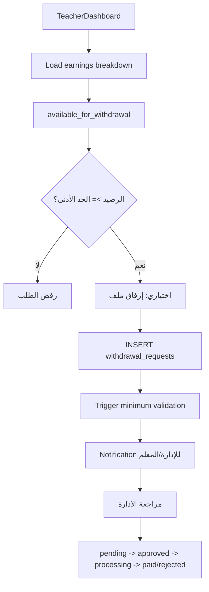

الحد الأدنى من `financial_settings.min_withdrawal_amount`، والقيمة الافتراضية في الواجهة 100 عند غياب الإعداد.

### 17.6 منع السحب الزائد

الـRPC تخصم طلبات السحب:

```text
pending + approved + processing
```

من الرصيد المتاح، لذلك لا يجب السماح بطلب سحب جديد يتجاوز المتاح بعد الطلبات المعلقة.

يجب كذلك منع:

- سحب مبلغ سالب.
- إدراج teacher_id لمعلم آخر.
- تجاوز المبلغ المتاح بسبب طلبين متزامنين.
- تعديل طلب بعد بدء المعالجة.

---

## 18. إلغاء الجلسات والأثر المالي

### 18.1 إلغاء قبل بدء الجلسة

يجب تحديد السياسة بوضوح:

- هل تعاد الدقائق المحجوزة فقط؟
- هل توجد رسوم إلغاء؟
- هل يخصم شيء من المعلم؟
- هل يزيد عداد الإلغاءات؟
- هل يحتاج إشعار الإدارة؟

الواجهة الحالية تحدث حالة الحجز وترسل إشعاراً، لكن منطق إعادة الدقائق والقيود الزمنية يجب أن يكون في قاعدة البيانات أو Edge Function.

### 18.2 إلغاء أثناء الجلسة

يجب أن يمر عبر مسار الجلسة/الخادم، لا مجرد update مباشر:

1. تحديد الطرف الذي أنهى.
2. حفظ `cancellation_reason`.
3. تحديد المدة الفعلية.
4. تطبيق قاعدة الجلسة القصيرة أو المكتملة.
5. منع الخصم المكرر.
6. إخطار الطرف الآخر.

### 18.3 إلغاء بعد الإنهاء

لا يجب تحويل `completed` إلى `cancelled` من الواجهة. أي تصحيح مالي يجب أن يكون عملية إدارية مدققة.

---

## 19. التقارير والمواد بعد الجلسة

### 19.1 تقرير AI

`session-report`:

1. يقرأ الحجز.
2. يحدد الطالب والمعلم والمادة.
3. يجمع timeline من الجلسة/المحادثة.
4. يرسل المحتوى إلى AI.
5. ينتج تقريراً منظماً:
   - `summary`.
   - `performance_score`.
   - `quality_score`.
   - `usefulness_score`.
   - `total_messages`.
   - `violations_count`.
   - `detected_questions`.
   - `sample_exchanges`.
6. يحفظ JSON في `sessions.ai_report`.
7. يحسب نقاط الطالب:

```text
performance >= 80 -> 50 نقطة
performance >= 60 -> 30 نقطة
otherwise          -> 15 نقطة
```

8. يرسل إشعاراً للطالب والمعلم.

### 19.2 تقرير المعلم

`TeacherSessionReports`:

- يقرأ الحجوزات الخاصة بالمعلم.
- يقرأ `sessions.ai_report`.
- يعرض التقرير حسب الطالب والمادة.
- يعرض درجة الأداء والمراسلات والمخالفات.

### 19.3 تقرير الطالب

`SessionMaterials`:

- يعرض التسجيل.
- يعرض التقرير إذا كان موجوداً.
- يعرض مدة الجلسة.
- يعرض المادة.
- يحسب الأيام المتبقية حتى انتهاء المادة.

---

## 20. الواجبات والاختبارات: النموذج العام

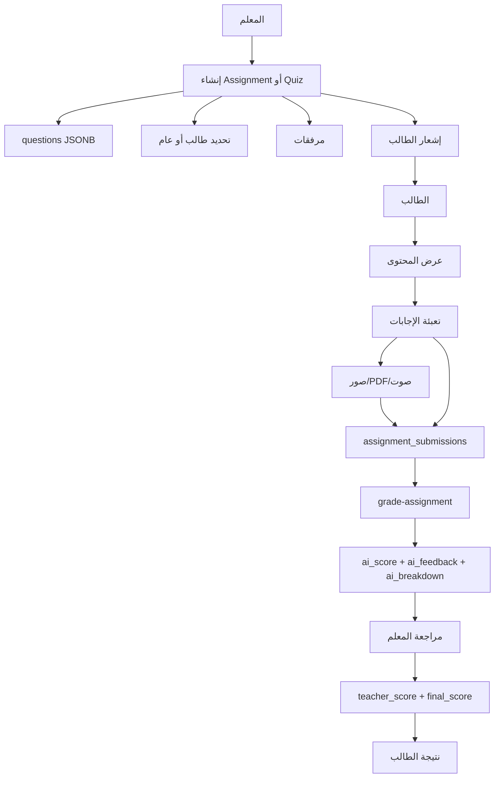

### 20.1 `assignments`

الحقول المهمة:

- `teacher_id`.
- `student_id` اختياري.
- `title`.
- `description`.
- `subject_id`.
- `teaching_stage`.
- `total_points`.
- `due_date`.
- `questions JSONB`.
- `attachments`.
- `allow_text`.
- `allow_image`.
- `allow_audio`.
- `content_type`.
- `status`.

`content_type`:

```text
assignment
quiz
```

### 20.2 أنواع الأسئلة

الواجهة تدعم منطقياً:

- سؤال نصي.
- `multiple_choice`.
- `multiple_select`.
- أنواع إضافية حسب `questions JSONB`.

عند السؤال الاختياري يجب وجود:

- نص السؤال.
- درجة أكبر من صفر.
- خياران على الأقل.
- إجابة صحيحة.

### 20.3 إنشاء الواجب من المعلم

`TeacherAssignments`:

1. يقرأ الواجبات الخاصة بالمعلم.
2. يقرأ بنك الأسئلة الخاص به.
3. يقرأ المواد.
4. يقرأ الطلاب الذين لديهم حجوزات مؤكدة أو مكتملة.
5. يختار `assignment` أو `quiz`.
6. يحدد طالباً أو يتركه عاماً.
7. يضيف الأسئلة يدوياً أو من `question_bank`.
8. يرفع المرفقات.
9. يحسب مجموع الدرجات من الأسئلة أو يستخدم 100.
10. يدرج `assignments`.
11. يرسل `notifications`.
12. قد يرسل رسالة `chat_messages` تحتوي marker:

```text
[[ASSIGNMENT:/student/assignments]]
```

### 20.4 بنك الأسئلة

`question_bank` يخزن:

- `teacher_id`.
- `question_text`.
- `question_type`.
- الخيارات.
- الإجابة الصحيحة.
- metadata حسب الكود.

المعلم يستطيع:

- إنشاء سؤال.
- استيراد سؤال إلى واجب.
- حذف سؤال.
- استخدام `extract-questions-from-file` لاستخراج أسئلة من ملف.

---

## 21. تسليم الطالب للواجب أو الاختبار

### 21.1 عرض الواجب

سياسة `assignments` تسمح للطالب برؤية:

```text
student_id = auth.uid()
OR student_id IS NULL
```

يجب التحقق أن هذا السلوك مقصود، لأن الواجب العام قد يظهر لجميع الطلاب إذا لم توجد قيود إضافية على المرحلة/المادة.

### 21.2 قفل الاشتراك

`StudentAssignments` يفحص:

```text
user_subscriptions.is_active = true
AND remaining_minutes > 0
AND ends_at valid
```

عند عدم وجود اشتراك:

- يظهر الواجب مقفلاً.
- يظهر رابط `/pricing`.

### 21.3 إعداد الإجابة

الطالب يملأ:

- إجابات نصية.
- إجابات MCQ.
- إجابات MSQ كمصفوفة.
- صور أو PDF.
- تسجيل صوتي عبر `MediaRecorder`.

### 21.4 رفع الملفات

المسار:

```text
assignment-files/<student_id>/<assignment_id>/...
```

يجب أن تضمن Storage policies أن الطالب لا يرفع في مجلد طالب آخر ولا يقرأ ملفات submission لغيره.

### 21.5 إنشاء `assignment_submissions`

البيانات المنطقية:

- `assignment_id`.
- `student_id`.
- `answers`.
- `text_answer`.
- `image_urls`.
- `audio_url`.
- `submitted_at`.
- `status = submitted`.

بعد الإدراج:

```text
grade-assignment({ submission_id })
```

ثم إشعار المعلم.

---

## 22. التصحيح الآلي واليدوي

### 22.1 Edge Function `grade-assignment`

تتحقق من:

1. هوية الطالب/المعلم/admin.
2. وجود submission.
3. وجود assignment.
4. تطابق الطالب مع submission أو المعلم مع assignment.
5. قراءة الأسئلة والإجابات.
6. إرسال prompt للـAI.
7. تحليل JSON الناتج.
8. حساب مجموع breakdown.
9. تقييد النتيجة بين 0 و`total_points`.
10. تحديث:

```text
ai_score
ai_feedback
ai_breakdown
status = ai_graded
```

### 22.2 ضمان الدرجة

إذا اختلفت الدرجة الكلية عن مجموع تفاصيل الأسئلة بأكثر من 0.5، يستخدم النظام مجموع breakdown باعتباره أقرب للحساب القابل للتدقيق.

إذا كانت الإجابة خارج النطاق العلمي أو غير جادة، يضيف تحذيراً إلى feedback.

### 22.3 مراجعة المعلم

`ReviewSubmission` يستطيع:

- قراءة التسليم والواجب والطالب.
- تشغيل التصحيح الآلي يدوياً.
- رؤية درجة AI والتفصيل.
- اعتماد درجة AI مباشرة.
- أو إدخال:
  - `teacher_score`.
  - `teacher_feedback`.
  - `final_score`.
  - `status = reviewed`.
  - `reviewed_at`.
- إرسال إشعار للطالب.

### 22.4 أولوية الدرجات

للطالب:

```text
display_score =
  final_score ?? ai_score
```

لذلك:

- قبل مراجعة المعلم: درجة AI.
- بعد المراجعة: الدرجة النهائية التي اعتمدها المعلم.

### 22.5 حالات التسليم

```text
submitted
ai_graded
reviewed
```

آلة الحالات:

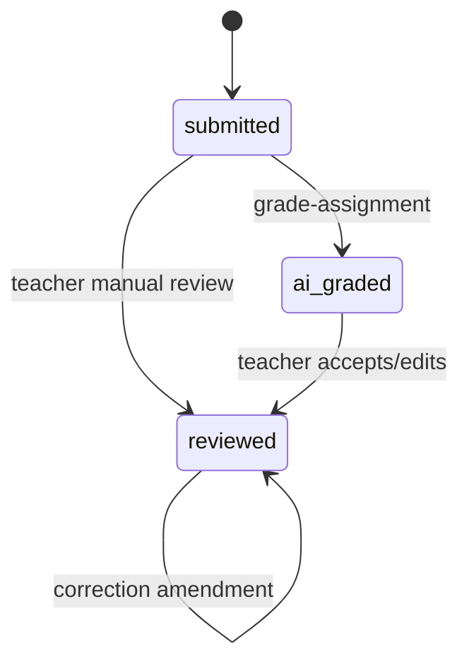

يجب منع الطالب من تعديل `teacher_score` أو `final_score` أو `reviewed_at`.

---

## 23. تفاصيل قسم الواجبات عند المعلم

`TeacherAssignments` يعرض:

- عدد الواجبات.
- عدد التسليمات التي تحتاج مراجعة.
- عدد الطلاب المعينين.
- متوسط الدرجات النهائية.
- تبويب الواجبات.
- تبويب التسليمات.
- تبويب بنك الأسئلة.

فلاتر التسليم:

- الكل.
- `submitted`.
- `ai_graded`.
- `reviewed`.

وفلاتر النوع:

- assignment.
- quiz.

العناصر ذات `status = submitted` أو `ai_graded` تعتبر بحاجة للمراجعة.

---

## 24. تفاصيل قسم الواجبات عند الطالب

`StudentAssignments` يعرض:

- الواجبات غير المسلمة.
- الاختبارات غير المسلمة.
- النتائج والمراجعة.
- درجة AI.
- درجة المعلم.
- الدرجة النهائية.
- feedback المعلم.
- breakdown لكل سؤال.
- نسبة الطالب من إجمالي النقاط.

الحساب:

```text
pct = round(score / total_points * 100)
```

يتم احتساب:

- `gradedCount`.
- `pendingReviewCount`.
- `totalEarned`.
- `totalAvailable`.

---

## 25. المحادثة المرتبطة بالحجز والواجب

المحادثة تجمع كل الحجوزات بين نفس الطالب والمعلم:

```text
student_id = X
AND teacher_id = Y
```

والرسائل من كل `booking_id` الخاص بهذا الزوج تعرض في محادثة موحدة.

عند إنشاء واجب، يمكن للمعلم إرسال marker داخل رسالة chat. يقرأ الطالب marker ويستطيع الانتقال مباشرة إلى:

```text
/student/assignments
```

يجب عدم اعتبار marker صلاحية وصول؛ الوصول النهائي يظل عبر RLS والاستعلام الخاص بالطالب.

---

## 26. الإشعارات والأحداث

| الحدث | من | إلى | الجدول/الآلية |
|---|---|---|---|
| إنشاء طلب حجز | الطالب | المعلم | `booking_requests` + `notifications` |
| قبول طلب | المعلم | الطالب | `bookings` + `notifications` |
| رفض طلب | المعلم | الطالب | `booking_requests` + notification |
| إلغاء الطالب | الطالب | المعلم | `bookings` + notification |
| بدء جلسة | المعلم | الطالب | Realtime على `bookings` |
| قبول جلسة فورية | الطرف الآخر | الطرف الأول | `session_status` |
| جلسة قريبة | system | الطرفين | `send-notification` |
| رسالة جديدة | أي طرف | الطرف الآخر | `chat_messages` + Realtime |
| تقرير AI | system | الطالب والمعلم | `sessions.ai_report` + notification |
| إرسال واجب | المعلم | الطالب | notification + chat |
| تسليم واجب | الطالب | المعلم | notification |
| تصحيح واجب | المعلم/system | الطالب | notification |
| انتهاء اشتراك | system | الطالب | notification |
| طلب سحب | المعلم | الإدارة | `withdrawal_requests` |

### 26.1 القنوات المهمة

- `student-bookings`.
- `student-subscription-sync`.
- `student-notifications-dashboard`.
- `student-schedule-table`.
- `teacher-booking-requests`.
- قنوات تحديث الحجوزات للمعلم.
- `chat_messages`.
- `support_messages`.
- `profiles`.
- `student_points`.
- `wallets`.

---

## 27. التسجيل والأحداث الأمنية داخل الجلسة

### 27.1 `session_events`

يستخدم لتسجيل أحداث مثل:

- دخول الجلسة.
- الخروج.
- heartbeat أو فقد الاتصال.
- إعادة الانضمام.
- تغيير التبويب.
- peer heartbeat stale.
- end session.

### 27.2 منع مشاركة بيانات الاتصال

`useSessionProtection` و`analyze-violations` يراقبان:

- رسائل chat.
- الصوت/المحادثة حسب الوظيفة.
- إشارات مشاركة الهاتف أو البريد أو الروابط الحساسة.

الجداول:

- `violations`.
- `user_warnings`.
- `system_logs`.

والنتيجة قد تكون:

- فلترة الرسالة.
- إنشاء مخالفة.
- تحذير.
- حظر.

---

## 28. RLS الأساسية

### 28.1 الطالب

الطالب يجب أن يستطيع:

- قراءة ملفه.
- قراءة اشتراكاته.
- إنشاء طلبات حجزه.
- قراءة حجوزاته.
- قراءة جلساته.
- إرسال رسائل حجوزاته.
- قراءة مواده.
- إرسال تسليماته.
- قراءة فواتيره.
- إنشاء تقييماته.

### 28.2 المعلم

المعلم يجب أن يستطيع:

- قراءة ملفه وجدوله.
- قراءة طلبات الحجز المؤهلة.
- قبول/رفض الطلبات المسموحة.
- قراءة حجوزاته كمعلم.
- تشغيل الجلسة.
- قراءة مواد جلساته.
- إنشاء واجباته.
- قراءة تسليمات واجباته.
- تحديث الدرجات النهائية.
- قراءة أرباحه.
- إنشاء طلب سحب باسمه.

### 28.3 العمليات التي يجب ألا تكون مباشرة من العميل

يجب منع المستخدم من تعديل:

- `bookings.teacher_id`.
- `bookings.student_id`.
- `bookings.price`.
- `bookings.status` إلى completed.
- `sessions.teacher_earning`.
- `sessions.platform_fee`.
- `user_subscriptions.remaining_minutes`.
- `teacher_earnings.amount/status`.
- `assignment_submissions.final_score`.
- `invoices.total_amount`.

هذه الحقول يجب أن تتغير عبر Trigger/RPC/Edge Function بصلاحيات خادم.

---

## 29. المخاطر الحرجة

### P0: قبول الطلب خارج Transaction

القبول وتكوين الحجز منفصلان. هذا يسبب:

- طلب accepted بلا booking.
- تكرار الحجز.
- حجز فوق الرصيد.
- تضارب موعد بعد قبول الطلب.

### P0: خصم الدقائق غير الموثق كعملية idempotent

إن لم يكن شرط نهاية الجلسة محصوراً في أول انتقال من `ended_at = null`، قد يتكرر الخصم عند إعادة المحاولة.

### P0: تحديثات مالية من العميل

أي RLS تسمح للمعلم/الطالب بتحديث صف مالي كامل تحتاج مراجعة عمودية على مستوى الأعمدة.

### P1: المعادلة قد تنتج عمولة سالبة

إذا تجاوز `hourly_rate` إجمالي الساعة الأساسي، يصبح `platform_fee` سالباً. يلزم قيد أو سياسة تسعير واضحة.

### P1: رصيد الطالب المحجوز غير مقفول

حساب الرصيد من عدة استعلامات ثم الإدراج يترك race condition. الحل Row Locks وRPC ذرية.

### P1: فرق الدفع المحلي وStripe

يجب ضمان idempotency Webhook وعدم إنشاء أكثر من `user_subscription` لنفس اشتراك Stripe.

### P1: التسجيلات المنتهية لا تعني حذف Storage

انتهاء `session_materials.expires_at` لا يثبت حذف الملف الفيزيائي.

### P1: توقيت الجهاز

توليد الأيام والأوقات من browser local time قد يختلف عن توقيت الخادم والمعلم.

### P1: صلاحية الطالب/المعلم في LiveSession

يجب رفض أي `booking_id` لا ينتمي إلى `auth.uid()` server-side، لا بالاعتماد على الواجهة.

### P2: التسليم المتعدد للواجب

يجب تحديد هل الطالب يسمح له بمحاولة واحدة أم عدة محاولات، ووضع قيد أو `attempt_number`.

### P2: البيانات العامة للواجب

`student_id IS NULL` قد يجعل الواجب عاماً لكل الطلاب. يجب التأكد من ربط المادة والمرحلة.

### P2: واجهة ولي الأمر

واجهة ولي الأمر الحالية تحتاج ربطاً حقيقياً بجدول `parent_students` وببيانات الأبناء.

---

## 30. مصفوفة اختبارات القبول الشاملة

### 30.1 الباقات والرصيد

- إنشاء باقة مجانية مرة واحدة فقط.
- رفض استخدام free trial ثانٍ.
- الدفع المدفوع لا ينشئ اشتراكاً مكرراً عند refresh.
- تزامن Stripe مع الاشتراك المحلي.
- مجموع اشتراكين فعالين يظهر صحيحاً.
- الاشتراك المنتهي لا يحجز.
- تغيير الباقة لا يغير مدة اشتراك قديم.
- promo code يطبق على Stripe ولا يغير دقائق الاشتراك.

### 30.2 الحجز

- حجز مباشر لمعلم واحد.
- broadcast لمادة ومرحلة.
- مجموعة مواعيد واحدة لها `group_id`.
- قبول المجموعة ينشئ نفس عدد الحجوزات.
- رفض المجموعة لا يترك حجوزات.
- الطلب المنتهي لا يقبل.
- تعارض طالب/معلم في نفس الوقت يمنع ذرياً.
- طلبان متزامنان لا يتجاوزان الرصيد.
- فشل إنشاء booking يعيد حالة الطلب أو يلغي المعاملة كاملة.

### 30.3 الخصم والجلسة

- جلسة أقل من 5 دقائق لا تخصم.
- جلسة 5 دقائق تخصم 5 دقائق.
- جلسة 60 دقيقة تخصم 60 دقيقة.
- session duration تستخدم `duration_seconds` عند توفره.
- إعادة إرسال end لا تخصم مرتين.
- الجلسة تبدأ فقط بعد اتصال الطرفين.
- الطالب لا يفتح جلسة طالب آخر.
- teacher لا يبدأ جلسة معلم آخر.
- فقد الاتصال لا ينهي الجلسة خطأً دون سياسة واضحة.

### 30.4 الأرباح

- ربح الجلسة 60 دقيقة يساوي hourly rate للمعلم.
- `platform_fee = gross - teacher_base`.
- VAT snapshot محفوظ وقت الإنهاء.
- تعديل hourly rate لاحقاً لا يغير جلسة قديمة.
- الجلسة القصيرة لا تنتج ربحاً.
- الرصيد القابل للسحب يطرح السحب المعلق.
- طلبان للسحب لا يتجاوزان الرصيد.
- `paid` يقلل الرصيد المتاح.

### 30.5 التسجيلات

- التسجيل يبدأ بعد الطرفين.
- آخر chunk لا يضيع عند الإنهاء.
- فشل الشبكة يستخدم backup.
- retry لا ينشئ material ثانية.
- الطالب والمعلم يقرآن التسجيل الخاص بهما فقط.
- التسجيل ينتهي بعد 7 أيام أو حسب سياسة الإنتاج.
- انتهاء المادة يعالج Storage.

### 30.6 الواجبات والاختبارات

- المعلم ينشئ assignment.
- المعلم ينشئ quiz.
- السؤال الاختياري لا يحفظ بلا إجابة صحيحة.
- الطالب يرى المحتوى المسموح فقط.
- الطالب لا يرسل إجابات ناقصة.
- الملفات تحفظ تحت مجلد الطالب.
- AI لا يصحح submission لطرف غير مصرح.
- مجموع breakdown يطابق الدرجة.
- المعلم يعتمد أو يعدل درجة AI.
- الطالب يرى final_score بعد المراجعة.
- الطالب لا يعدل درجة المعلم.

---

## 31. مخطط زمني كامل من أول الاشتراك حتى النتيجة

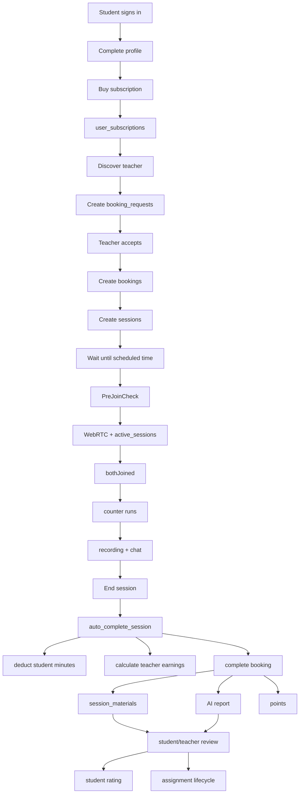

---

## 32. التوصية الهندسية النهائية

الترتيب الصحيح لتثبيت المنظومة:

1. بناء RPC موحدة لقبول مجموعة الطلبات والتحقق من الرصيد والتعارض وإنشاء الحجوزات.
2. جعل إنهاء الجلسة وخصم الدقائق والفوترة عملية idempotent بقيد خادم واضح.
3. تثبيت معادلة التسعير النهائية في Function واحدة موثقة واختبارها بأمثلة رقمية.
4. فصل `teacher_earnings` عن `wallets` بوضوح في الواجهة والأسماء والتقارير.
5. حماية التسجيلات بـSigned URLs وسياسات Storage غير عامة.
6. جعل `save-session-recording` و`session-report` قابلين لإعادة المحاولة دون تكرار المادة أو النقاط.
7. فرض أدوار الطالب والمعلم على مستوى Router وRLS وEdge Functions.
8. إضافة idempotency للدفع والاشتراك والفواتير.
9. إضافة قيود انتقال للحالات بدلاً من السماح بتحديث text status عشوائياً.
10. إضافة unique/attempt policy واضحة لتسليمات الواجبات.
11. ربط Realtime بتحديثات جزئية بدلاً من إعادة تحميل لوحة كاملة عند كل حدث.
12. تنفيذ اختبارات E2E للمسار الكامل:

```text
اشتراك
→ طلب حجز
→ قبول
→ booking
→ session
→ counter
→ recording
→ auto_complete
→ خصم الطالب
→ رصيد المعلم
→ material/report
→ assignment/quiz
→ rating
```

---

## 33. الخلاصة

المنصة تحتوي على دورة متكاملة من الناحية الوظيفية، لكن أهم نقاط المال والزمن والصلاحية موزعة بين React وRLS وTriggers وEdge Functions. لذلك لا يكفي أن تظهر الواجهة الحالة الصحيحة؛ يجب أن تكون قاعدة البيانات هي التي تضمن:

- من يملك الحجز.
- من يحق له قبول الطلب.
- كم دقيقة يملك الطالب.
- كم دقيقة تخصم فعلياً.
- متى تبدأ الجلسة.
- متى تنتهي.
- كم يساوي ربح المعلم.
- كم عمولة المنصة.
- هل التسجيل متاح ولمن.
- هل الدرجة نهائية ومن اعتمدها.

المسار الإنتاجي الآمن هو نقل كل انتقال حساس إلى Transaction/RPC/Trigger موثوق، ثم جعل الواجهتين الطالبية والمعلمية تعرضان هذه الحقيقة بدلاً من إعادة حسابها بشكل مستقل.