# المخطط الهندسي الرئيسي المتكامل لمنصة التعليم

## 0. الغرض من الوثيقة

هذه الوثيقة هي المرجع الموحد لبنية منصة التعليم وآلية تشغيلها. تربط كل قسم ظاهر للمستخدم مع:

- المسار والواجهة.
- الجداول التي يقرأ منها.
- الجداول التي يكتب فيها.
- الصلاحية المطلوبة.
- الـ RPC أو Edge Function أو Trigger المسؤول.
- الإشعار الناتج.
- التحديث الفوري Realtime.
- الحالة قبل العملية وبعدها.
- الأخطاء التي يجب منعها.

النطاق يشمل:

1. المصادقة وإنشاء الحساب وإكمال الملف.
2. حساب الطالب بالكامل.
3. حساب المعلم بالكامل.
4. لوحة الإدارة والرقابة.
5. ولي الأمر والدعم.
6. الباقات والدفع والفواتير.
7. البحث والحجز والقبول.
8. الجلسات المباشرة والعداد والتسجيل.
9. المواد والتقارير والتقييم.
10. الواجبات والاختبارات وبنك الأسئلة.
11. الأرباح والسحب ومحفظة الاتصال.
12. الإشعارات والدردشة والدعم.
13. النقاط والمستويات والشارات.
14. RLS وRealtime والعمليات الخلفية.
15. حالات التزامن وIdempotency والفجوات الإنتاجية.

هذه وثيقة تحليل وتصميم مرجعي للواقع الحالي في فرع `main`. لا تنفذ Migration أو تغييراً خارجياً بمفردها.

---

## 1. الرؤية التشغيلية للمنصة

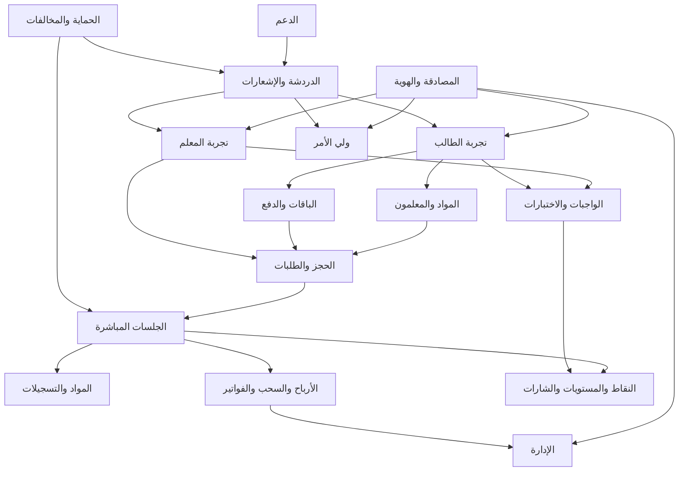

### 1.1 قاعدة العمل الأساسية

الواجهة تعرض الحالة، لكنها لا تملك الحقيقة المالية أو الأمنية. الحقيقة النهائية يجب أن تكون في:

- PostgreSQL.
- RLS.
- RPC ذرية.
- Triggers.
- Edge Functions بصلاحيات خادم.
- Stripe Webhooks عند الدفع.

ولا يجوز أن يعتمد النظام في الأمور الحساسة على:

- حساب React للرصيد.
- ساعة جهاز المستخدم.
- `localStorage`.
- تغيير status مباشر من العميل.
- قيمة مرسلة من العميل للسعر أو الربح أو الخصم.

---

## 2. طبقات النظام

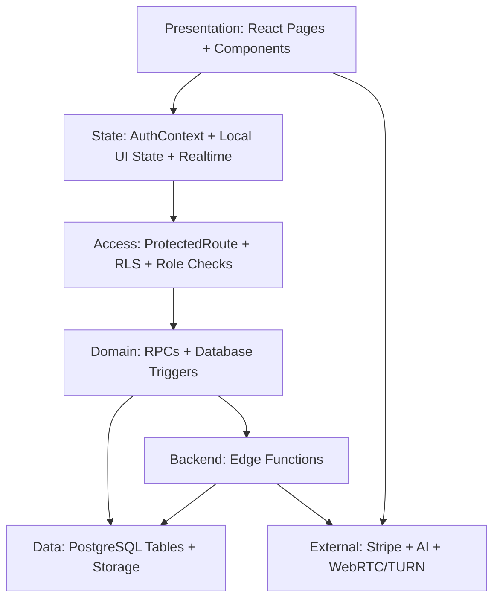

### 2.1 طبقة العرض

تشمل:

- الصفحات.
- الجداول.
- التقويم.
- البطاقات.
- النوافذ المنبثقة.
- مشغلات التسجيل.
- نماذج الحجز.
- نماذج الواجبات.
- Toasts.
- أصوات الإشعارات.

### 2.2 طبقة الحالة

تشمل:

- `AuthContext`.
- profile الحالي.
- الأدوار.
- الإشعارات غير المقروءة.
- حالة الاتصال بالجسلة.
- حالة تحميل البيانات.
- قيم الفورم المؤقتة.
- local storage الخاص بقفل التبويب أو الإخفاء المحلي.

### 2.3 طبقة الوصول

يجب أن تعمل ثلاث طبقات معاً:

| الطبقة | وظيفتها |
|---|---|
| Router guard | منع فتح المسار غير المناسب |
| RLS | منع قراءة/كتابة صفوف غير مملوكة |
| RPC/Edge authorization | منع تنفيذ العملية حتى لو حاول العميل الالتفاف |

### 2.4 طبقة المجال

هي المكان الصحيح لـ:

- قبول الطلب.
- حجز الدقائق.
- منع التعارض.
- إنهاء الجلسة.
- الخصم.
- التسوية المالية.
- اعتماد الدرجة.
- تغيير الحالات.

### 2.5 طبقة البيانات

تحتوي:

- جداول المجال.
- القيود.
- الفهارس.
- العلاقات.
- الـTriggers.
- Storage policies.
- Audit logs.

---

## 3. خريطة المسارات والأقسام

### 3.1 عام ومصادقة

| المسار | القسم | البيانات |
|---|---|---|
| `/` | الصفحة الرئيسية | إعدادات عامة ومحتوى تسويقي |
| `/login` | الدخول والتسجيل وOTP/OAuth | Auth + profiles |
| `/register` | تحويل إلى التسجيل | Auth |
| `/signup` | تحويل إلى التسجيل | Auth |
| `/teacher-register` | تسجيل معلم | Auth + role request |
| `/teacher-signup` | تسجيل معلم | Auth + role request |
| `/forgot-password` | نسيان كلمة المرور | Auth |
| `/reset-password` | إعادة كلمة المرور | Auth |
| `/complete-profile` | استكمال الملف | `profiles` |
| `/pricing` | الباقات | `subscription_plans` |
| `/teach-with-us` | الانضمام كمعلم | ملف/طلب معلم حسب المسار |
| `/faq` | الأسئلة الشائعة | محتوى ثابت |
| `/help` | مركز المساعدة | محتوى ثابت/الدعم |
| `/privacy` | الخصوصية | محتوى ثابت |
| `/terms` | الشروط | محتوى ثابت |
| `/refund` | الاسترجاع | محتوى ثابت |

### 3.2 الطالب

| المسار | القسم |
|---|---|
| `/dashboard` | تحويل حسب الدور |
| `/student` | لوحة الطالب |
| `/search` | البحث عن المعلمين |
| `/booking` | الحجز |
| `/subscription-details` | الاشتراك والدقائق |
| `/invoices` | الفواتير |
| `/payment-success` | نتيجة الدفع |
| `/session` | الجلسة الحية |
| `/chat` | الدردشة |
| `/support` | الدعم |
| `/profile` | الملف |
| `/rating` | تقييم الجلسة |
| `/student/assignments` | الواجبات والاختبارات |
| `/ai-tutor` | المدرس الذكي |
| `/homework-solver` | حل الواجبات |
| `/parent` | ولي الأمر |

### 3.3 المعلم

| المسار | القسم |
|---|---|
| `/teacher` | لوحة المعلم |
| `/teacher/wallet` | محفظة المكالمات |
| `/teacher/assignments` | الواجبات والاختبارات |
| `/teacher/assignments/review/:id` | مراجعة التسليم |
| `/session` | الجلسة الحية |
| `/chat` | الدردشة |
| `/support` | الدعم |
| `/profile` | الملف |

### 3.4 الإدارة

| المسار | القسم |
|---|---|
| `/admin-login` | دخول الإدارة |
| `/admin` | لوحة الإدارة |
| `/admin/students/:id` | ملف طالب إداري |
| `/admin/teachers/:id` | ملف معلم إداري |

---

## 4. نموذج المستخدمين والأدوار

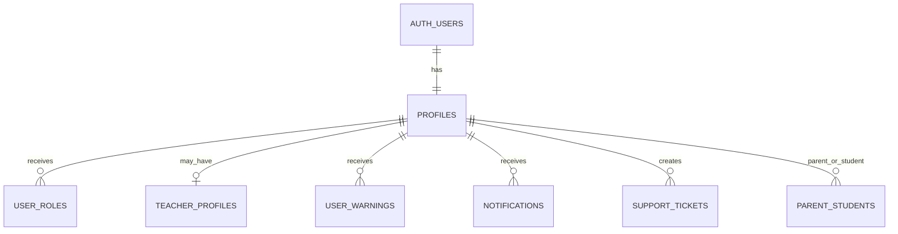

### 4.1 `profiles`

الملف الرئيسي للمستخدم:

- `user_id`.
- `full_name`.
- `phone`.
- `avatar_url`.
- المرحلة/البيانات الشخصية.
- اكتمال الملف.
- بيانات التواصل التي تحتاج حماية.

### 4.2 `public_profiles`

نسخة آمنة للعرض العام، يستخدمها:

- الطالب لرؤية المعلم.
- المعلم لرؤية الطالب.
- الجداول والتقارير.

يجب ألا تحتوي على:

- بيانات مالية.
- هاتف خاص غير مصرح.
- بيانات أمنية.
- مفاتيح أو معرفات داخلية غير لازمة.

### 4.3 `user_roles`

الأدوار الأساسية:

```text
student
teacher
admin
parent
support أو صلاحيات مخصصة
```

يجب استخدام:

```text
has_role(user_id, role)
has_permission(user_id, permission)
```

بدلاً من الثقة في role مخزن في المتصفح.

### 4.4 `teacher_profiles`

يحتوي على:

- الاعتماد والموافقة.
- `hourly_rate`.
- النبذة.
- الخبرة.
- جدول الأيام.
- ساعات التوفر.
- حالة الظهور.
- الإحصاءات العامة.

### 4.5 `teacher_subjects` و`subjects`

تربطان:

- المعلم بالمادة.
- المادة بالمرحلة.
- البحث بالحالة المعتمدة.
- الحجز باسم المادة.

---

## 5. قاعدة البيانات حسب المجالات

### 5.1 الهوية والصلاحيات

- `profiles`
- `public_profiles`
- `user_roles`
- `user_permissions` أو جداول الصلاحيات المرتبطة
- `user_warnings`
- `violations`
- `system_logs`
- `audit_logs` المالية والإدارية

### 5.2 المعلمون والمواد

- `teacher_profiles`
- `public_teacher_profiles`
- `teacher_subjects`
- `subjects`
- `teacher_daily_stats`

### 5.3 الاشتراك والدفع

- `subscription_plans`
- `user_subscriptions`
- `payment_records`
- `invoices`
- `invoice_zatca_log`
- `financial_settings`
- `financial_months`
- `financial_reconciliation`

### 5.4 الحجز والجلسة

- `booking_requests`
- `bookings`
- `sessions`
- `active_sessions`
- `session_events`
- `webrtc_signals`
- `session_materials`

### 5.5 التواصل والإشعارات

- `chat_messages`
- `notifications`
- `support_tickets`
- `support_messages`
- `internal_calls`
- `call_events` أو بيانات الاتصال ذات الصلة

### 5.6 التعليم والتقييم

- `assignments`
- `assignment_submissions`
- `question_bank`
- `reviews`
- `student_points`
- `student_levels`
- `badges`
- `student_badges`
- `ai_logs`

### 5.7 أرباح المعلم

- `teacher_earnings`
- `withdrawal_requests`
- `teacher_daily_stats`
- `financial_reconciliation`

### 5.8 المحفظة الهاتفية

- `wallets`
- `wallet_transactions`
- بيانات المكالمات الداخلية

### 5.9 Storage

- `session-recordings`
- `assignment-files`
- مرفقات الدردشة.
- مرفقات الدعم.
- مرفقات السحب عند وجودها.

---

## 6. العلاقات المركزية

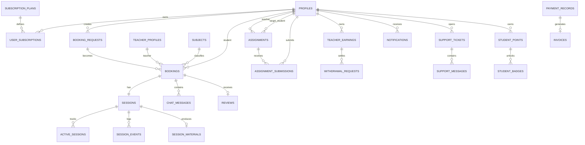

---

## 7. دورة إنشاء الحساب وإكمال الملف

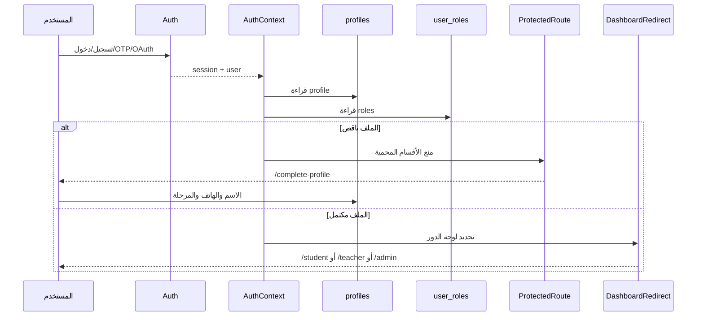

### 7.1 واجهة الدخول

الوظائف:

- تسجيل جديد.
- دخول.
- OTP.
- OAuth.
- تفعيل دور معلم من query parameter.
- نسيان كلمة المرور.
- إعادة تعيين كلمة المرور.

### 7.2 إكمال الملف

`CompleteProfile` يكتب:

- الاسم الكامل.
- الهاتف.
- المرحلة الدراسية.
- أي حقول مطلوبة لإكمال الحساب.

يجب أن يكون الإكمال idempotent، بحيث يمكن للمستخدم إعادة فتح الصفحة دون إنشاء profile ثانٍ.

### 7.3 التحويل حسب الدور

`/dashboard` لا يجب أن يقرر الدور من قيمة غير موثوقة. الترتيب المقترح:

```text
admin -> /admin
teacher -> /teacher
parent -> /parent
student -> /student
```

إذا امتلك المستخدم أكثر من دور، يحتاج النظام إلى سياسة اختيار صريحة.

---

## 8. لوحة الطالب: الأقسام والبيانات والوظائف

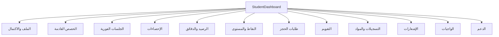

### 8.1 بطاقة الملف

تقرأ:

- `profiles`.
- حالة اكتمال الملف.
- `AuthContext`.

تنتج:

- اسم الطالب.
- الصورة.
- رابط تعديل الملف.
- تنبيه إكمال الملف.

### 8.2 الحصص القادمة

الاستعلامات المنطقية:

```text
bookings.student_id = auth.uid()
AND (
  scheduled_at >= now()
  OR session_status = 'in_progress'
)
```

تضم:

- اسم المعلم من `public_profiles`.
- اسم المادة من `subjects`.
- الوقت.
- المدة.
- status.
- session_status.
- رابط الجلسة.
- رابط الدردشة.
- زر الإلغاء عند تحقق شروط الإلغاء.

### 8.3 الإحصاءات

من `bookings` و`sessions` و`reviews`:

- الجلسات المكتملة.
- الجلسات الملغاة.
- الوقت الفعلي.
- التقدم.
- النقاط.

حساب الوقت:

```text
إذا deducted_minutes > 0:
    actual_seconds = deducted_minutes * 60
وإلا إذا duration_seconds > 0:
    actual_seconds = duration_seconds
وإلا:
    actual_seconds = ended_at - started_at
```

### 8.4 رصيد الاشتراك

يعرض:

- الدقائق المتبقية.
- عدد الجلسات المتبقية.
- تاريخ الانتهاء.
- تنبيه قرب انتهاء الرصيد.
- تنبيه انخفاض الدقائق.
- رابط `/pricing` عند عدم وجود رصيد.

المصدر:

```text
user_subscriptions
JOIN subscription_plans
```

### 8.5 طلبات الحجز المعلقة

تعرض:

- الطلب المفتوح.
- المعلم/المادة.
- الوقت.
- مدة الجلسة.
- انتهاء الطلب.
- زر الإلغاء.

لا يجوز للواجهة اعتبار الطلب مقبولاً حتى يحدث `booking` فعلياً.

### 8.6 التقويم والجدول

`ScheduledSessionsCalendar` و`StudentScheduleTable` يعرضان:

- الجلسات المجدولة.
- الجلسات الفورية المقبولة.
- التذكيرات.
- الانضمام.
- الدردشة.
- الإخفاء المحلي لبعض العناصر.

الإخفاء المحلي لا يغير السجل في قاعدة البيانات.

### 8.7 المواد والتسجيلات

من:

- `session_materials`.
- `sessions.ai_report`.
- `bookings`.
- `subjects`.

ويجب أن يرى الطالب مواده فقط:

```text
auth.uid() = student_id
AND is_deleted = false
AND expires_at > now()
```

### 8.8 الواجبات

الرابط:

```text
/student/assignments
```

يعرض:

- غير المسلم.
- المسلم بانتظار التصحيح.
- المصحح آلياً.
- المعتمد من المعلم.
- الدرجة.
- الملاحظات.
- المرفقات.
- الموعد النهائي.

### 8.9 النقاط والمستوى والشارات

المصدر:

- `student_points`.
- `student_levels`.
- `badges`.
- `student_badges`.

الأحداث التي قد تزيد النقاط:

- إنهاء جلسة.
- أداء جيد في تقرير AI.
- تسليم واجب.
- تحقيق إنجاز.

يجب جعل إضافة النقاط RPC أو Trigger idempotent، لا update عشوائياً من الواجهة.

### 8.10 فواتير الطالب

الرابط:

```text
/invoices
```

يعرض:

- رقم الفاتورة.
- المبلغ.
- VAT.
- حالة الدفع.
- حالة ZATCA.
- PDF.
- رابط التحميل.

المصادر:

- `payment_records`.
- `invoices`.
- `invoice_zatca_log`.

---

## 9. البحث والحجز من جهة الطالب

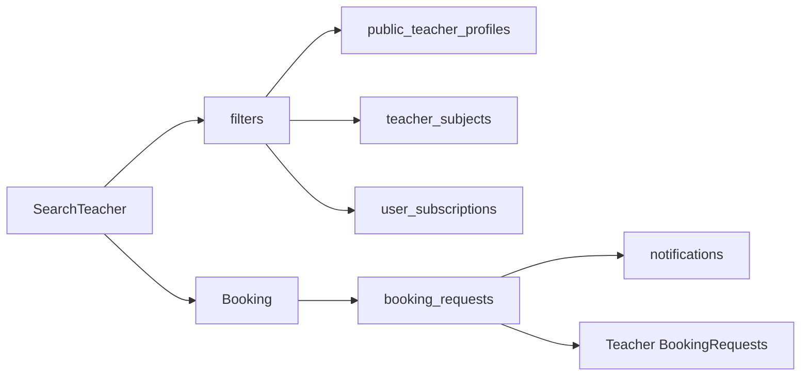

### 9.1 البحث

الفلاتر:

- المادة.
- المرحلة.
- التقييم.
- السعر.
- التوفر.
- اسم المعلم.

لا تظهر بيانات معلم غير معتمد:

```text
teacher_profiles.is_approved = true
```

### 9.2 إنشاء طلب الحجز

الطالب يحدد:

- المعلم أو broadcast.
- المادة.
- التاريخ والوقت.
- مدة الجلسة.
- المرحلة.
- ملاحظة اختيارية.

قبل الإرسال:

1. فحص profile.
2. فحص الاشتراك.
3. فحص الدقائق القابلة للحجز.
4. فحص الوقت السابق.
5. فحص صيغة البيانات.

بعد الإرسال:

1. `booking_requests.status = open`.
2. إنشاء إشعار للمعلم/المعلمين.
3. تحديث جدول الطالب Realtime.
4. منع إنشاء طلب مكرر لنفس الطالب والوقت والمعلم.

---

## 10. لوحة المعلم: الأقسام والبيانات والوظائف

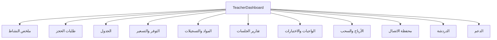

### 10.1 ملخص النشاط

من:

- `bookings`.
- `sessions`.
- `teacher_daily_stats`.
- `teacher_earnings`.
- `reviews`.

يعرض:

- الجلسات القادمة.
- الطلبات الجديدة.
- الجلسات المكتملة.
- إجمالي الدقائق.
- متوسط التقييم.
- الأرباح.
- السحب المتاح.

### 10.2 طلبات الحجز

`BookingRequests`:

- يستمع إلى الطلبات الجديدة.
- يفلتر حسب المواد المعتمدة.
- يعرض الطالب والمادة والوقت.
- يجمع `group_id`.
- يفحص التعارض.
- يفحص الجلسات النشطة.
- يقبل أو يرفض.

### 10.3 قبول الطلب

العملية الصحيحة:

```text
lock booking_request
lock student subscriptions
lock teacher time slot
validate request
validate balance
validate no overlap
create booking
create session
mark request accepted
emit notifications
commit
```

يجب ألا تنفذ هذه العملية كعدة عمليات مستقلة في المتصفح.

### 10.4 جدول المعلم

يعرض:

- الجلسات القادمة.
- الجلسات الفورية.
- اسم الطالب.
- المادة.
- الوقت.
- حالة الجلسة.
- زر الدردشة.
- زر الإلغاء وفق السياسة.
- زر الانضمام.

### 10.5 التوفر والتسعير

`SchedulePricingManager` يعدل:

- الأيام المتاحة.
- من وإلى.
- الوصف.
- الخبرة.
- السعر بالساعة.

قواعد الحفظ:

- منع `available_from >= available_to`.
- منع سعر سالب.
- وضع سقف تسعير أو حماية من عمولة سالبة.
- حفظ timestamp للتعديل.
- عدم تغيير أرقام جلسات مكتملة بأثر رجعي.

### 10.6 المواد والتسجيلات

المعلم يرى مواده إذا:

```text
teacher_id = auth.uid()
AND is_deleted = false
AND expires_at > now()
```

ويستطيع:

- تشغيل التسجيل.
- قراءة مدة الجلسة.
- قراءة تقرير AI.
- تنزيل الملف إذا سمحت السياسة.

### 10.7 تقارير الجلسات

`TeacherSessionReports` يقرأ:

- الحجوزات الخاصة بالمعلم.
- الجلسات المرتبطة.
- `ai_report`.
- الطالب والمادة.

يعرض:

- درجة الأداء.
- ملخص الجلسة.
- عدد الرسائل.
- المخالفات.
- الأسئلة المكتشفة.
- أمثلة التبادل.

### 10.8 واجبات واختبارات

المعلم:

1. ينشئ Assignment أو Quiz.
2. يحدد طالباً أو يجعله عاماً.
3. يكتب الأسئلة.
4. يستورد من بنك الأسئلة.
5. يرفع مرفقات.
6. يحدد الموعد.
7. يرسل إشعارات ورسائل.
8. يراقب التسليمات.
9. يشغل AI grading.
10. يعتمد الدرجة أو يعدلها.

### 10.9 الأرباح والسحب

يعرض:

- confirmed.
- pending.
- paid.
- available.
- إجمالي الجلسات.
- إجمالي الدقائق.
- السحوبات.
- الحالة المالية.

### 10.10 محفظة الاتصال

`/teacher/wallet` منفصل عن أرباح التدريس:

- رصيد المكالمات.
- شحن.
- خصم مكالمة.
- تاريخ الحركات.
- حالة المكالمة.

الوظائف:

```text
credit_wallet_balance
deduct_wallet_balance
start_internal_call
respond_internal_call
mark_internal_call_connected
end_internal_call
```

---

## 11. دورة الحجز الكاملة والربط بين الطرفين

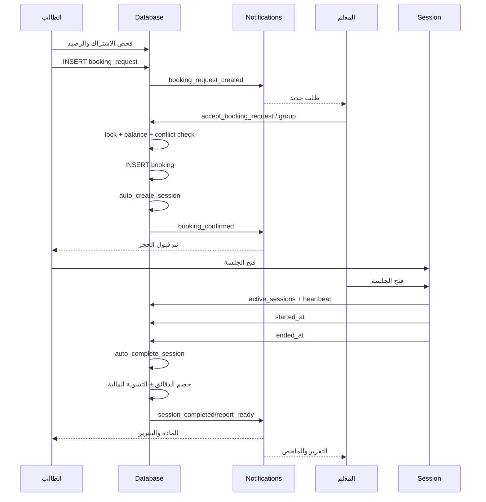

---

## 12. حالات الطلب والحجز والجلسة

### 12.1 `booking_requests`

```text
open
accepted
rejected
cancelled
expired
```

### 12.2 `bookings.status`

```text
pending
confirmed
completed
cancelled
```

### 12.3 `bookings.session_status`

```text
not_started
waiting_acceptance
in_progress
completed
cancelled
rejected
expired
```

### 12.4 `sessions`

الحالات المستنتجة من الحقول:

```text
created
waiting
started
ended
short_session
settled
```

### 12.5 الانتقالات المسموحة

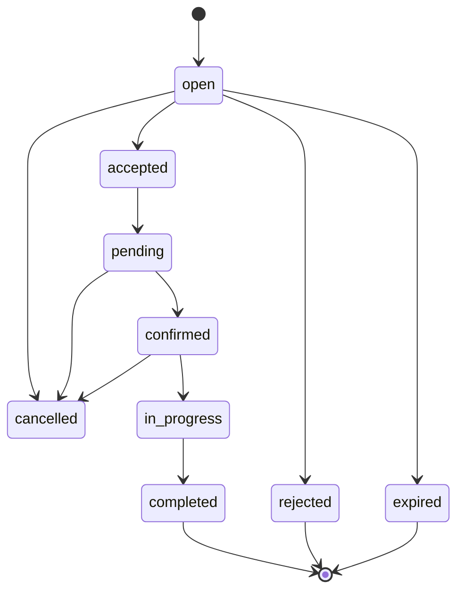

يجب رفض الانتقال العكسي، مثل:

```text
completed -> confirmed
paid -> pending
reviewed -> submitted
```

إلا بعملية تصحيح إدارية مدققة.

---

## 13. عداد الجلسة والحضور

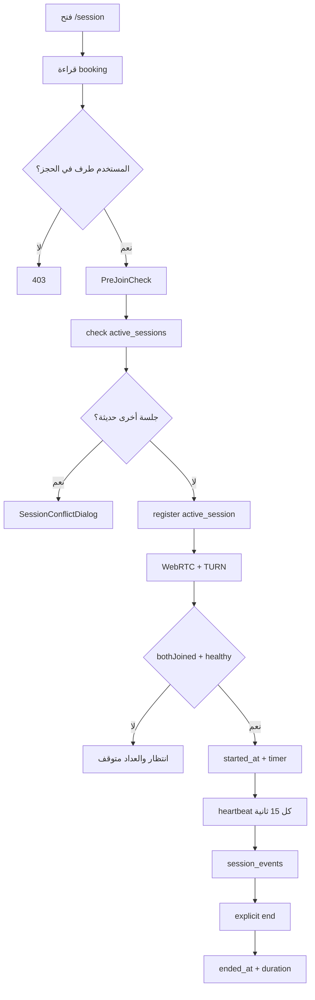

### 13.1 قواعد `active_sessions`

- قيد فريد على `user_id, booking_id`.
- heartbeat كل 15 ثانية.
- جلسة تعتبر فعالة إذا كان آخر heartbeat أقل من 30 ثانية.
- عند stale يتم وضع `is_connected = false`.
- stale لا ينهي الجلسة تلقائياً.
- الإنهاء يحتاج فعل صريح أو سياسة خادم.

### 13.2 بداية العداد

المصدر الموصى به:

```text
started_at = server timestamp
```

ولا يعتمد على:

```text
Date.now() من جهاز أحد الطرفين
```

ويجب تعريف ما إذا كان العداد يبدأ عند:

1. اتصال الطرفين.
2. قبول المعلم.
3. تشغيل الجلسة يدوياً.

القاعدة الموصى بها: يبدأ عند تحقق اتصال الطرفين وتسجيل `started_at` خادمياً.

### 13.3 نهاية العداد

يتوقف عند:

- ضغط أحد الطرفين على إنهاء.
- سياسة timeout خادمية.
- إلغاء إداري.

لا يتوقف لمجرد:

- إغلاق تبويب مؤقت.
- heartbeat stale.
- فقدان اتصال قصير.

---

## 14. إنهاء الجلسة والتسوية المالية

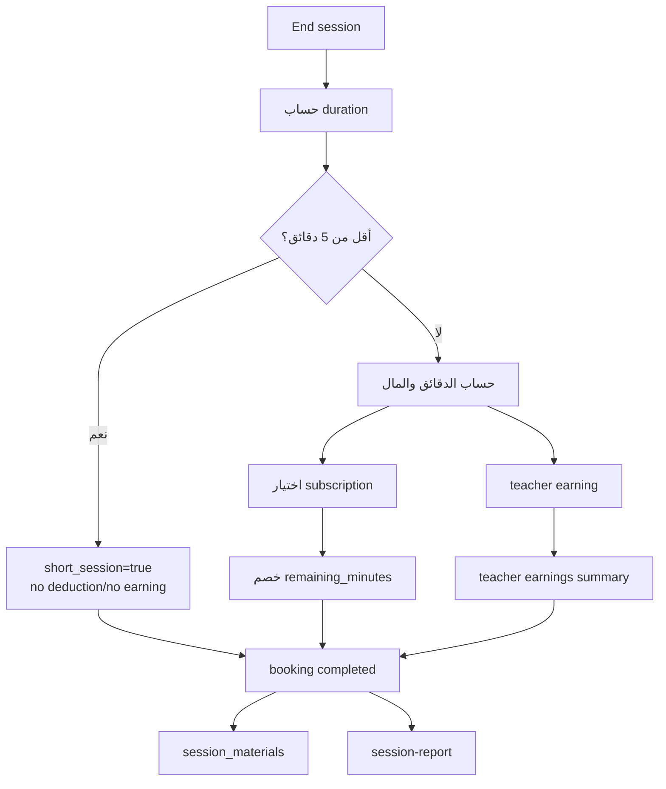

### 14.1 حساب المدة

الأولوية:

```text
duration_seconds > 0
    => ceil(duration_seconds / 60)
duration_minutes > 0
    => duration_minutes
started_at + ended_at
    => ceil(wall_seconds / 60)
```

### 14.2 جلسة أقل من 5 دقائق

```text
deducted_minutes = 0
teacher_earning = 0
gross_amount = 0
platform_fee = 0
teacher_base_amount = 0
vat_amount = 0
net_amount = 0
```

### 14.3 جلسة مؤهلة

حسب آخر منطق ظاهر في migrations:

```text
gross_amount = (duration_minutes / 60) * 60
teacher_base_amount = (duration_minutes / 60) * hourly_rate
platform_fee = gross_amount - teacher_base_amount
teacher_earning = teacher_base_amount
net_amount = teacher_base_amount
vat_amount = gross_amount * vat_rate / (100 + vat_rate)
deducted_minutes = duration_minutes
```

يجب التحقق من تعريف function الفعلي في قاعدة الإنتاج قبل اعتماد التقارير النهائية، لأن منطق التسعير تغير عبر عدة migrations.

### 14.4 منع التكرار

يجب أن يتحقق الـTrigger من:

```text
OLD.ended_at IS NULL
AND NEW.ended_at IS NOT NULL
```

ويفضل وجود:

```text
billing_applied_at
material_created_at
report_generated_at
```

أو مفاتيح idempotency تعادلها.

---

## 15. الباقات والدفع والفواتير

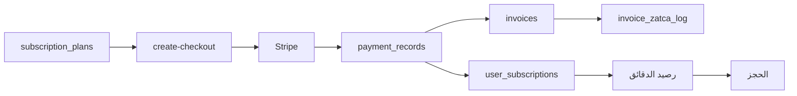

### 15.1 `subscription_plans`

يمثل المنتج:

- السعر.
- عدد الجلسات.
- مدة الجلسة.
- خصائص AI.
- التسجيل.
- الأولوية.

### 15.2 `user_subscriptions`

يمثل اشتراك مستخدم:

- `user_id`.
- `plan_id`.
- `remaining_minutes`.
- `sessions_remaining`.
- `is_active`.
- `starts_at`.
- `ends_at`.
- `session_duration_minutes`.
- معرّفات Stripe.

### 15.3 الدفع

`create-checkout`:

1. يتحقق من المستخدم.
2. يقرأ الباقة من DB.
3. يستخدم السعر الخادم.
4. يطبق promo عبر Stripe.
5. ينشئ checkout session.
6. يسجل `payment_records`.
7. يفعّل الباقة المجانية وفق سياسة الاستخدام.

### 15.4 Webhook وIdempotency

يجب أن يكون لكل عملية Stripe مفتاح مرجعي فريد:

```text
stripe_checkout_session_id
stripe_subscription_id
stripe_payment_intent_id
```

ويجب ألا يؤدي refresh أو تكرار webhook إلى:

- اشتراكين.
- فاتورتين.
- إضافة دقائق مرتين.

---

## 16. نظام الإشعارات المتكامل

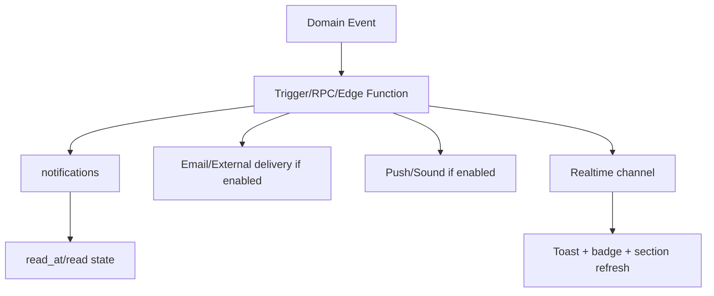

### 16.1 سجل `notifications`

الحقول المستخدمة وظيفياً:

- `user_id`.
- `title`.
- `body`.
- `type`.
- `link`.
- `created_at`.
- حالة القراءة أو `read_at` حسب schema.

### 16.2 قواعد الإشعار

كل إشعار يجب أن يحدد:

1. صاحب الإشعار.
2. المصدر.
3. نوع الحدث.
4. الرابط الآمن.
5. وقت الإنشاء.
6. مفتاح منع التكرار.
7. قناة العرض.

### 16.3 مصفوفة الأحداث

| الحدث | المنشئ | المستلم | النوع | الرابط |
|---|---|---|---|---|
| تسجيل جديد | Auth | المستخدم | `welcome` | `/complete-profile` |
| نقص الملف | AuthContext | المستخدم | `profile_incomplete` | `/complete-profile` |
| طلب حجز جديد | الطالب | المعلم | `booking_request` | `/teacher` |
| قبول الحجز | المعلم | الطالب | `booking_confirmed` | `/student` |
| رفض الحجز | المعلم | الطالب | `booking_rejected` | `/student` |
| إلغاء الحجز | الطالب | المعلم | `booking_cancelled` | `/teacher` |
| قرب الجلسة | scheduler | الطرفان | `session_reminder` | `/session` |
| جلسة فورية | النظام | المعلم | `instant_session` | `/session` |
| دخول الطرف الآخر | الجلسة | الطرف الآخر | `participant_joined` | `/session` |
| انتهاء الجلسة | النظام | الطرفان | `session_completed` | `/student` أو `/teacher` |
| توفر التسجيل | النظام | الطرفان | `recording_ready` | `/student` أو `/teacher` |
| توفر التقرير | AI | الطرفان | `session_report` | `/student` أو `/teacher` |
| تقييم جديد | الطالب | المعلم | `rating_received` | `/teacher` |
| واجب جديد | المعلم | الطالب | `assignment` | `/student/assignments` |
| تسليم واجب | الطالب | المعلم | `assignment_submitted` | `/teacher/assignments` |
| تصحيح جاهز | المعلم/AI | الطالب | `assignment_graded` | `/student/assignments` |
| رسالة جديدة | أي طرف | الطرف الآخر | `chat_message` | `/chat` |
| تذكرة جديدة | المستخدم | الدعم | `support_ticket` | `/support` |
| رد الدعم | الدعم | المستخدم | `support_reply` | `/support` |
| انخفاض الرصيد | scheduler | الطالب | `balance_low` | `/subscription-details` |
| قرب انتهاء الباقة | scheduler | الطالب | `subscription_expiring` | `/subscription-details` |
| طلب سحب | المعلم | الإدارة | `withdrawal_requested` | `/admin` |
| تحديث السحب | الإدارة | المعلم | `withdrawal_status` | `/teacher` |
| مخالفة | الحماية | المستخدم/الإدارة | `violation` | `/support` أو `/admin` |
| فشل AI | Edge Function | الإدارة | `ai_error` | `/admin` |

### 16.4 الصوت وToast

`ChatNotificationToast` و`useNotificationSound` يعرضان الرسائل الجديدة. يجب منع:

- تشغيل الصوت لنفس الإشعار مرتين.
- ظهور Toast للمستخدم الذي أرسل الرسالة لنفسه.
- تكرار notification بسبب Realtime + fetch.

المفتاح المقترح:

```text
notification.id
```

### 16.5 القراءة

عند فتح القسم:

1. يتم تحميل الإشعارات.
2. يظهر غير المقروء في badge.
3. عند العرض يتم `mark as read`.
4. لا يحذف السجل إلا بسياسة واضحة.

---

## 17. Realtime والقنوات

| المجال | الجدول/القناة | المستخدم |
|---|---|---|
| ملف المستخدم | `profiles` | صاحب الملف |
| حجوزات الطالب | `bookings` | الطالب |
| طلبات المعلم | `booking_requests` | المعلم المؤهل |
| الجلسة | `sessions` | طرفا الحجز |
| الحضور | `active_sessions` | طرفا الجلسة |
| إشارات WebRTC | `webrtc_signals` | طرفا الجلسة |
| الدردشة | `chat_messages` | المشاركون |
| الإشعارات | `notifications` | صاحب الإشعار |
| النقاط | `student_points` | الطالب |
| الاشتراك | `user_subscriptions` | الطالب |
| الدعم | `support_messages` | صاحب التذكرة والدعم |
| المحفظة | `wallets` | المعلم |

### 17.1 قاعدة عدم إعادة التحميل الشامل

عند وصول حدث Realtime:

- حدث حجز: حدث العنصر نفسه.
- إشعار: زد badge وأضف العنصر.
- رسالة: أضف الرسالة.
- اشتراك: أعد حساب الرصيد.
- جلسة: حدث timer/status.

لا تعِد تحميل لوحة كاملة لكل حدث، لتجنب race conditions والضغط غير الضروري.

---

## 18. الجلسة المباشرة: كل المكونات

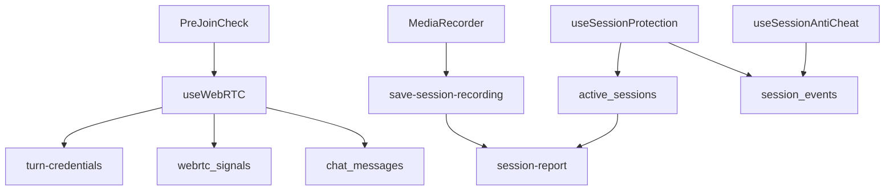

### 18.1 PreJoinCheck

يفحص:

- الكاميرا.
- الميكروفون.
- السماح في المتصفح.
- الأجهزة المتاحة.
- إمكانية تشغيل WebRTC.

### 18.2 الحماية

`useSessionProtection`:

- يسجل الدخول والخروج.
- heartbeat.
- يمنع جلسة تبويب ثانية.
- ينظف الجلسة القديمة.
- يرصد peer stale.

`useSessionAntiCheat`:

- قفل التبويبات.
- مراقبة سلوك المستخدم.
- تسجيل الأحداث الأمنية.

### 18.3 WebRTC

`useWebRTC` مسؤول عن:

- offer/answer.
- ICE candidates.
- peer connection.
- data channel.
- الصوت والفيديو.
- مشاركة الشاشة.

### 18.4 التسجيل

مسار البيانات:

```text
MediaRecorder
→ chunks
→ local backup
→ Storage session-recordings
→ save-session-recording
→ sessions.recording_url
→ session_materials.recording_url
```

---

## 19. المواد والتسجيلات والتقارير

### 19.1 `session_materials`

العلاقة:

```text
session_id UNIQUE
teacher_id
student_id
recording_url
duration_minutes
expires_at
is_deleted
```

### 19.2 Trigger المادة

`auto_create_session_material`:

1. يعمل عند نهاية الجلسة.
2. يتجاهل أقل من 5 دقائق حسب النسخة الحالية.
3. ينشئ مادة واحدة.
4. يمنع التكرار بـ`ON CONFLICT`.

### 19.3 Signed URL

لا تعرض `recording_url` الخام كمصدر عام. يجب:

1. استخراج path.
2. إنشاء Signed URL.
3. مدة صلاحية قصيرة.
4. التأكد أن المستخدم طرف في الحجز.

### 19.4 تقرير AI

`session-report`:

- يقرأ الحجز.
- يجمع الحوار والأحداث.
- ينشئ JSON.
- يحفظ `sessions.ai_report`.
- يحدث نقاط الطالب.
- ينشئ إشعاراً للطرفين.
- يسجل `ai_logs`.

في حال فشل AI:

- لا يجب فقد الجلسة أو التسجيل.
- ينشأ log فشل.
- يرسل إشعاراً للإدارة.
- يسمح بإعادة المحاولة دون تكرار النقاط أو الإشعارات.

---

## 20. الواجبات والاختبارات وبنك الأسئلة

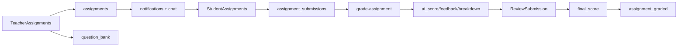

### 20.1 إنشاء المحتوى

الحقول المنطقية:

- المعلم.
- الطالب الاختياري.
- العنوان.
- الوصف.
- المادة.
- المرحلة.
- النوع.
- الأسئلة.
- الدرجات.
- الموعد.
- المرفقات.
- خصائص الإجابة.

### 20.2 إرسال المحتوى

يجب تحديد:

- هل المحتوى عام؟
- هل هو لجميع طلاب المعلم؟
- هل هو لطالب محدد؟
- هل يتطلب اشتراكاً نشطاً؟
- هل يفتح بعد تاريخ معين؟

### 20.3 التسليم

`assignment_submissions` يرتبط بـ:

- assignment.
- student.
- answers.
- files.
- status.
- timestamps.
- AI grade.
- teacher grade.
- final grade.

### 20.4 التحقق

قبل التسليم:

- الواجب موجود.
- الطالب مسموح.
- الموعد لم ينتهِ أو توجد سياسة late.
- لم يتم التسليم سابقاً أو يسمح بمحاولة جديدة.
- الملفات ضمن النوع والحجم.
- الدرجات لا تتجاوز الإجمالي.

### 20.5 التصحيح

```text
submitted
→ ai_graded
→ reviewed
```

الـAI لا يصبح نهائياً إلا إذا:

- اعتمده المعلم.
- أو توجد سياسة تلقائية معلنة.

### 20.6 حماية الدرجات

الطالب يستطيع:

- إنشاء submission باسمه.
- قراءة نتيجته.

ولا يستطيع:

- تغيير `ai_score`.
- تغيير `teacher_score`.
- تغيير `final_score`.
- تغيير `reviewed_at`.

المعلم يستطيع تعديل التسليمات المرتبطة بواجباته فقط.

---

## 21. الدردشة والمكالمات

### 21.1 الدردشة

`chat_messages` تربط:

- sender.
- receiver أو booking.
- `booking_id`.
- النص.
- الملفات.
- وقت الرسالة.
- حالة القراءة.

القراءة يجب أن تقصر على:

```text
auth.uid() = sender_id
OR auth.uid() = receiver_id
OR auth.uid() طرف في booking_id
```

### 21.2 ملفات الدردشة

يجب التحقق من:

- نوع الملف.
- حجمه.
- path يتضمن user ID.
- صلاحية الطرفين.
- حذف أو انتهاء المرفق حسب السياسة.

### 21.3 المكالمات الداخلية

الدورة:

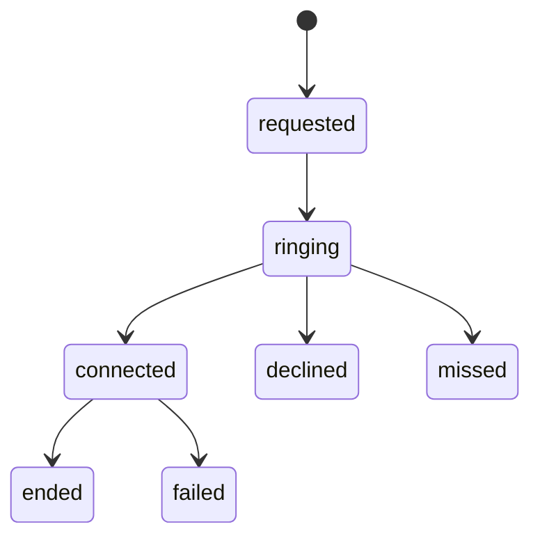

الدوال:

- `start_internal_call`.
- `respond_internal_call`.
- `mark_internal_call_connected`.
- `end_internal_call`.

المحاسبة:

```text
start -> reserve/check wallet
connected -> begin billing
end -> calculate duration + deduct wallet
```

لا يجب خصم المحفظة قبل الاتصال الفعلي إلا كحجز مؤقت يعاد عند الفشل.

---

## 22. الدعم وولي الأمر

### 22.1 الدعم

الجداول:

- `support_tickets`.
- `support_messages`.
- المرفقات.

الحالات المقترحة:

```text
open
in_progress
waiting_user
resolved
closed
```

التدفق:

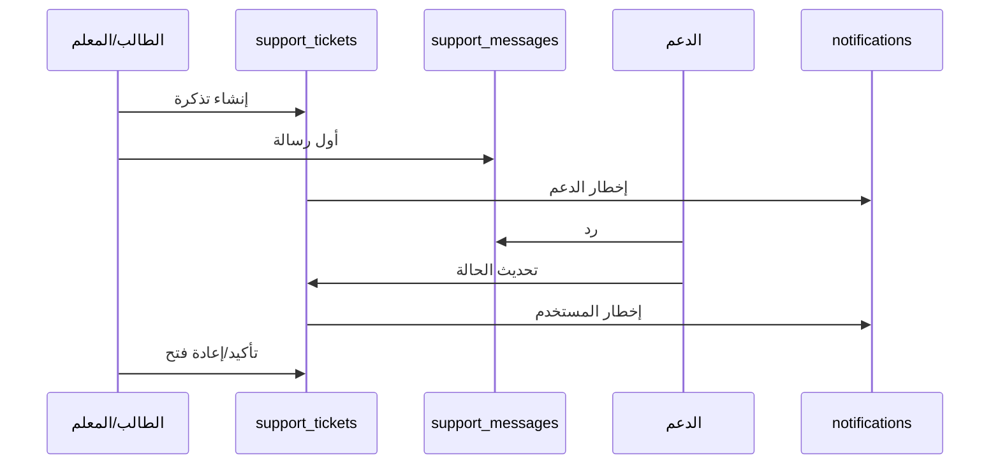

### 22.2 ولي الأمر

الجداول:

- `parent_students`.
- `profiles`.
- بيانات الطالب المقروءة عبر صلاحية الوالد.

يجب أن يربط ولي الأمر بالطالب صراحة:

```text
parent_id
student_id
status
verified_at
```

الواجهة الحالية تحتاج ربط بيانات الأبناء فعلياً بدلاً من البيانات الثابتة.

يجب ألا يستطيع ولي الأمر:

- تعديل درجات الطالب.
- تغيير رصيد الطالب.
- دخول جلسة لا تخصه.
- قراءة محادثة خاصة دون سياسة معلنة.

---

## 23. النقاط والمستويات والشارات

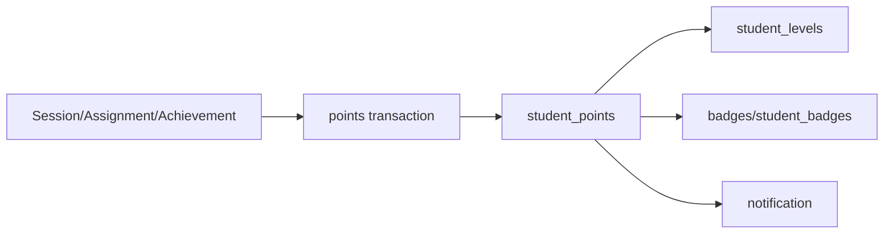

### 23.1 عملية النقاط

كل عملية يجب أن تحتوي:

- الطالب.
- السبب.
- المصدر.
- القيمة.
- مفتاح idempotency.
- timestamp.

مثال:

```text
session_report:<session_id>:performance_points
```

حتى لا تضاف النقاط مرتين عند إعادة تشغيل التقرير.

### 23.2 المستوى والشارة

يحسب المستوى من مجموع النقاط، وتمنح الشارة عند تحقق شرطها. يجب ألا تعتمد الجائزة على تعديل client-side.

---

## 24. أرباح المعلم والسحب

### 24.1 الحقول المالية للجلسة

```text
gross_amount
vat_amount
teacher_base_amount
platform_fee
teacher_earning
net_amount
platform_fee_rate_snapshot
vat_rate_snapshot
deducted_minutes
short_session
```

### 24.2 `teacher_earnings`

يمثل السجل الدوري أو المحاسبي:

- المعلم.
- الشهر.
- المبلغ.
- الساعات.
- الإجمالي.
- صافي المبلغ.
- الحالة.
- رقم الفاتورة.

### 24.3 `withdrawal_requests`

يمثل:

- المعلم.
- المبلغ.
- طريقة السحب.
- الحالة.
- بيانات التتبع.
- المرفقات.
- timestamps.

### 24.4 الحساب

```text
confirmed_total = SUM(amount where confirmed)
paid_total = SUM(amount where paid)
pending_withdrawals =
  SUM(amount where pending/approved/processing)

available =
  max(confirmed_total - paid_total - pending_withdrawals, 0)
```

### 24.5 دورة السحب

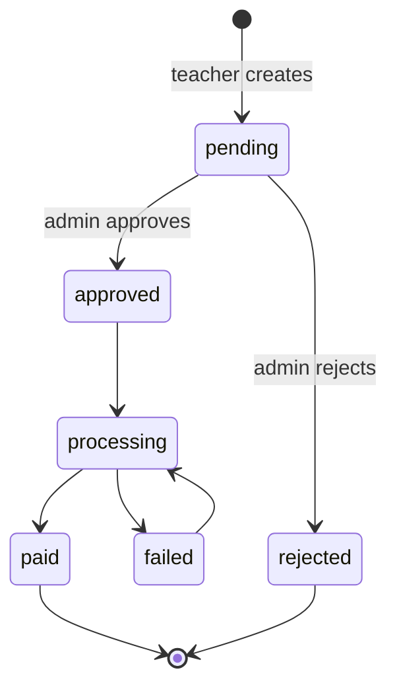

كل انتقال يجب أن يكتب Audit Log.

---

## 25. لوحة الإدارة والرقابة

الإدارة ليست مجرد شاشة عرض؛ هي طبقة تصحيح وتسوية:

- إدارة الطلاب.
- إدارة المعلمين.
- اعتماد المعلمين.
- مراقبة الحجوزات.
- مراقبة الجلسات.
- مراجعة المخالفات.
- مراجعة السحوبات.
- مراجعة الفواتير.
- مراقبة فشل AI.
- الإحصاءات اليومية.
- التسوية المالية.

### 25.1 صلاحيات الإدارة

يجب التفريق بين:

```text
admin
manage_teacher_earnings
manage_support
manage_users
manage_finance
view_audit
```

ولا يكفي role عام إذا كان النظام يحتاج فصل مهام.

### 25.2 التسوية المالية

`run_financial_reconciliation` يقارن:

```text
expected = SUM(sessions.teacher_earning)
actual = SUM(teacher_earnings.amount)
diff = actual - expected
```

وينتج:

```text
ok
minor_drift
mismatch
```

يجب عرض mismatch للإدارة وعدم إخفائه في الواجهة.

---

## 26. RLS: مصفوفة الوصول

| الجدول | الطالب | المعلم | الإدارة | الخدمة |
|---|---|---|---|---|
| `profiles` | نفسه | نفسه | الكل وفق صلاحية | نعم |
| `public_profiles` | قراءة عامة | قراءة آمنة | الكل | نعم |
| `user_roles` | قراءة محدودة | قراءة محدودة | إدارة | Auth/RPC |
| `teacher_profiles` | قراءة المعتمد | تعديل نفسه | إدارة | نعم |
| `user_subscriptions` | قراءة نفسه | لا | إدارة | Trigger/Function |
| `booking_requests` | إنشاء/قراءة نفسه | قراءة المؤهل + قبول/رفض | إدارة | RPC |
| `bookings` | قراءة طرف | قراءة طرف | إدارة | RPC |
| `sessions` | قراءة طرف | قراءة طرف | إدارة | Trigger/Function |
| `active_sessions` | جلسة نفسه | جلسة نفسه | مراقبة | Session |
| `webrtc_signals` | طرفا الجلسة | طرفا الجلسة | لا | WebRTC |
| `session_materials` | مواده | مواده | إدارة | Trigger |
| `chat_messages` | طرف المحادثة | طرف المحادثة | دعم وفق السياسة | نعم |
| `notifications` | نفسه | نفسه | إدارة | Functions |
| `assignments` | المسموح | واجباته | إدارة | نعم |
| `assignment_submissions` | نفسه | واجباته | إدارة | AI/Review |
| `teacher_earnings` | لا | قراءة نفسه | إدارة | Financial RPC |
| `withdrawal_requests` | لا | إنشاء/قراءة نفسه | إدارة | Financial RPC |
| `invoices` | نفسه | لا/حسب الدور | إدارة | Payment |
| `support_tickets` | نفسه | نفسه | الدعم | نعم |
| `student_points` | نفسه | لا | إدارة | RPC |

### 26.1 حقول ممنوعة من تحديث العميل

يجب منع تعديل مباشر لـ:

- معرفات أطراف الحجز.
- السعر.
- حالة الدفع.
- الدقائق المتبقية.
- ربح المعلم.
- عمولة المنصة.
- الدرجة النهائية.
- حالة الفاتورة.
- حالة السحب.
- حالة اعتماد المعلم.

---

## 27. العمليات الخلفية والـEdge Functions

| الوظيفة | المدخل | الناتج | idempotency |
|---|---|---|---|
| `create-checkout` | plan + URLs + promo | Stripe checkout | session/payment ID |
| `check-subscription` | user/Stripe data | subscription state | subscription ID |
| `turn-credentials` | authenticated user | TURN credentials | short-lived |
| `save-session-recording` | booking + recording URL | session/material | session ID |
| `session-report` | booking/session | ai_report + points | session ID |
| `grade-assignment` | submission ID | AI score | submission ID |
| `send-notification` | target/event | notification | event key |
| `analyze-violations` | session/messages | violation | message/event ID |
| `update-daily-stats` | date/teacher | stats | teacher/date |
| `make-phone-call` | target + wallet | call | call ID |
| `call-status-webhook` | provider event | call status | provider event ID |

كل Function يجب أن:

1. تتحقق من Bearer token.
2. تتحقق من الدور أو ملكية السجل.
3. تتحقق من المدخلات.
4. تستخدم service role فقط داخل الخادم.
5. لا تثق بقيمة مالية من العميل.
6. تكتب log عند الفشل.
7. تعيد حالة قابلة للعرض.
8. تمنع التكرار.

---

## 28. جدولة المهام

المهام التي تحتاج Scheduler/Cron:

- انتهاء الطلبات المفتوحة.
- تذكير الجلسات القادمة.
- تنظيف `active_sessions` القديمة.
- فحص الاشتراكات المنتهية.
- إرسال تنبيه الرصيد المنخفض.
- إغلاق الأشهر المالية القديمة.
- حذف/أرشفة التسجيلات المنتهية.
- تحديث الإحصاءات اليومية.
- إعادة محاولة تقارير AI الفاشلة.
- معالجة السحوبات المتعثرة.
- التحقق من الفواتير وZATCA.

### 28.1 قاعدة إعادة المحاولة

كل مهمة يجب أن تحتوي:

```text
attempt_count
last_attempt_at
next_retry_at
last_error
status
```

ولا تعيد عملية مالية أو إشعاراً بلا مفتاح منع تكرار.

---

## 29. مصفوفة المهام end-to-end

| المهمة | البداية | المعالجة | النتيجة | الإشعار |
|---|---|---|---|---|
| إنشاء طالب | Auth | profile + role | حساب طالب | welcome |
| إنشاء معلم | Auth | teacher profile + review | طلب اعتماد | admin |
| شراء باقة | Pricing | Stripe + subscription | دقائق | payment success |
| إنشاء طلب حجز | Booking | balance + request | open request | teacher |
| قبول حجز | Teacher | lock + booking + session | confirmed | student |
| بدء جلسة | LiveSession | active + WebRTC | timer | participant |
| إنهاء جلسة | LiveSession | duration + billing | completed | both |
| خصم دقائق | Trigger | select subscription + update | reduced balance | low balance if needed |
| حساب ربح | Trigger | gross/fee/base/net | session finance | teacher/admin |
| حفظ تسجيل | Function | storage + material | recording ready | both |
| إنشاء تقرير | Function | AI + sessions | report + points | both |
| تقييم | Rating | review + rating RPC | teacher rating updated | teacher |
| إنشاء واجب | TeacherAssignments | assignment + notify | assigned | student |
| تسليم واجب | StudentAssignments | submission + files | submitted | teacher |
| تصحيح AI | grade function | breakdown + score | ai_graded | teacher |
| اعتماد الدرجة | Review | final score | reviewed | student |
| طلب سحب | Withdrawal | minimum + available | pending | admin |
| اعتماد سحب | Admin | status transition | paid/processing | teacher |
| فتح دعم | Support | ticket + message | open | support |
| رد دعم | Support | message + status | waiting/resolved | user |

---

## 30. الفشل والتعافي

### 30.1 فشل قبول الحجز

السلوك المطلوب:

```text
لا booking
لا خصم
لا accepted نهائي
إشعار فشل أو انتهاء
سجل خطأ
```

### 30.2 فشل WebRTC

يجب ألا يساوي:

```text
فشل WebRTC = جلسة مكتملة
```

يتم:

- إبقاء الحجز.
- عرض إعادة المحاولة.
- تسجيل الحدث.
- تطبيق سياسة الإلغاء فقط إذا انتهت المهلة.

### 30.3 فشل التسجيل

يجب:

- الاحتفاظ بالجلسة.
- حفظ local backup.
- إعادة الرفع.
- عدم إنشاء مادة ناقصة كمادة مكتملة.
- إظهار حالة التسجيل.

### 30.4 فشل AI

يجب:

- عدم تغيير حالة الجلسة المالية.
- عدم تكرار النقاط.
- تسجيل `ai_logs`.
- إتاحة retry.
- إخطار الإدارة فقط عند تجاوز threshold.

### 30.5 فشل الدفع

يجب:

- عدم تفعيل الاشتراك من success page وحدها.
- اعتماد webhook موثق.
- عدم مضاعفة الدقائق.
- ترك payment record قابلاً للمطابقة.

---

## 31. مشاكل التزامن وIdempotency

### 31.1 حجزان متزامنان

الخطر:

```text
طلبان يقرآن نفس remaining_minutes
كلاهما ينجح
```

الحل:

- Transaction.
- `SELECT ... FOR UPDATE` للاشتراكات.
- قفل وقت المعلم.
- unique constraint أو exclusion constraint للتداخل.

### 31.2 قبول مزدوج

الخطر:

معلمان يقبلان نفس broadcast request.

الحل:

```text
UPDATE ... WHERE status='open'
RETURNING *
```

إذا لم يرجع صف، فقد سبق قبول الطلب.

### 31.3 إنهاء مزدوج

الحل:

```text
WHERE ended_at IS NULL
```

وإلا لا تعاد التسوية.

### 31.4 إشعار مزدوج

استخدم:

```text
event_type + entity_id + recipient_id
```

كمفتاح منطقي فريد.

### 31.5 تقرير مزدوج

استخدم:

```text
session_id
```

مع حالة report:

```text
queued
processing
completed
failed
```

### 31.6 نقاط مزدوجة

كل مصدر نقاط يحتاج `source_event_id` فريداً.

---

## 32. القيود والفهارس المطلوبة

### 32.1 قيود uniqueness

- `sessions.booking_id`.
- `session_materials.session_id`.
- `reviews.booking_id`.
- `active_sessions(user_id, booking_id)`.
- `teacher_earnings(teacher_id, month)`.
- معرف Stripe.
- مفتاح event notification.
- submission حسب سياسة المحاولات.

### 32.2 فهارس مهمة

- `booking_requests(status, scheduled_at)`.
- `booking_requests(teacher_id, status)`.
- `bookings(student_id, scheduled_at)`.
- `bookings(teacher_id, scheduled_at)`.
- `sessions(booking_id, ended_at)`.
- `notifications(user_id, created_at)`.
- `chat_messages(booking_id, created_at)`.
- `assignment_submissions(assignment_id, status)`.
- `withdrawal_requests(teacher_id, status)`.
- `user_subscriptions(user_id, is_active, ends_at)`.

### 32.3 التداخل الزمني

إذا كان PostgreSQL يسمح، الأفضل استخدام Exclusion Constraint على:

```text
teacher_id + tstzrange(scheduled_at, scheduled_at + duration)
```

مع استثناء الحالات الملغاة.

---

## 33. الاختبارات المطلوبة

### 33.1 المصادقة

- مستخدم جديد.
- مستخدم OAuth.
- OTP.
- profile ناقص.
- دور متعدد.
- مستخدم محظور.
- محاولة فتح `/teacher` كطالب.

### 33.2 الرصيد

- اشتراك واحد.
- اشتراكان.
- اشتراك منتهٍ.
- رصيد صفر.
- حجزان متزامنان.
- جلسة قصيرة.
- إعادة إنهاء الجلسة.

### 33.3 الحجز

- direct teacher.
- broadcast.
- group acceptance.
- double acceptance.
- teacher conflict.
- student conflict.
- expired request.
- cancellation.

### 33.4 الجلسة

- الطالب يدخل.
- المعلم يدخل.
- طرف ثالث يرفض.
- تبويب ثانٍ يرفض.
- heartbeat stale.
- فقد اتصال.
- إعادة انضمام.
- timer يبدأ مرة واحدة.
- timer يتوقف مرة واحدة.

### 33.5 المال

- gross/base/fee/net.
- VAT snapshot.
- سعر معلم مرتفع.
- withdrawal minimum.
- two concurrent withdrawals.
- paid transition.
- reconciliation mismatch.

### 33.6 التسجيل

- تسجيل كامل.
- chunks.
- آخر chunk.
- backup.
- retry.
- انتهاء المادة.
- signed URL unauthorized.

### 33.7 الواجبات

- assignment عام.
- assignment لطالب محدد.
- quiz.
- سؤال بلا إجابة.
- upload كبير.
- duplicate submission.
- AI failure.
- teacher review.
- student cannot alter final grade.

### 33.8 الإشعارات

- إنشاء كل event.
- عدم التكرار.
- read/unread.
- Realtime.
- الصوت.
- link آمن.
- مستخدم غير مستحق لا يرى الإشعار.

---

## 34. الفجوات الإنتاجية ذات الأولوية

### P0

1. دمج قبول الطلب وإنشاء الحجز وخصم/حجز الدقائق في Transaction واحدة.
2. منع الخصم والتسوية المكررة عند إعادة إنهاء الجلسة.
3. فرض أدوار الطالب والمعلم على Router وRLS والـFunctions.
4. منع تحديث الحقول المالية والدرجات من العميل.
5. حماية التسجيلات وعدم استخدام URL عام دائم.
6. idempotency للدفع والاشتراك والفاتورة.

### P1

1. قفل التعارض الزمني في قاعدة البيانات.
2. ضبط المعادلة النهائية للتسعير ومنع عمولة سالبة.
3. فصل رصيد الاتصال عن أرباح التدريس في الاسم والتقارير.
4. إنشاء مركز إشعارات موحد.
5. إضافة جدول Domain Events أو مفاتيح أحداث موحدة.
6. تنفيذ scheduler حقيقي للانتهاء والتذكير والتنظيف.
7. ربط Parent Dashboard ببيانات حقيقية.

### P2

1. دعم محاولات متعددة للواجبات إن كانت مطلوبة.
2. تحسين تقرير الفشل وإعادة المحاولة.
3. إضافة صفحة سجل النشاط للمستخدم.
4. توحيد التوقيت إلى timezone محفوظ لكل مستخدم.
5. تحسين فهارس الاستعلامات الثقيلة.

---

## 35. الترتيب المقترح للتنفيذ

### المرحلة 1: تثبيت المجال

- تثبيت جميع statuses.
- تعريف ownership.
- تعريف event keys.
- تعريف دور كل جدول.
- توثيق المعادلة المالية النهائية.

### المرحلة 2: العمليات الذرية

- `create_booking_from_request`.
- `accept_booking_group_atomic`.
- `start_session_atomic`.
- `finish_session_atomic`.
- `submit_assignment_atomic`.
- `review_submission_atomic`.
- `create_withdrawal_atomic`.

### المرحلة 3: الصلاحيات

- RLS عمودي ومنطقي.
- role gates.
- Storage policies.
- Edge authorization.
- signed URLs.

### المرحلة 4: الإشعارات

- Domain events.
- notification dedupe.
- Realtime.
- read state.
- scheduler.

### المرحلة 5: الاختبارات

- Unit للمعادلات.
- SQL tests للـRLS.
- Integration للـRPC.
- E2E لمسار الطالب.
- E2E لمسار المعلم.
- اختبارات concurrency.

### المرحلة 6: المراقبة

- system logs.
- financial reconciliation.
- AI logs.
- failed jobs.
- alerting.
- dashboards للإدارة.

---

## 36. المسار الكامل المرجعي

```mermaid
flowchart TB
    A[إنشاء الحساب] --> B[إكمال الملف]
    B --> C{الدور}
    C -->|طالب| D[شراء باقة]
    C -->|معلم| E[إكمال ملف واعتماد]
    D --> F[البحث عن معلم]
    F --> G[إنشاء طلب حجز]
    E --> H[تحديد المادة والسعر والتوفر]
    H --> I[استلام الطلب]
    I --> J[قبول ذري]
    G --> J
    J --> K[booking + session]
    K --> L[إشعارات وتذكير]
    L --> M[PreJoin + WebRTC]
    M --> N[active sessions + heartbeat]
    N --> O[timer]
    O --> P[recording + chat]
    P --> Q[finish session]
    Q --> R[duration]
    R --> S[deduct student minutes]
    R --> T[calculate teacher earnings]
    S --> U[complete booking]
    T --> U
    U --> V[material]
    U --> W[AI report]
    W --> X[points + notifications]
    V --> Y[student/teacher review]
    E --> Z[create assignment]
    Z --> AA[student submits]
    AA --> AB[AI grade]
    AB --> AC[teacher reviews]
    AC --> AD[final score + notification]
    T --> AE[withdrawal]
    AE --> AF[admin approval]
```

---

## 37. الخلاصة الهندسية

المنصة ليست مجموعة صفحات منفصلة؛ هي دورة مترابطة:

```text
هوية
→ دور
→ ملف
→ باقة
→ دقائق
→ حجز
→ قبول
→ جلسة
→ حضور
→ عداد
→ تسجيل
→ إنهاء
→ خصم
→ تسوية مالية
→ مادة وتقرير
→ نقاط وتقييم
→ واجب
→ تسليم
→ تصحيح
→ إشعارات
→ دعم وإدارة
```

كل رابط في هذه السلسلة يجب أن يكون:

1. مملوكاً لطرف واضح.
2. محمياً بـRLS.
3. قابلاً لإعادة المحاولة.
4. غير قابل للتكرار المالي.
5. موثقاً بإشعار أو سجل.
6. قابلاً للتدقيق من الإدارة.
7. مرتبطاً بحالة قبل وبعد.

المعيار النهائي لسلامة المنصة هو أن يستطيع النظام الإجابة بدقة عن كل عملية:

- من بدأها؟
- من يملك السجل؟
- ما الحالة السابقة؟
- ما الحالة الجديدة؟
- ما الجدول الذي تغير؟
- ما الإشعار الذي خرج؟
- هل يمكن تكرارها؟
- هل ترتب عليها خصم أو ربح؟
- هل يمكن التراجع عنها؟
- من يستطيع رؤيتها بعد التنفيذ؟

إذا لم تكن الإجابة مضمونة في قاعدة البيانات والـRPC والـRLS، فهي ما زالت منطق واجهة وليست عملية إنتاجية مكتملة.