# المخطط الهندسي الشامل لمنظومة لوحة تحكم الطالب

## 1. هدف الوثيقة ونطاقها

هذه الوثيقة تصف منظومة الطالب كما هي منفذة في فرع `main` من منصة `taealam`، من منظور:

- الواجهة الأمامية React وReact Router.
- سياق المصادقة والأدوار والحماية.
- صفحات الطالب ومكوّناته ومساراته.
- جداول PostgreSQL في Supabase وعلاقاتها.
- RLS وRealtime وTriggers وRPCs.
- Edge Functions والخدمات الخارجية.
- الأحداث الناتجة عن تفاعل الطالب أو المعلم أو النظام.
- الفجوات والمخاطر التي يجب علاجها قبل اعتبار دورة الطالب إنتاجية بالكامل.

الوثيقة تحليل هندسي للواقع الحالي وليست اقتراحاً لتغيير الكود. لم يتم تعديل المستودع أو قاعدة البيانات أثناء إعدادها.

المصادر الأساسية التي تم تحليلها:

- `src/App.tsx`
- `src/components/ProtectedRoute.tsx`
- `src/contexts/AuthContext.tsx`
- `src/pages/StudentDashboard.tsx`
- `src/pages/SearchTeacher.tsx`
- `src/pages/Booking.tsx`
- `src/pages/SubscriptionDetails.tsx`
- `src/pages/StudentInvoices.tsx`
- `src/pages/PaymentSuccess.tsx`
- `src/pages/Rating.tsx`
- `src/pages/Chat.tsx`
- `src/pages/LiveSession.tsx`
- `src/pages/StudentAssignments.tsx`
- `src/pages/SupportChat.tsx`
- مكوّنات `src/components/student/`
- جميع migrations الخاصة بنطاق الطالب والحجز والجلسات والاشتراكات
- Edge Functions الخاصة بالدفع والجلسات والتصحيح والإشعارات

---

## 2. الخلاصة التنفيذية

لوحة الطالب ليست شاشة واحدة فقط، بل مركز تشغيل لدورة تعليمية كاملة:

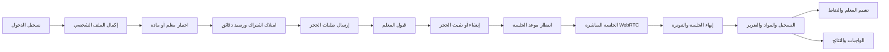

المسار التجاري يعتمد على مستويين:

1. `subscription_plans` و`user_subscriptions` داخل Supabase لتحديد الدقائق المتاحة فعلياً للحجز.
2. Stripe عبر `create-checkout` و`check-subscription` لمعالجة الاشتراك والدفع والتحقق من اشتراك Stripe.

المسار الزمني يعتمد على كيانين مترابطين:

1. `booking_requests`: رغبة الطالب في موعد أو أكثر، بانتظار قبول معلم.
2. `bookings`: الحجز الفعلي الذي تتحول إليه الجلسة.

المسار التعليمي بعد الجلسة يعتمد على:

- `sessions` لحالة ومدة وفوترة الجلسة.
- `session_materials` للتسجيل والملخصات.
- `sessions.ai_report` لتقرير AI.
- `reviews` لتقييم المعلم.
- `student_points` للنقاط.
- `assignments` و`assignment_submissions` للواجبات والاختبارات.

أهم ملاحظة هندسية: الواجهة الأمامية تنفذ جزءاً من قواعد الحجز والتعارض والرصيد بنفسها، لكن قاعدة البيانات تحتوي أيضاً على Triggers للحماية. يجب اعتبار قاعدة البيانات مصدر الحقيقة النهائي، وعدم الاعتماد على نتائج React وحدها.

---

## 3. السياق المعماري العام

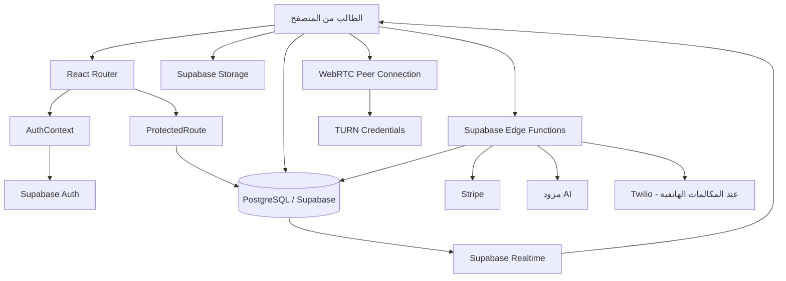

### 3.1 مصادر الحقيقة

| المجال | مصدر الحقيقة الحالي |
|---|---|
| هوية المستخدم | Supabase Auth |
| الاسم والصورة والهاتف والمرحلة | `profiles` |
| الدور | `user_roles` و`AuthContext.roles` |
| حالة الحظر | `user_warnings.is_banned` |
| الباقات | `subscription_plans` |
| الدقائق المتاحة | مجموع `user_subscriptions.remaining_minutes` النشطة |
| الطلب قبل قبول المعلم | `booking_requests` |
| الحجز | `bookings` |
| الجلسة التنفيذية | `sessions` |
| الحضور الحي | `active_sessions` |
| الرسائل | `chat_messages` |
| التنبيهات | `notifications` |
| الدفع | Stripe + `payment_records` + `invoices` |
| نتيجة الواجب | `assignment_submissions` |
| الملفات | Supabase Storage |
| التقرير الذكي | `sessions.ai_report` |

---

## 4. خريطة المسارات والصلاحيات

### 4.1 المسارات المرتبطة بالطالب

| المسار | الصفحة | الحماية الحالية | الغرض |
|---|---|---|---|
| `/student` | `StudentDashboard` | `ProtectedRoute` | لوحة الطالب الرئيسية |
| `/search` | `SearchTeacher` | غير محمي في Router | اكتشاف المعلمين والحجز السريع |
| `/booking` | `Booking` | `ProtectedRoute` | الحجز المباشر أو broadcast |
| `/pricing` | `Pricing` | غير محمي في Router | عرض الباقات وبدء الدفع |
| `/subscription-details` | `SubscriptionDetails` | `ProtectedRoute` | تفاصيل الرصيد والخصومات والجلسات |
| `/invoices` | `StudentInvoices` | `ProtectedRoute` | عرض وتنزيل الفواتير |
| `/payment-success` | `PaymentSuccess` | `ProtectedRoute` | نتيجة Stripe بعد العودة |
| `/session?booking=<id>` | `LiveSession` | `ProtectedRoute` | الجلسة الحية |
| `/chat?booking=<id>` | `Chat` | `ProtectedRoute` | المحادثة مع المعلم |
| `/support` | `SupportChat` | `ProtectedRoute` | خدمة العملاء والتذاكر |
| `/rating?booking=<id>` | `Rating` | `ProtectedRoute` | تقييم جلسة مكتملة |
| `/student/assignments` | `StudentAssignments` | `ProtectedRoute` | الواجبات والاختبارات والنتائج |
| `/ai-tutor` | `AITutor` | `ProtectedRoute` | المدرس الذكي |
| `/homework-solver` | `HomeworkSolver` | `ProtectedRoute` | حل الواجبات |
| `/profile` | `Profile` | `ProtectedRoute` | الملف الشخصي |
| `/complete-profile` | `CompleteProfile` | `ProtectedRoute` | استكمال البيانات اللازمة للحجز |
| `/parent` | `ParentDashboard` | `ProtectedRoute` | واجهة ولي الأمر الحالية |

### 4.2 التحويل الافتراضي بعد `/dashboard`

```mermaid
flowchart TD
    A[/dashboard] --> B{الأدوار المحملة}
    B -->|admin| C[/admin]
    B -->|teacher| D[/teacher]
    B -->|غير ذلك| E[/student]
```

### 4.3 الحماية الحالية

`ProtectedRoute` ينفذ:

1. انتظار تحميل المصادقة.
2. تحويل المستخدم غير المسجل إلى `/login`.
3. قراءة `user_warnings` بحثاً عن `is_banned = true`.
4. عرض شاشة تقييد الحساب عند الحظر.
5. تمرير الصفحة للمستخدم المسجل وغير المحظور.

لا يفرض `ProtectedRoute` حالياً دور `student` صراحة. لذلك المسار `/student` محمي بالمصادقة والحظر، لكنه ليس محمياً ببوابة دور مستقلة. الاعتماد الحالي على الدور يحدث في `DashboardRedirect` وبعض المكونات وRLS، وليس في Router نفسه.

---

## 5. تركيب لوحة الطالب `/student`

```mermaid
flowchart TB
    D[StudentDashboard]
    D --> N[Navbar]
    D --> CS[CustomerServiceButton]
    D --> W[رسالة الترحيب]
    D --> NC[بطاقة أقرب حصة]
    D --> PC[تنبيه إكمال الملف]
    D --> LB[تنبيه الرصيد المنخفض أو المنتهي]
    D --> STATS[بطاقات الإحصائيات]
    D --> CAL[ScheduledSessionsCalendar]
    D --> PBR[PendingBookingRequests]
    D --> HIST[StudentScheduleTable historyOnly]
    D --> WARN[WarningsSection]
    D --> MAT[SessionMaterials]
    D --> BAL[SubscriptionBalance]
    D --> AI[بطاقة AI Tutor]
    D --> AS[بطاقة Assignments]
    D --> SM[SmartMatchWidget]
    D --> BN[BottomNav]
```

### 5.1 رأس الصفحة والهوية

- الاسم يعرض من `AuthContext.profile.full_name`.
- في حال غياب الاسم يظهر "طالب".
- يتم عرض عدد الحصص القادمة من `upcomingClasses.length`.
- يظهر اسم الباقة المجمعة من `subscription_plans.name_ar`.
- `Navbar` يوفر التنقل العام وإشعارات/حساب المستخدم حسب تركيبه الحالي.
- `CustomerServiceButton` يفتح مسار خدمة العملاء.

### 5.2 بطاقة أقرب حصة

يتم اختيار الحصة من حصص اليوم فقط:

1. جلسات `bookings` الخاصة بالطالب.
2. `status` ضمن `pending` أو `confirmed`.
3. `scheduled_at >= now()` للحصص المجدولة.
4. إضافة الجلسات التي `status = confirmed` و`session_status = in_progress`.
5. إزالة التكرار بواسطة `booking.id`.
6. إثراء الاسم من `public_profiles`.
7. ترتيب الجلسة الجارية أولاً ثم الأقرب زمنياً.

عند كون الحجز `confirmed` يظهر رابط:

```text
/session?booking=<booking_id>
```

### 5.3 استكمال الملف الشخصي

يعتبر الملف ناقصاً إذا كان أحد الآتي غير موجود:

- `profiles.full_name`
- `profiles.phone`
- `profiles.teaching_stage`

عند النقص يظهر رابط:

```text
/complete-profile?redirect=/student
```

وتعيد صفحة الحجز الفحص نفسه قبل السماح بإرسال طلب.

### 5.4 تنبيهات الرصيد

يتم حساب:

```text
remainingMinutes = subscription.remaining_minutes
sessionMinutes = subscription.session_duration_minutes || 60
```

الحالات:

| الحالة | الشرط | الإجراء |
|---|---|---|
| يمكن الحجز | رصيد موجود ويكفي مدة الجلسة | رابط البحث والحجز |
| رصيد منخفض | `0 < remainingMinutes < sessionMinutes` | رابط `/pricing` |
| الرصيد منتهٍ | `remainingMinutes <= 0` | رابط `/pricing` |
| لا توجد باقة محلية | `subscription = null` | تظهر حالة عدم امتلاك اشتراك في المكونات ذات الصلة |

الملاحظة المهمة: `SubscriptionBalance` يجمع بين الاشتراك المحلي ونتيجة Stripe، لكن قابلية الحجز الفعلية تعتمد على `user_subscriptions` المحلية ودقائقها.

### 5.5 بطاقات الإحصائيات

| البطاقة | طريقة الحساب |
|---|---|
| حصص مكتملة | عدد `bookings.status = completed` للطالب |
| حصص غير مكتملة | عدد `bookings.status = cancelled` في الاستعلام المحدود |
| وقت التعلم الفعلي | مجموع مدة الجلسات المكتملة مع سلسلة fallback |
| نسبة التقدم | `completedCount / 20 * 100` بحد أقصى 100 |
| النقاط | `student_points.total_points` |

سلسلة حساب الوقت:

1. `sessions.deducted_minutes * 60` إذا كانت أكبر من صفر.
2. وإلا `sessions.duration_seconds`.
3. وإلا الفرق بين `ended_at` و`started_at`.

### 5.6 جدول الجلسات والتقويم

توجد واجهتان متكاملتان:

- `ScheduledSessionsCalendar`: عرض أسبوعي/شهري، تذكيرات، الانضمام والإلغاء.
- `StudentScheduleTable historyOnly`: تجميع الحصص حسب المعلم وعرض التاريخ والحالة والرسائل.

الجدول يستخدم `localStorage` لإخفاء الحصص من العرض فقط:

```text
hidden_bookings_<user_id>
```

الإخفاء لا يحذف الحجز من قاعدة البيانات ولا يغير حالته.

### 5.7 الطلبات المعلقة

`PendingBookingRequests` يعرض طلبات الطالب في `booking_requests` بحالة `open`، مع:

- المادة.
- الموعد.
- مدة الطلب.
- انتهاء الطلب.
- إمكانية إلغاء الطلب.
- انتهاء تلقائي محلي للطلبات القديمة.
- تحديث حي عبر Realtime.

### 5.8 المواد والتسجيلات

`SessionMaterials` يقرأ:

- `session_materials` للطالب.
- `sessions` للحصول على `ai_report`.
- `bookings` و`subjects` لعرض اسم المادة.
- ملفات التسجيل من bucket `session-recordings`.

قد يحتوي العنصر على:

- تسجيل الجلسة.
- تقرير AI.
- مدة الجلسة.
- تاريخ الجلسة.
- اسم المادة.

### 5.9 الواجبات

البطاقة الجانبية توجه إلى:

```text
/student/assignments
```

وتسمح صفحة الواجبات بـ:

- عرض واجبات مخصصة للطالب.
- عرض الاختبارات.
- الإجابة النصية.
- أسئلة الاختيار الفردي والمتعدد.
- رفع الصور وPDF.
- تسجيل إجابة صوتية.
- إرسال الواجب.
- تشغيل التصحيح الآلي.
- عرض درجة AI ودرجة المعلم والدرجة النهائية.

---

## 6. دورة المصادقة والتهيئة

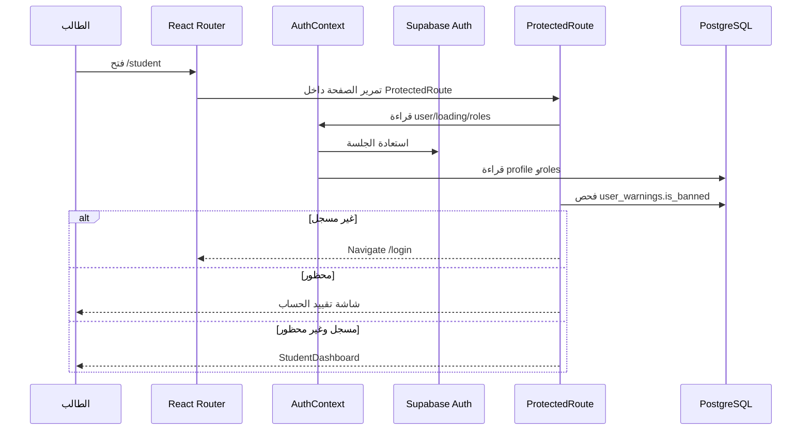

### 6.1 تخزين المصادقة المحلي

`AuthContext` يحتفظ مؤقتاً في `localStorage` بـ:

- profile cache لكل مستخدم.
- roles cache لكل مستخدم.
- آخر مستخدم.

يتم استخدام الذاكرة المحلية لتسريع العرض، لكنها ليست مصدر صلاحيات نهائي. يجب أن تبقى RLS والمصادقة داخل Supabase هي الحماية النهائية.

### 6.2 ملف المستخدم

Trigger إنشاء المستخدم ينشئ أو يجهز:

- `profiles`.
- الدور الافتراضي.
- عناصر مرتبطة بالمستخدم بحسب migrations.

---

## 7. دورة اكتشاف المعلم والحجز

### 7.1 اكتشاف المعلمين في `/search`

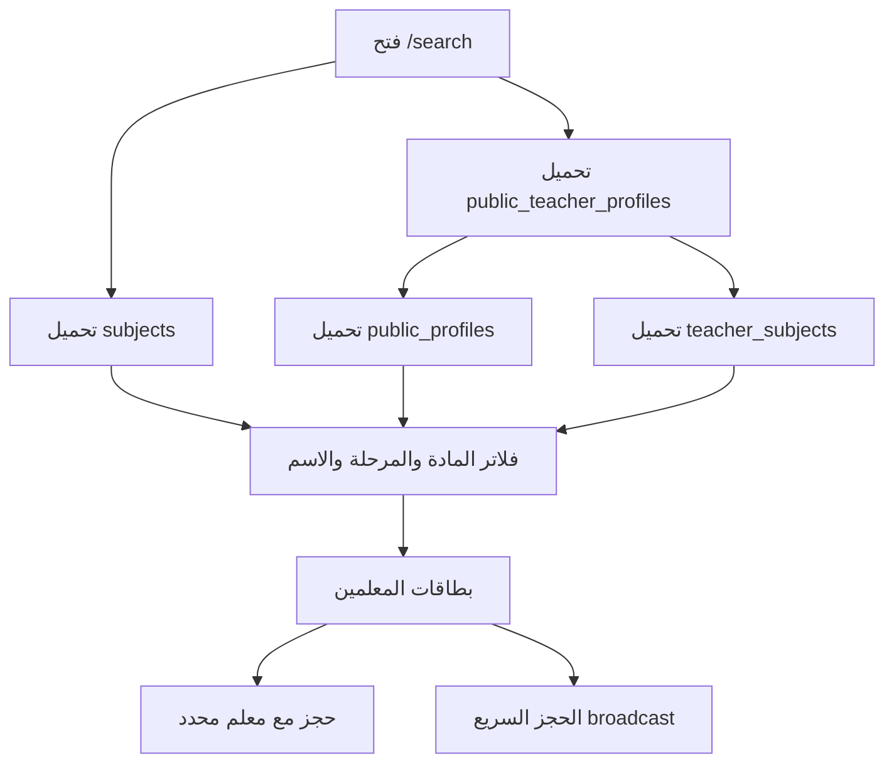

البيانات المستخدمة:

- `public_teacher_profiles`: الملف العام للمعلم، التقييم، السعر، الأيام المتاحة، المراحل.
- `public_profiles`: الاسم والصورة.
- `teacher_subjects`: المواد التي يدرسها المعلم.
- `subjects`: قائمة المواد العامة.

الفلاتر:

- الاسم أو اسم المادة.
- المادة.
- المرحلة التعليمية.
- الترتيب حسب التقييم أو الخيارات المتاحة في الواجهة.
- مؤشر توفر المعلم الآن من `available_days` و`available_from/to`.

### 7.2 فحص الرصيد قبل الحجز

الواجهة تحسب:

```text
إجمالي الرصيد = مجموع remaining_minutes للاشتراكات النشطة
المحجوز = دقائق bookings القادمة + دقائق booking_requests المفتوحة
الرصيد القابل للحجز = max(0, إجمالي الرصيد - المحجوز)
```

ثم:

```text
عدد المواعيد الممكنة = floor(الرصيد القابل للحجز / مدة الجلسة)
```

هذا فحص عرض وتجربة مستخدم. الحماية النهائية موجودة في Trigger:

`validate_booking_request_against_balance()`

### 7.3 الحجز المباشر مع معلم

عند فتح:

```text
/booking?teacher=<teacher_user_id>
```

يتم تحميل:

- اسم المعلم من `public_profiles`.
- توفره من `public_teacher_profiles`.
- مواده من `teacher_subjects`.
- قائمة الأيام المتاحة.
- ساعات التوفر.
- اشتراك الطالب.
- الحجوزات والطلبات المحجوزة خلال النطاق الزمني.

ثم يختار الطالب:

1. المادة.
2. اليوم.
3. وقتاً أو عدة أوقات.
4. يراجع ملخص الطلب.
5. يرسل الطلبات.

كل إرسال مجموعة يحصل على `group_id` واحد.

### 7.4 الحجز broadcast

عند عدم تحديد معلم:

1. يختار الطالب المادة والمرحلة.
2. النظام يحسب عدد المعلمين المؤهلين.
3. يختار الطالب عدة مواعيد.
4. ينشئ صفاً في `booking_requests` لكل موعد.
5. يرسل تنبيهات للمعلمين المعتمدين الذين يدرسون المادة والمرحلة.
6. يشترك المعلمون في الطلب المفتوح ويقبل أحدهم.

### 7.5 إنشاء `booking_requests`

الحقول المنطقية المستخدمة:

| الحقل | الوظيفة |
|---|---|
| `student_id` | الطالب صاحب الطلب |
| `subject_id` | المادة |
| `scheduled_at` | الموعد |
| `duration_minutes` | مدة الجلسة |
| `status` | open/accepted/rejected/cancelled/expired |
| `expires_at` | نهاية صلاحية الطلب |
| `group_id` | ربط طلبات الإرسال الواحد |
| `teaching_stage` | المرحلة المطلوبة |
| `accepted_by` | المعلم الذي قبل |
| `accepted_at` | وقت القبول |

### 7.6 انتهاء الطلب

يوجد منطق في الواجهة لتحديد الطلب المنتهي، كما توجد قيمة `expires_at` في قاعدة البيانات. يجب أن يكون هناك Job/cron أو عملية موثوقة لتغيير الحالة إلى `expired`، لأن الاعتماد على فتح صفحة الطالب وحده لا يضمن تنظيف الطلبات القديمة.

---

## 8. قبول المعلم وتحويل الطلب إلى حجز

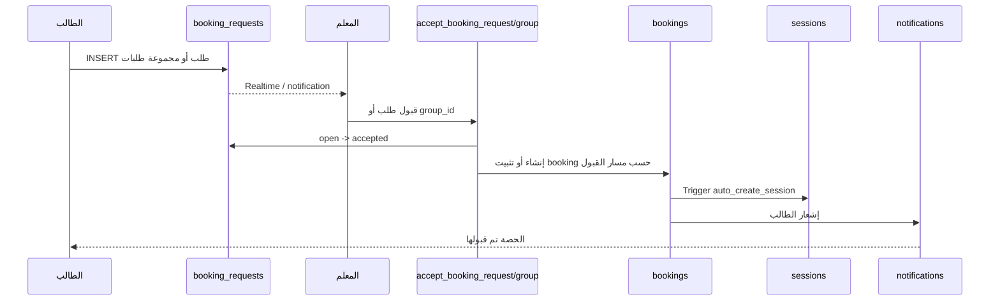

الـRPCs الموجودة:

- `accept_booking_request(_request_id, _teacher_id)`
- `accept_booking_group(_group_id, _teacher_id)`

الـRPC الفردي يغير `booking_requests` إلى `accepted`، أما إنشاء الحجز النهائي فيعتمد على مسار التطبيق/الـTrigger الموجود في المستودع. يجب التأكد إنتاجياً أن القبول وإنشاء `bookings` لا ينفصلان في معاملة واحدة.

### حالات الطالب بعد قبول الطلب

```text
booking_request: open
        |
        v
booking_request: accepted
        |
        v
booking: pending أو confirmed
        |
        v
session: not_started
```

### خطر اتساق مهم

إذا تغيرت حالة `booking_requests` إلى `accepted` ثم فشل إنشاء `bookings` أو فشل التحقق من الرصيد، فقد يظل الطلب مقبولاً من دون حجز فعلي. يجب أن يكون القبول، والتحقق من الرصيد، ومنع التعارض، وإنشاء الحجز في RPC/Transaction واحدة.

---

## 9. الجلسة الفورية

`StudentScheduleTable` يحتوي على مسار جلسة فورية مع معلم:

```mermaid
flowchart TD
    A[الطالب يضغط جلسة فورية] --> B[فحص جلسة الطالب النشطة]
    B -->|جلسة نشطة| X[رفض وبيان السبب]
    B -->|لا توجد| C[فحص جلسة المعلم الحالية]
    C -->|in_progress| Y[المعلم مشغول]
    C -->|waiting_acceptance| Z[للمعلم طلب آخر]
    C -->|متاح| D[فحص اشتراك ورصيد]
    D -->|لا يكفي| P[الانتقال إلى pricing]
    D -->|يكفي| E[INSERT booking]
    E --> F[session_status = waiting_acceptance]
    F --> G[إشعار المعلم]
    G --> H{المعلم يقبل؟}
    H -->|نعم| I[session_status = in_progress]
    H -->|لا| J[rejected/cancelled]
    I --> K[/session?booking=id]
```

في قبول الطالب لطلب الجلسة الفورية:

- يغير الطالب `session_status` إلى `in_progress`.
- يرسل إشعار قبول للمعلم.
- ينتقل إلى `/session?booking=<id>`.

في الرفض:

- `session_status = rejected`.
- `status = cancelled`.
- إرسال إشعار للمعلم.

يجب التعامل مع هذا المسار بحذر، لأن تحديث `session_status` من العميل مباشرة يحتاج RLS أو RPC تمنع قبول طالب لطلب غير مملوك له أو قبول طلب تغيرت حالته بالتوازي.

---

## 10. نموذج حالات الحجز والجلسة

### 10.1 `bookings.status`

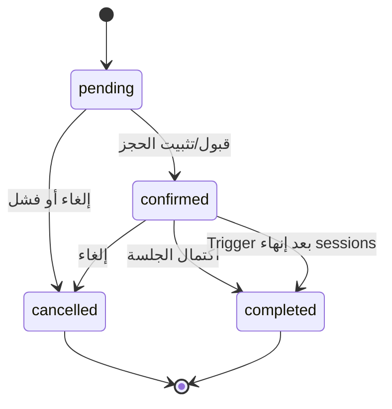

### 10.2 `bookings.session_status`

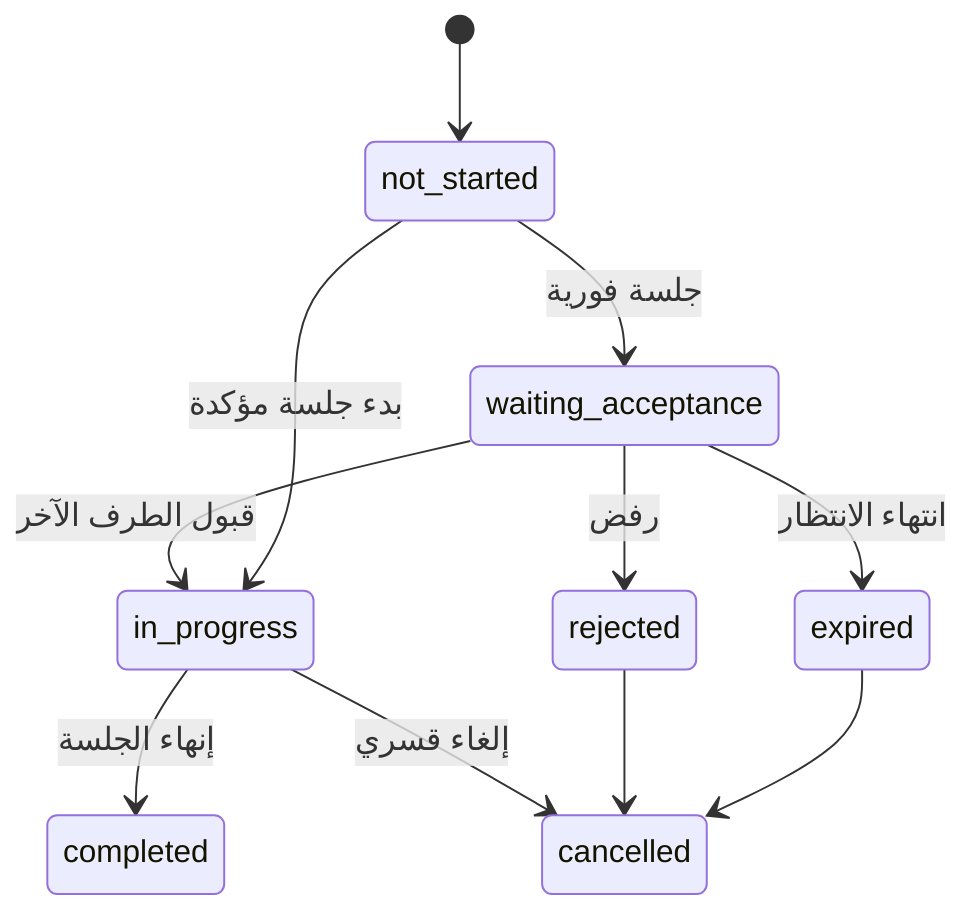

ينبغي توحيد هذه القيم في enum أو قيد قاعدة بيانات موحد، وعدم تركها كنصوص مشتتة بين مكونات React.

---

## 11. التقويم والإلغاء

### 11.1 التذكيرات

`ScheduledSessionsCalendar` و`UpcomingSessionsTable`:

- يحدثان الوقت الحالي كل 30 ثانية لتغيير حالة زر الانضمام.
- ينفذان تحديثاً دورياً كل 15 ثانية في التقويم للتعامل مع ضياع حدث Realtime.
- يستخدمان `session_reminders_sent` لمنع التذكير المكرر من عدة أجهزة أو إعادة تحميل.
- يرسلان إشعار `session_reminder` عند قرب الجلسة.

### 11.2 الإلغاء من الطالب

التدفق الحالي:

1. الطالب يضغط إلغاء.
2. الواجهة تحدث `bookings.status = cancelled`.
3. التقويم قد يحدث أيضاً `session_status = cancelled`.
4. ترسل الواجهة إشعاراً للمعلم باستخدام قالب `bookingCancelledByStudent`.
5. يظهر Toast نجاح أو خطأ.

يجب أن يضمن الخادم:

- أن الطالب يملك الحجز.
- أن الحجز قابل للإلغاء في الوقت الحالي.
- عدم خصم أو إعادة الدقائق بشكل غير متسق.
- تسجيل سبب الإلغاء.
- عدم السماح بإلغاء جلسة مكتملة.

---

## 12. الاشتراكات والدفع والفواتير

### 12.1 نموذج الاشتراك

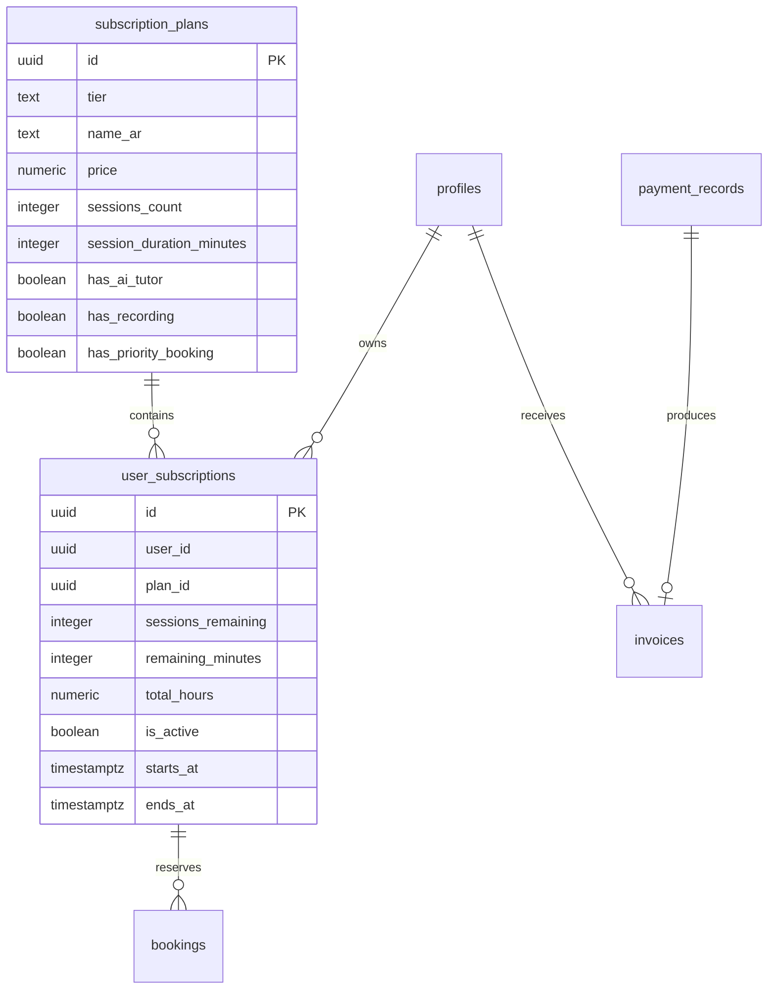

### 12.2 شراء باقة

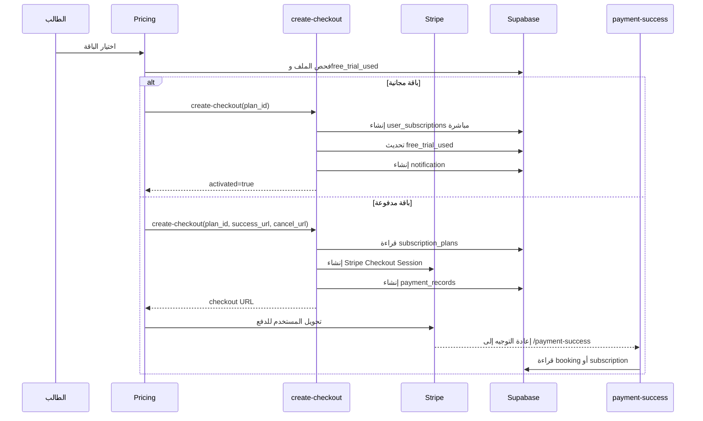

### 12.3 تحقق Stripe

`check-subscription`:

- يقرأ Bearer token.
- يحصل على المستخدم.
- يبحث عن Stripe customer بالبريد.
- يفحص الاشتراكات النشطة.
- يعيد `subscribed`, `tier`, `subscription_end`.

هذه النتيجة تستخدم للعرض، بينما صلاحية الحجز تعتمد على سجلات `user_subscriptions` المحلية. يجب وجود مزامنة موثوقة بين Webhook Stripe والاشتراك المحلي.

### 12.4 شاشة نجاح الدفع

`PaymentSuccess` تعمل بطريقتين:

- إذا وجد `?booking=<id>` تعرض تفاصيل حجز الحصة.
- إذا لم يوجد تعرض تفاصيل الاشتراك:
  - اسم الباقة.
  - الجلسات المتبقية.
  - تاريخ الانتهاء.
  - أولوية الحجز إذا كانت الباقة تدعمها.

لا ينبغي اعتبار الوصول إلى صفحة النجاح وحده دليلاً على نجاح الدفع؛ يجب أن تكون حالة الدفع مثبتة بالخادم أو Webhook.

### 12.5 الفواتير

صفحة `/invoices` تقرأ فواتير الطالب من `invoices` وتتيح:

- عرض رقم الفاتورة.
- حالة ZATCA.
- التاريخ.
- صافي المبلغ.
- الضريبة.
- الإجمالي.
- إنشاء PDF في المتصفح.
- QR Code من `qr_code` أو رقم الفاتورة.

حماية الفواتير:

```text
auth.uid() = invoices.student_id
OR has_role(auth.uid(), 'admin')
```

الحالات الرئيسية:

```text
zatca_status = pending | cleared | failed
```

---

## 13. دورة الجلسة الحية من منظور الطالب

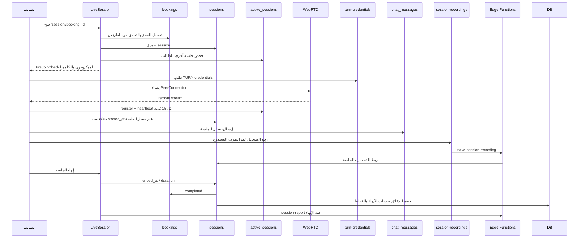

### 13.1 قبل الدخول

قبل تشغيل الجلسة:

- قراءة `booking` من query string.
- تحميل بيانات الطالب والمعلم والمادة.
- التحقق من أن المستخدم أحد طرفي الحجز.
- فحص وجود جلسة أخرى نشطة للطالب.
- فحص قفل التبويب.
- فحص الميكروفون والكاميرا عبر `PreJoinCheck`.

### 13.2 WebRTC

يستخدم المسار:

- WebRTC عبر `useWebRTC`.
- إشارات WebRTC في `webrtc_signals` أو قناة الإشارة المستخدمة في hook.
- TURN credentials من Edge Function `turn-credentials`.
- DataChannel لأحداث مثل:
  - `session-end`.
  - `timer-start`.
  - `hand-raise`.
  - whiteboard/screen share events.

### 13.3 الحضور والنبض

`useSessionProtection` يسجل في `active_sessions`:

- `user_id`.
- `booking_id`.
- `is_connected`.
- `last_heartbeat`.
- `disconnected_at`.
- معلومات الجهاز عند وجودها.

السلوك:

- heartbeat كل 15 ثانية.
- إعادة heartbeat عند عودة التبويب للواجهة.
- تحديث الانقطاع عند الإغلاق قدر الإمكان.
- مراقبة نبض الطرف الآخر.
- لا تنهي الجلسة تلقائياً لمجرد نبض قديم؛ تظهر حالة معلوماتية.

### 13.4 منع التبويب والجلسات المتعددة

`useSessionAntiCheat` و`useSessionProtection` يستخدمان:

- قفل `localStorage` على مستوى الحجز والمستخدم.
- `active_sessions` لاكتشاف جلسة أخرى نشطة.
- `session_events` لتسجيل أحداث مثل الدخول والخروج وتغير التبويب.
- مراقبة visibility وfocus.

### 13.5 عداد الجلسة

العداد لا يبدأ لمجرد فتح الصفحة. يبدأ بعد تحقق:

```text
meetingStarted && bothJoined && connectionHealthy
```

ويمكن أن يتوقف مؤقتاً عند ضعف الاتصال أو عدم تحقق شروط الطرفين، بحسب منطق الصفحة.

### 13.6 التسجيل

في البنية الحالية:

- يبدأ التسجيل تلقائياً بعد انضمام الطرفين، بحسب صلاحية الباقة ومسار التسجيل.
- يتم رفع chunks دورية تقريباً كل 60 ثانية.
- يستخدم bucket `session-recordings`.
- تحفظ نسخة احتياطية محلية عند فشل الرفع.
- يتم استئناف رفع النسخة الاحتياطية عند العودة.
- يستدعى `save-session-recording` لربط التسجيل بالحجز/الجلسة.

يجب ضبط سياسة الوصول للتسجيلات بحيث لا تصبح عامة بلا داعٍ، وأن يقرأها الطالب فقط إذا كان طرفاً في الجلسة.

### 13.7 إنهاء الجلسة

عند الضغط على إنهاء:

1. إرسال حدث نهاية للطرف الآخر.
2. إيقاف التسجيل ورفع آخر نسخة.
3. تنظيف PeerConnection والـMediaStream.
4. تحديث `active_sessions`.
5. تحديث `sessions.ended_at`.
6. حساب مدة الجلسة.
7. Trigger `auto_complete_session`.
8. تغيير الحجز إلى `completed`.
9. خصم الدقائق.
10. حساب توزيع المبلغ والأرباح.
11. احتساب نقاط الطالب.
12. تشغيل `session-report` إذا كانت الشروط متحققة.
13. العودة للوحة الطالب أو شاشة النتيجة.

### 13.8 الفوترة في قاعدة البيانات

`auto_complete_session()` يحسب:

- مدة الجلسة.
- الجلسة القصيرة إذا كانت أقل من 5 دقائق.
- `deducted_minutes`.
- `gross_amount`.
- `platform_fee`.
- `teacher_base_amount`.
- `net_amount`.
- خصم `remaining_minutes`.
- تغيير `sessions.status` إلى `completed`.
- تغيير `bookings.status/session_status` إلى مكتمل.
- نقاط الطالب عند الجلسة المؤهلة.

الجلسة الأقل من 5 دقائق لا تخصم رصيداً ولا تنتج أرباحاً وفق المنطق الحالي.

---

## 14. المحادثة بين الطالب والمعلم

### 14.1 فتح المحادثة

```text
/chat?booking=<booking_id>
```

الصفحة:

1. تقرأ الحجز.
2. تحدد هل المستخدم هو الطالب أم المعلم.
3. تحدد الطرف الآخر من `student_id/teacher_id`.
4. تقرأ `public_profiles` للاسم.
5. تجمع كل الحجوزات بين نفس الطالب والمعلم.
6. تعرض رسائل `chat_messages` عبر كل تلك الحجوزات.
7. تستمع إلى Realtime.

### 14.2 الرسائل والملفات

الرسالة النصية:

```text
chat_messages(
  booking_id,
  sender_id,
  content
)
```

الملفات:

- bucket `chat-files`.
- PDF وصور وصوت حسب القيود في الصفحة.
- تخزين URL واسم الملف ونوعه داخل `chat_messages`.
- معاينة PDF/الصورة وتنزيلها.

### 14.3 قيود الطالب

الصفحة تتحقق من وجود اشتراك نشط للطالب قبل الإرسال. كما أن Trigger `filter_chat_message` قد يفلتر رسائل تتضمن مشاركة بيانات اتصال، ويضع علامة `is_filtered` بحسب المخالفة.

RLS:

- أطراف الحجز يقرؤون الرسائل.
- أطراف الحجز يرسلون الرسائل.
- لا يسمح للمستخدم بقراءة محادثة لا يملك حجزها.

### 14.4 التنبيه

بعد إرسال الرسالة:

- يتم تحديث الواجهة بشكل متفائل.
- يتم الإدراج في قاعدة البيانات.
- يرسل إشعار للطرف الآخر.
- تصل الرسالة الجديدة عبر Realtime.
- يصدر صوت تنبيه عند وصول رسالة من الطرف الآخر.

---

## 15. الواجبات والاختبارات

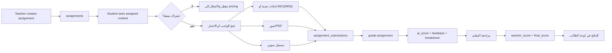

### 15.1 رؤية الواجبات

سياسة `assignments` تسمح للطالب برؤية:

- الواجبات التي `student_id = auth.uid()`.
- أو الواجبات العامة غير المرتبطة بطالب `student_id IS NULL`، حسب منطق السياسة الحالي.

الصفحة تقرأ:

- `title`.
- `description`.
- `total_points`.
- `due_date`.
- `questions`.
- `attachments`.
- `allow_text`.
- `allow_image`.
- `allow_audio`.
- `subject_id`.
- `teaching_stage`.
- `content_type`.

### 15.2 منع التكرار

يتم حساب الواجبات المعلقة بإزالة كل `assignment_id` موجود في submissions المحلية.

ينبغي وجود قيد قاعدة بيانات يمنع أكثر من تسليم فعال لنفس الطالب ونفس الواجب، أو تعريف واضح لمحاولات متعددة إذا كانت مطلوبة.

### 15.3 التسليم

التحقق في الواجهة:

- وجود إجابة لكل سؤال.
- احترام نوع السؤال.
- تجهيز صور وملفات.
- تسجيل الصوت عبر `MediaRecorder`.

الملفات ترفع إلى:

```text
assignment-files/<student_id>/<assignment_id>/...
```

ثم تنشأ روابط موقعة لمدة طويلة وتوضع في submission.

### 15.4 التصحيح

بعد إدراج `assignment_submissions`:

```text
supabase.functions.invoke("grade-assignment", {
  body: { submission_id }
})
```

ثم يرسل إشعار للمعلم.

حقول النتيجة:

- `ai_score`.
- `ai_feedback`.
- `ai_breakdown`.
- `teacher_score`.
- `teacher_feedback`.
- `final_score`.
- `status`.
- `submitted_at`.
- `reviewed_at`.

النتيجة المعروضة:

```text
final_score ?? ai_score
```

---

## 16. المواد والتقارير والنقاط

### 16.1 إنشاء مادة الجلسة

Trigger `auto_create_session_material` ينشئ مادة بعد تحديث الجلسة، بشرط تجاوز حد الجلسة القصيرة وفق المنطق الحالي.

المادة قد تحتوي:

- `booking_id`.
- `student_id`.
- `teacher_id`.
- `recording_url`.
- `material_type`.
- `expires_at`.

### 16.2 تقرير AI للجلسة

`session-report`:

1. يقرأ بيانات الحجز والجلسة.
2. يقرأ رسائل الجلسة أو المادة اللازمة.
3. يستدعي مزود AI.
4. يبني تقريراً منظماً.
5. يحفظه داخل `sessions.ai_report`.
6. يحسب نقاطاً إضافية حسب درجة الأداء.
7. يحدث `student_points`.
8. يرسل إشعاراً للطالب والمعلم.

### 16.3 النقاط

يستخدم `student_points`:

- `total_points`.
- `streak_days`.
- `last_activity_at`.

وتوجد جداول:

- `student_levels`.
- `badges`.
- `student_badges`.

حالياً لوحة الطالب تعرض مجموع النقاط بوضوح، بينما عرض المستوى والشارات يعتمد على المكونات أو المسارات الأخرى وليس كلّه مدمجاً في `StudentDashboard`.

---

## 17. التقييم

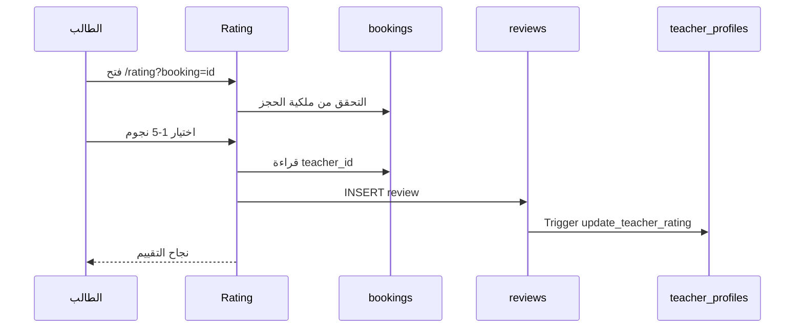

قواعد الواجهة:

- لا يوجد `booking` يعيد الطالب للوحة.
- حجز لا يخص الطالب يعيد الطالب للوحة.
- التقييم صفر غير مسموح.
- التقييم المكرر يعرض رسالة مناسبة.

قيد قاعدة البيانات:

- `reviews.booking_id` فريد، ما يمنع أكثر من تقييم للحجز نفسه.

يجب أن تفرض RLS أيضاً أن الحجز مكتمل أو أن وقت التقييم مسموح، لا أن تكتفي بملكية الطالب فقط.

---

## 18. الإشعارات وRealtime

### 18.1 القنوات المهمة في لوحة الطالب

| القناة | الجدول | الفلتر | الوظيفة |
|---|---|---|---|
| `profile-completion-<uid>` | `profiles` | `user_id` | تحديث اكتمال الملف |
| `student-bookings` | `bookings` | `student_id` | إعادة تحميل الحصص |
| `student-subscription-sync` | `user_subscriptions` | `user_id` | إعادة جمع الرصيد |
| `student-notifications-dashboard` | `notifications` | `user_id` | Toast وصوت |
| `student-wallet-<uid>` | `wallets` | `user_id` | تحديث المحفظة |
| `student-points-<uid>` | `student_points` | `user_id` | تحديث النقاط |
| `student-schedule-table` | `bookings` | `student_id` | حالات الانتظار والجلسة |
| `student-session-status` | `bookings` | حسب المكون | بدء الجلسة |
| `support-<ticket>` | `support_messages` | `ticket_id` | دعم العملاء |
| `unified-chat-<booking>` | `chat_messages` | معالجة الزوج | رسائل المعلم |

### 18.2 الأحداث التي تصل للطالب

- قبول طلب الحجز.
- إلغاء الحجز.
- بدء المعلم الجلسة.
- قبول/رفض الجلسة الفورية.
- رسالة من المعلم.
- تذكير بجلسة قريبة.
- انتهاء أو قرب انتهاء الاشتراك.
- تقرير جلسة جاهز.
- نتيجة واجب أو تصحيح AI.
- تحذير أو تقييد.

### 18.3 مشكلة تصميم محتملة

بعض القنوات تعيد تحميل `fetchData()` بالكامل عند كل تعديل، وبعض المكونات الأخرى لديها polling كل 15 ثانية. هذا يزيد الاستعلامات عند كثرة التحديثات أو عند فتح عدة تبويبات. الأفضل لاحقاً تحديد payload event وتحديث الجزء المتأثر فقط، مع قياس تكلفة Realtime في الإنتاج.

---

## 19. RLS ومصفوفة الوصول

| الجدول | الطالب يقرأ | الطالب يكتب/يحدث | الملاحظة |
|---|---|---|---|
| `profiles` | ملفه وبعض العام | ملفه | الملف العام يعرض عبر views |
| `user_roles` | دوره | عادة لا | الدور ليس منطقاً يحدده العميل |
| `subjects` | نعم | لا | عامة |
| `public_profiles` | العام | لا | View أو جدول عام |
| `public_teacher_profiles` | العام | لا | لا يعرض البيانات المالية الحساسة |
| `teacher_subjects` | القراءة العامة | لا | إدارة المعلم |
| `subscription_plans` | القراءة حسب السياسة | لا | خطط عامة/مخصصة |
| `user_subscriptions` | اشتراكاته | سياسات موجودة للتحديث | يجب منع رفع الرصيد ذاتياً |
| `booking_requests` | طلباته | إنشاء/إلغاء أو تحديث خاص | قبول المعلم منفصل |
| `bookings` | حجوزاته | إنشاء/تحديث حسب السياسة | يجب تقييد الحقول القابلة للتعديل |
| `sessions` | جلسات حجوزاته | لا أو تحديث محدود | المعلم يملك تحديثات التنفيذ |
| `active_sessions` | جلساته | heartbeat/cleanup | يجب تقييد booking ownership |
| `session_events` | أحداثه | إدراج أحداثه | تدقيق الجلسة |
| `chat_messages` | محادثاته | إرسال | طرفا الحجز فقط |
| `notifications` | إشعاراته | تعليم كمقروء | الإدراج الأفضل للخادم |
| `reviews` | عامة | إنشاء تقييمه | يجب ربطه بحجز مكتمل |
| `student_points` | حسب السياسة الحالية | تحديث/إدراج في السياسة | الأفضل أن تكون الزيادة server-side فقط |
| `session_materials` | مواده | حسب السياسة | التسجيلات تحتاج حماية قوية |
| `assignments` | المعين له/العامة | لا | المعلم ينشئ |
| `assignment_submissions` | تسليماته | إنشاء/تحديث تسليمه | المعلم يراجع |
| `invoices` | فواتيره | لا | الإدارة تدير |
| `support_tickets` | تذاكره | إنشاء وتحديث محدود | الدعم يدير |
| `support_messages` | رسائل تذاكره | إرسال | الإدارة تقرأ وترد |

### 19.1 أهم قواعد يجب اختبارها

1. لا يستطيع طالب قراءة حجز طالب آخر بتغيير `booking` في URL.
2. لا يستطيع طالب تغيير `teacher_id` أو `student_id` أو السعر في حجز قائم.
3. لا يستطيع طالب رفع `remaining_minutes` أو `sessions_remaining`.
4. لا يستطيع طالب إرسال رسالة عبر booking لا يخصه.
5. لا يستطيع طالب قراءة تسجيل جلسة لا يخصه.
6. لا يستطيع طالب إدراج review لحجز غير مكتمل أو ليس له.
7. لا يستطيع طالب قبول طلب حجز كأنه معلم.
8. لا يستطيع طالب تعديل `final_score` أو `teacher_feedback`.
9. لا يستطيع طالب قراءة فاتورة طالب آخر.
10. لا يستطيع طالب استخدام `session_id` عشوائي للوصول إلى تقرير أو مادة.

---

## 20. Triggers وRPCs وEdge Functions

### 20.1 Triggers ذات الصلة بالطالب

| العنصر | الأثر |
|---|---|
| `handle_new_user` | تجهيز profile بعد إنشاء Auth user |
| `assign_default_role` | إنشاء الدور الافتراضي |
| `auto_create_session` | إنشاء session بعد booking |
| `auto_complete_session` | حساب المدة والإغلاق والخصم والنقاط |
| `auto_create_session_material` | إنشاء مادة/تسجيل للجلسة |
| `update_teacher_rating` | إعادة حساب تقييم المعلم |
| `filter_chat_message` | فلترة مشاركة بيانات الاتصال |
| `update_updated_at_column` | تحديث timestamps |
| invoice triggers | رقم الفاتورة وسجل ZATCA |

### 20.2 RPCs

| RPC | الاستخدام |
|---|---|
| `has_role` | فحص الدور |
| `has_permission` | فحص صلاحية إضافية |
| `accept_booking_request` | قبول طلب مفرد |
| `accept_booking_group` | قبول مجموعة طلبات |
| `validate_booking_request_against_balance` | Trigger validation للرصيد |
| `get_platform_revenue_summary` | الإدارة، وليس الطالب |
| `start_internal_call` | مكالمة داخلية عند توفرها |
| `respond_internal_call` | قبول أو رفض المكالمة |
| `mark_internal_call_connected` | تثبيت اتصال المكالمة |
| `end_internal_call` | إنهاء المكالمة |

### 20.3 Edge Functions

| Function | دورها في منظومة الطالب |
|---|---|
| `create-checkout` | إنشاء Checkout أو تفعيل المجاني |
| `check-subscription` | فحص Stripe |
| `grade-assignment` | تصحيح الواجب |
| `turn-credentials` | إصدار TURN credentials |
| `save-session-recording` | ربط التسجيل بالجلسة |
| `session-report` | تقرير AI ونقاط |
| `analyze-violations` | تحليل رسائل/صوت الجلسة |
| `send-notification` | تذكيرات وإشعارات النظام |
| `make-phone-call` | مكالمة هاتفية مدفوعة عند استخدام الميزة |
| `call-status-webhook` | تحديث مكالمة واسترداد الرصيد |

---

## 21. خدمة العملاء وواجهة ولي الأمر

### 21.1 خدمة العملاء

`SupportChat` يتيح:

- إنشاء `support_tickets`.
- فتح تذكرة قائمة.
- إرسال رسائل في `support_messages`.
- رفع صور وPDF وصوت إلى `support-files`.
- المحادثة الحية عبر Realtime.
- استخدام `AIAssistantChat` كبداية للمساعدة.
- تحويل محادثة AI إلى تذكرة حقيقية مع سجل المحادثة.

### 21.2 ولي الأمر

`ParentDashboard` موجود كمسار محمي، لكن الكود الحالي يعرض بيانات ثابتة تجريبية مثل:

- أسماء طلاب.
- نسب تقدم.
- حصص قادمة.
- مواد.
- تقييمات.
- إشعارات ثابتة.

رغم وجود جدول `parent_students` في قاعدة البيانات، لا يظهر من المسار الحالي أن `ParentDashboard` مربوط فعلياً بهذا الجدول أو بجداول الحجوزات والاشتراكات الخاصة بالأبناء. لذلك يجب اعتبار واجهة ولي الأمر غير مكتملة وظيفياً، ولا ينبغي استخدامها كمصدر بيانات إنتاجي.

---

## 22. خرائط القراءة والكتابة الرئيسية

### 22.1 تحميل لوحة الطالب

```text
profiles
  -> profile completion

bookings
  -> upcoming scheduled
  -> live sessions
  -> completed history
  -> cancelled history
  -> subjects
  -> sessions
  -> reviews

public_profiles
  -> teacher display names

student_points
  -> dashboard points

user_subscriptions
  -> aggregate remaining minutes
  -> aggregate sessions remaining
  -> plan name/tier

check-subscription
  -> Stripe subscription status
```

### 22.2 إنشاء طلب حجز

```text
profiles
  -> completeness
subjects
  -> subject choices
user_subscriptions
  -> available balance
bookings
  -> existing conflict/reserved minutes
booking_requests
  -> existing reserved request minutes
teacher_profiles/public_teacher_profiles
  -> teacher availability
teacher_subjects
  -> teacher eligibility
booking_requests INSERT
notifications INSERT
```

### 22.3 قراءة الاشتراك

```text
user_subscriptions
  -> active + remaining_minutes > 0 + ends_at > now
subscription_plans
  -> plan display
payment_records/invoices
  -> payment and billing history
check-subscription
  -> Stripe view
```

### 22.4 قراءة المواد

```text
session_materials
sessions
bookings
subjects
storage.session-recordings
```

---

## 23. الأحداث التشغيلية الكاملة

| الحدث | المصدر | المستهلكون | الأثر |
|---|---|---|---|
| تسجيل مستخدم جديد | Auth | triggers | profile/role |
| تحديث الملف | Profile | StudentDashboard | إزالة تنبيه النقص |
| إنشاء طلب حجز | Student/Booking | Teacher + notifications | طلب مفتوح |
| قبول طلب | Teacher/RPC | Student + bookings | حجز مؤكد |
| رفض طلب | Teacher | Student | طلب مرفوض |
| انتهاء طلب | cron/UI | Student/Teacher | expired |
| إنشاء booking | DB/app | sessions trigger | جلسة مرتبطة |
| قرب الحصة | Calendar/timer | notifications | reminder |
| بدء المعلم | Teacher/booking | Student Realtime | زر الانضمام |
| قبول جلسة فورية | Student | Teacher | in_progress |
| دخول الطرفين | WebRTC | active_sessions | بدء عداد/تسجيل |
| إرسال رسالة | Chat | الطرف الآخر | Realtime + notification |
| مخالفة نصية | chat trigger | violations/admin | فلترة/تدقيق |
| إنهاء الجلسة | LiveSession | sessions trigger | complete/billing |
| إنشاء التسجيل | LiveSession | save-session-recording | material |
| إنشاء تقرير | session-report | Student/Teacher | ai_report + points |
| إرسال واجب | StudentAssignments | Teacher + grade-assignment | submission |
| تصحيح AI | grade-assignment | Student | ai score |
| مراجعة المعلم | Teacher | Student | final score |
| تقييم الجلسة | Rating | teacher profile | rating update |
| قرب انتهاء الاشتراك | send-notification | Student | renewal prompt |
| فتح تذكرة | SupportChat | Support | ticket |

---

## 24. الفجوات والمخاطر الإنتاجية

### P0 — حماية الدور

`/student` محمي بالمصادقة والحظر، لكن لا يوجد تحقق صريح داخل `ProtectedRoute` من أن المستخدم طالب. يجب إضافة بوابة دور أو سياسة تحويل موحدة تمنع معلم/مدير من فتح واجهة الطالب أو تنفيذ عمليات طالب عبر UI.

### P0 — قبول الطلب وإنشاء الحجز

`accept_booking_request` و`accept_booking_group` يغيران الطلب إلى `accepted`. يجب التحقق إنتاجياً أن إنشاء `bookings` والتحقق من الرصيد ومنع تعارض الموعد يحدث في نفس Transaction، وإلا يمكن أن يصبح الطلب مقبولاً بلا حجز.

### P0 — الكتابة المباشرة من العميل إلى حقول حساسة

عدة مسارات في الواجهة تنفذ `insert/update` مباشرة على:

- `bookings`.
- `booking_requests`.
- `notifications`.
- `reviews`.
- `student_points`.

يجب مراجعة RLS وقيود الأعمدة، وليس الاكتفاء بوجود سياسة على مستوى الصف. المهم منع تغيير الحقول الحساسة حتى لو كان الصف مملوكاً للطالب.

### P1 — تعارض المواعيد غير ذري

الحجز في `Booking` و`SearchTeacher` يفحص التعارض من العميل قبل الإدراج. يوجد خطر race condition إذا أرسل جهازان الطلب في الوقت نفسه. يجب إضافة قيد/وظيفة ذرية في PostgreSQL تمنع تداخل الحجز المؤكد لنفس الطالب أو المعلم.

### P1 — خصم الرصيد والحجز

الواجهة تخصم الطلبات والحجوزات المحجوزة حسابياً، وTrigger يتحقق عند إدراج `booking_requests`. يجب التأكد أن:

- تحديث طلبات متعددة في دفعة واحدة لا يتجاوز الرصيد.
- قبول الطلب لا يحجز الدقائق مرتين.
- إلغاء الطلب يعيد الحجز المحاسبي فوراً.
- انتهاء الطلب يحرر الحجز.

### P1 — اختلاف Stripe والاشتراك المحلي

`check-subscription` يقرأ Stripe، بينما الحجز يقرأ `user_subscriptions`. يجب وجود Webhook موثوق يضمن أن:

- الدفع الناجح ينشئ الاشتراك المحلي مرة واحدة.
- التجديد يحدث مرة واحدة.
- الإلغاء أو الفشل يوقف الاشتراك المحلي.
- إعادة المحاولة لا تنشئ اشتراكاً مكرراً.

### P1 — الإشعارات من المتصفح

بعض المسارات تحاول إدراج إشعارات مباشرة من العميل. بعد migrations توجد محاولات لتقييد INSERT على الإشعارات. يجب اختبار السياسة النهائية على الإنتاج والتأكد من أن الإشعار الحساس ينشئه Trigger أو Edge Function موثوق، لا متصفح الطالب.

### P1 — جلسة فورية بتحديث مباشر

تحديث `session_status` مباشرة من الطالب يحتاج تحققاً ذرياً من:

- ملكية الطلب.
- أن الحالة ما زالت `waiting_acceptance`.
- عدم وجود طرف آخر قبل الطالب.
- عدم وجود جلسة نشطة للطالب أو المعلم.

### P1 — حماية التسجيلات

بعض سياسات Storage القديمة تشير إلى أن تسجيلات الجلسات قد تكون قابلة للقراءة العامة. يجب فحص السياسة النهائية للـbucket `session-recordings` والتأكد من أنها تقيد القراءة بطرفي الجلسة أو Signed URLs قصيرة العمر.

### P1 — مصدر الوقت والمنطقة الزمنية

الواجهة تبني أياماً وساعات باستخدام توقيت المتصفح، بينما قاعدة البيانات تحفظ `timestamptz`. يجب توحيد:

- المنطقة الزمنية المعروضة.
- تحويل أوقات المعلم.
- منع حجز وقت ماضٍ بسبب اختلاف المنطقة الزمنية.
- تخزين كل المواعيد UTC.

### P1 — تكرار الاستعلامات

لوحة الطالب تجمع بين Realtime وpolling وإعادة تحميل كامل للبيانات. يجب قياس:

- عدد الاستعلامات عند فتح الصفحة.
- عدد الاستعلامات بعد حدث booking.
- سلوك عدة تبويبات.
- تسرب القنوات عند التنقل.

### P2 — إخفاء الحصص محلياً فقط

إخفاء الحصة من `StudentScheduleTable` لا يزامن بين الأجهزة، ولا يسجل تفضيل المستخدم في قاعدة البيانات. هذا مقبول كإخفاء عرضي، لكنه ليس أرشفة حقيقية.

### P2 — عداد الحصص المكتملة

نسبة التقدم ثابتة على أساس 20 حصة. يجب توثيق هل هذا هدف تعليمي مقصود أم قيمة تجريبية، وإلا يجب نقله إلى إعداد أو مستوى الطالب.

### P2 — ولي الأمر

واجهة `/parent` الحالية لا تظهر كواجهة متصلة ببيانات `parent_students`. يجب تنفيذ الربط قبل الاعتماد عليها.

### P2 — أنواع Supabase

أي جداول أضيفت حديثاً مثل:

- `internal_calls`.
- جداول الواجبات الحديثة.
- حقول الجلسة الجديدة.

يجب أن تنعكس في `src/integrations/supabase/types.ts` بإعادة توليد الأنواع.

---

## 25. مصفوفة اختبارات القبول

### 25.1 الهوية والحماية

- مستخدم غير مسجل يفتح `/student` ويحول إلى `/login`.
- مستخدم محظور يرى شاشة التقييد.
- مستخدم teacher لا يستطيع تنفيذ عمليات طالب عبر واجهة `/student`.
- تغيير `booking` في URL لا يكشف بيانات طالب آخر.

### 25.2 الملف والاشتراك

- طالب بلا اسم/هاتف/مرحلة يمنع من إكمال الحجز.
- طالب باشتراك منتهٍ لا يستطيع إرسال طلب.
- طالب لديه أكثر من اشتراك يرى مجموع الدقائق الصحيح.
- انتهاء الباقة يغير حالة العرض بعد Realtime أو إعادة التحميل.
- Stripe الناجح ينشئ اشتراكاً محلياً مرة واحدة.

### 25.3 الحجز

- حجز معلم مباشر يظهر مواد المعلم فقط.
- broadcast يرسل للمعلمين المؤهلين فقط.
- اختيار عدة مواعيد ينتج `group_id` واحداً.
- الطلب منتهٍ لا يقبل بعد `expires_at`.
- طلبان متزامنان لا يتجاوزان الرصيد.
- تعارض الطالب أو المعلم يمنع الحجز ذرياً.
- قبول المعلم ينشئ booking/session متسقين.
- إلغاء الطالب لا يحذف السجل التاريخي.

### 25.4 الجلسة

- الطالب لا يدخل جلسة لا تخصه.
- فحص الجهاز والميكروفون يعمل قبل الدخول.
- لا يمكن للطالب فتح جلستين نشطتين.
- heartbeat يسجل كل 15 ثانية.
- تغيير التبويب يسجل event مناسباً.
- دخول الطرفين يبدأ العداد.
- الجلسة الأقل من 5 دقائق لا تخصم رصيداً.
- الجلسة المكتملة تخصم مدة واحدة فقط.
- إعادة تحميل الصفحة لا تنشئ خصماً ثانياً.
- التسجيل يرفع ويظهر للطالب المصرح له فقط.

### 25.5 الدردشة

- الطالب يقرأ محادثة حجوزاته فقط.
- لا يستطيع إرسال رسالة بدون اشتراك إذا كانت السياسة تتطلب ذلك.
- رسالة مخالفة لا تصل للطرف الآخر بصورتها المحظورة.
- الملفات لا تكون عامة دون قصد.
- Realtime لا يكرر الرسالة بعد optimistic update.

### 25.6 الواجبات

- الطالب يرى الواجب المخصص له والعام المسموح فقط.
- الواجب المقفل لا يقبل التسليم بدون اشتراك.
- لا يمكن إرسال إجابات ناقصة.
- الصور والصوت ترفعان تحت مسار الطالب فقط.
- `grade-assignment` لا يصحح submission لطالب آخر.
- الدرجة النهائية تعرض درجة المعلم إن وجدت، وإلا درجة AI.

### 25.7 الفواتير والتقييم

- الطالب يرى فواتيره فقط.
- رقم الفاتورة فريد.
- PDF يعرض الضريبة والإجمالي الصحيحين.
- لا يمكن تقييم حجز طالب آخر.
- لا يمكن تقييم الحجز نفسه مرتين.
- تقييم مكتمل يحدث متوسط المعلم مرة واحدة.

---

## 26. التوصية التنفيذية التالية

إذا كان الهدف جعل منظومة الطالب جاهزة للإنتاج، فترتيب العمل المقترح هو:

1. إضافة فحص دور صريح للمسارات الطالبية.
2. تحويل قبول الطلب + التحقق من الرصيد + منع التعارض + إنشاء booking إلى Transaction/RPC واحدة.
3. تقييد كل تحديثات الحجز والاشتراك والدرجات على مستوى الأعمدة والانتقالات المسموحة.
4. اختبار RLS وStorage من خلال مستخدمين فعليين بأدوار مختلفة.
5. بناء Webhook/idempotency واضح للدفع والاشتراكات والفواتير.
6. تثبيت دورة الجلسة والخصم والتسجيل بتجارب إعادة التحميل والانقطاع.
7. تقليل إعادة التحميل الكامل الناتج عن Realtime وpolling.
8. ربط ParentDashboard فعلياً بجدول `parent_students` أو إبقاؤه خارج نطاق الإنتاج.
9. إعادة توليد Supabase types بعد اكتمال migrations الحديثة.
10. تنفيذ اختبارات E2E لدورة: اشتراك → طلب → قبول → جلسة → خصم → تسجيل → تقييم.

---

## 27. الخلاصة المعمارية

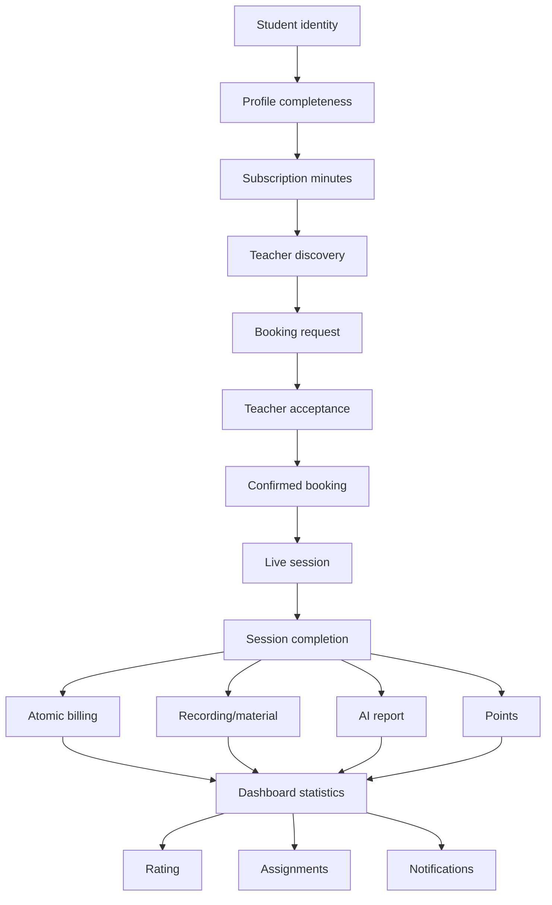

النظام الحالي يغطي معظم دورة الطالب من الواجهة إلى قاعدة البيانات، لكنه يعتمد في نقاط حرجة على تعاون العميل مع قاعدة البيانات. قبل الإصدار الإنتاجي النهائي يجب نقل ضمانات الانتقال المالي والزمني والصلاحيّات إلى Transactions وRPCs وقيود PostgreSQL، ثم اختبارها ضد التزامن والانقطاع والتلاعب بالطلبات.