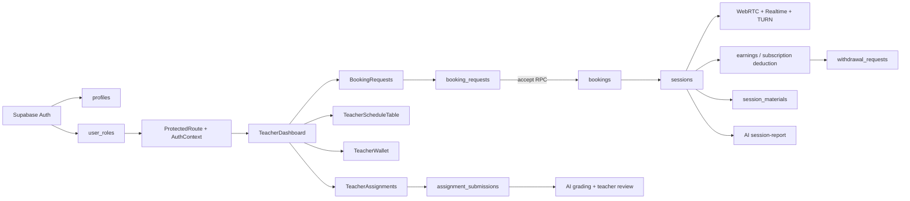
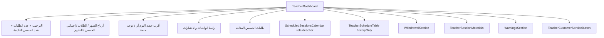
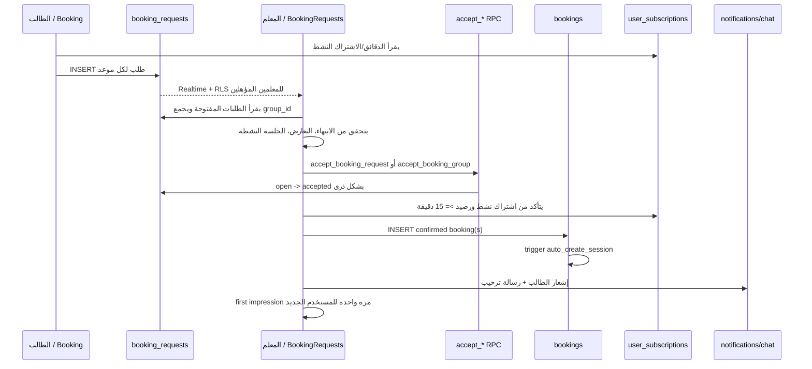
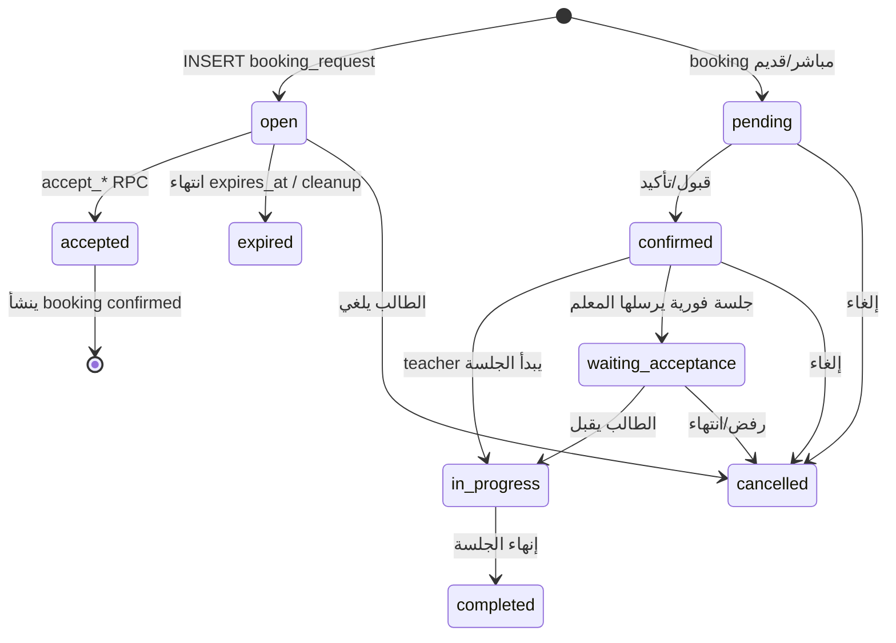
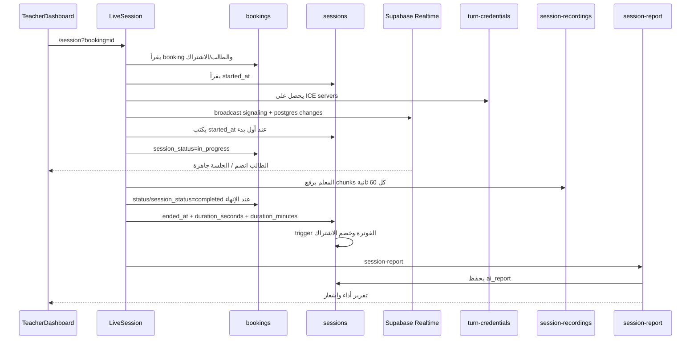
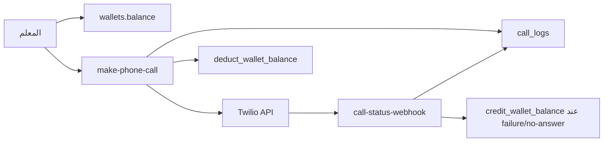
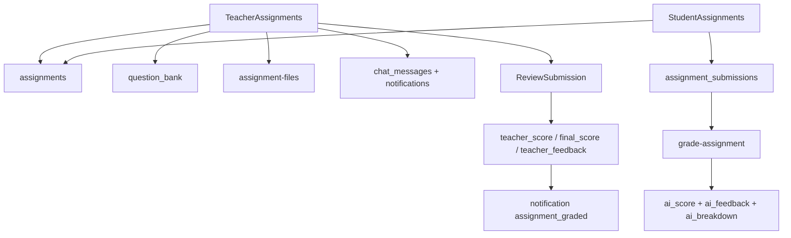
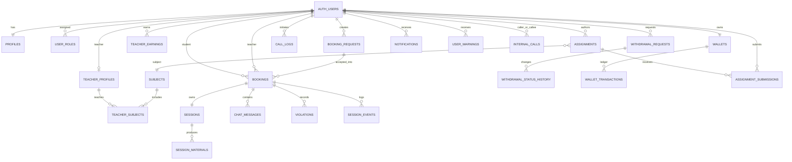

# المخطط الهندسي الدقيق لمنظومة لوحة تحكم المعلم — Taealam

> **نطاق الوثيقة:** فرع `main` من مستودع `refaaatads-debug/taealam`، كما يظهر في الكود والمخططات وملفات Edge Functions. هذه وثيقة قراءة هندسية وليست تقريراً عن حالة قاعدة الإنتاج لحظة القراءة. أي نقطة موسومة «تحقق إنتاجي» تحتاج فحصاً من Supabase/VPS قبل اعتمادها كحقيقة تشغيلية.
>
> **تاريخ القراءة:** 2026-09-04 — المنطقة الزمنية Asia/Riyadh.

## 1. الملخص التنفيذي

لوحة المعلم ليست شاشة CRUD واحدة؛ هي طبقة تشغيل فوق خمس دورات مترابطة:

1. **الهوية والدور:** Supabase Auth → `profiles` و`user_roles` → بوابة المسارات → تحقق موافقة المعلم.
2. **السوق والحجز:** الطالب ينشئ `booking_requests` مفتوحة، والمعلم يرى الطلبات المؤهلة ويقبلها عبر RPC ذري، ثم ينشئ التطبيق الحجوزات المؤكدة.
3. **الجلسة:** `bookings` تقود `sessions`، وWebRTC يتصل عبر Realtime/TURN، مع قفل الجلسة النشطة، تسجيل، دردشة، وإنهاء يطلق الفوترة والتقرير.
4. **المال:** أرباح الحصص في `teacher_earnings` والسحب عبر `withdrawal_requests`، بينما رصيد الاتصال الهاتفي منفصل في `wallets` و`call_logs`.
5. **التعليم اللاحق:** المواد والتسجيلات وتقارير AI والواجبات/الاختبارات والتصحيح والإشعارات.



### أهم نتيجة هندسية

السلطة الحقيقية موزعة بين **React** و**RLS** و**RPCs/Triggers**. الواجهة تمنع كثيراً من الحالات، لكنها ليست مصدر الثقة النهائي. القواعد الحساسة التي يجب اعتبارها authoritative هي: `accept_booking_group`, `accept_booking_request`, `auto_create_session`, `auto_complete_session`, `validate_booking_request_against_balance`, ودوال المكالمات الداخلية.

---

## 2. خريطة المستودع ومصادر الحقيقة

| الطبقة | الملفات/المجلدات | الدور |
|---|---|---|
| الدخول | `src/pages/Login.tsx`, `src/contexts/AuthContext.tsx`, `src/components/ProtectedRoute.tsx` | تسجيل الدخول، التسجيل، OAuth/OTP، الأدوار، الجلسة النشطة، الحظر |
| لوحة المعلم | `src/pages/TeacherDashboard.tsx` | تركيب الأقسام وجلب الملخص والـRealtime |
| الحجز والجدول | `src/components/teacher/BookingRequests.tsx`, `TeacherScheduleTable.tsx`, `CancelSessionDialog.tsx` | الطلبات، القبول، الجدول، الإلغاء، الجلسة الفورية |
| المال | `src/components/teacher/WithdrawalSection.tsx`, `src/pages/TeacherWallet.tsx`, `PhoneCallDialog.tsx` | أرباح الحصص/السحب مقابل رصيد الاتصال الهاتفي |
| الجلسة | `src/pages/LiveSession.tsx`, `src/hooks/useWebRTC.ts`, `useSessionProtection.ts`, `useSessionAntiCheat.ts` | بدء/إنهاء، الصوت/الفيديو، التسجيل، الدردشة، الجودة، مكافحة التعدد |
| التعليم | `src/pages/TeacherAssignments.tsx`, `src/pages/ReviewSubmission.tsx` | إنشاء الواجبات والاختبارات، بنك الأسئلة، التصحيح |
| البيانات | `src/integrations/supabase/client.ts`, `types.ts` | عميل Supabase وTyped API |
| SQL | `supabase/migrations/*.sql` | الجداول، RLS، RPCs، triggers، الفهارس، realtime |
| Edge Functions | `supabase/functions/*/index.ts` | TURN، AI، التسجيل، الاتصال الهاتفي، Stripe، الإشعارات |

تمت قراءة **149 migration** بحجم إجمالي يقارب **263KB**. التحليل وجد 39 جدولاً/كياناً ذا صلة، 52 دالة، 37 trigger، و154 سياسة RLS في نطاق المشروع؛ الأرقام تشمل تكرار/تعديلات السياسات عبر migrations، وليست مقياساً لعدد القواعد الفعالة في الإنتاج.

---

## 3. المسارات وبوابات الوصول

### 3.1 مسارات المعلم المباشرة

```mermaid
flowchart TD
  Login[/login] --> Dashboard[/dashboard]
  Dashboard -->|role=teacher| Teacher[/teacher]
  Teacher --> Wallet[/teacher/wallet]
  Teacher --> Assign[/teacher/assignments]
  Assign --> Review[/teacher/assignments/review/:id]
  Teacher --> Session[/session?booking=:id]
  Teacher --> Chat[/chat?booking=:id]
  Teacher --> Profile[/profile]
  Teacher --> Support[/support]
```

| المسار | الصفحة | الاستخدام الفعلي |
|---|---|---|
| `/teacher` | `TeacherDashboard` | الملخص، الطلبات، التقويم، سجل الحصص، السحب، المواد، التحذيرات |
| `/teacher/wallet` | `TeacherWallet` | رصيد الاتصال، سجل المكالمات، شحن Stripe |
| `/teacher/assignments` | `TeacherAssignments` | إنشاء واجب/اختبار، بنك أسئلة، مراجعة التسليمات |
| `/teacher/assignments/review/:id` | `ReviewSubmission` | تصحيح AI أو اعتماد/تعديل الدرجة يدوياً |
| `/session?booking=<id>` | `LiveSession` | الحصة المباشرة عبر WebRTC |
| `/chat?booking=<id>` | `Chat` أو سياق الجلسة | المحادثة والملفات/الصوت |
| `/profile` | `Profile` | إعدادات وبيانات الحساب |
| `/support` | `SupportChat` | خدمة العملاء |

### 3.2 سلوك `ProtectedRoute`

1. ينتظر `AuthContext.loading`.
2. إذا لم يوجد مستخدم → `/login`.
3. إذا كان الدور `admin` يتجاوز فحص الحظر.
4. لغير المديرين يفحص `user_warnings.is_banned=true`.
5. عند الحظر يعرض شاشة تقييد الحساب وروابط الدعم.
6. يعيد children؛ **لا يوجد داخل `ProtectedRoute` تحقق صريح من أن المسار `/teacher` لا يفتحه إلا دور teacher**. الاعتماد الفعلي على الدور يأتي من إعادة التوجيه ومن RLS/RPC، وهذه نقطة تحقق/تقوية موصى بها.

### 3.3 حل الدور في `AuthContext`

- `profiles` يجلب الاسم والصورة والهاتف.
- `user_roles` يجلب جميع الأدوار.
- الأولوية: `admin` ثم `teacher` ثم `parent` ثم `student`.
- تسجيل OAuth للمعلم يحفظ `pending_role=teacher` في `localStorage`، ثم يستدعي `set_new_user_role` بعد العودة.
- التسجيل العادي يمرر `full_name` و`role` في metadata؛ trigger قاعدة البيانات ينشئ `profiles` ويضيف دور الطالب الافتراضي، ثم يعالج دور المعلم من المسار/الـRPC.
- Cache محلي للـprofile والأدوار لتسريع الإقلاع.
- `user_active_session` يحتفظ بـ`session_token`, `device_info`, `last_seen`; Realtime يرصد جلسة أخرى ويعرض تعارضاً أو يسمح بالاستحواذ وفق حداثة heartbeat.

### 3.4 تسجيل الدخول

| الطريقة | التنفيذ | ما بعد النجاح |
|---|---|---|
| بريد/كلمة مرور | `supabase.auth.signInWithPassword` مع timeout 15 ثانية | قراءة الدور ثم `/teacher` أو المسار المناسب |
| تسجيل بريد | `supabase.auth.signUp` مع metadata | trigger للـprofile/role؛ قد ينتظر تأكيد البريد |
| هاتف | `signInWithOtp` | OTP ثم قراءة الدور |
| Google/Apple | `signInWithOAuth`; حفظ `pending_role` عند تسجيل معلم | `AuthContext` يطبق الدور بعد العودة |
| deep link | `?redirect=/...` | يحظى بالأولوية إذا كان يبدأ بـ`/` |

---

## 4. تركيب لوحة المعلم وسلوكها

### 4.1 ترتيب الشاشة



### 4.2 جلب الملخص في `fetchData`

| البيانات | الاستعلام/المصدر | ملاحظات |
|---|---|---|
| ملف المعلم | `teacher_profiles` حيث `user_id=user.id` | يحدد `is_approved`, المعدل، التقييم، الإجمالي |
| عدد الطلبات | `booking_requests`: `status=open`, `expires_at >= now` | عداد عام؛ RLS هو الذي يحدد ما يراه المعلم |
| الحصص القادمة | `bookings`: `teacher_id`, `status=confirmed`, `scheduled_at>=now`, limit 10 | مع `subjects(name)` |
| الحصص الحية | نفس الجدول مع `session_status=in_progress`, limit 5 | تدمج وتزال التكرارات بالـid |
| انتظار قبول الطالب | `session_status=waiting_acceptance`, limit 10 | لدعم الجلسة الفورية |
| أسماء الطلاب | `public_profiles` بـ`in(student_ids)` | تُدمج في `student_profile` |
| عدد الطلاب المعروض | `bookings.select(student_id,{count:'exact',head:true})` | **ليس distinct**؛ قد يكون الرقم عدد حجوزات لا عدد طلاب |
| أرباح الشهر | `teacher_earnings.amount` للشهر `YYYY-MM` ثم reduce | لا يستعمل هنا RPC صافي الأرباح |

عند عدم اعتماد المعلم (`teacher_profiles.is_approved=false`) تظهر شاشة انتظار الموافقة ولا تظهر أقسام التشغيل.

### 4.3 Realtime داخل لوحة المعلم

- `bookings` مفلتر بـ`teacher_id`: يعيد الجلب، ويعرض toast عند INSERT.
- `booking_requests`: أي INSERT/UPDATE يعيد الجلب ويصدر صوت/تنبيه طلب جديد.
- `notifications` مفلتر بـ`user_id`: toast بعنوان ومحتوى الإشعار.
- `teacher_earnings` مفلتر بـ`teacher_id`: يعيد الجلب بعد التغير.
- `TeacherScheduleTable` يستمع لتغيرات حجوزات المعلم؛ عند `session_status=in_progress` يعلن أن الطالب جاهز.

**تحقق أداء:** قناة `booking_requests` في `TeacherDashboard` غير مفلترة بـteacher؛ قد تسبب refresh للوحة عند تغير طلبات أخرى، حتى لو كان RLS يمنع كشف البيانات. يستحسن تضييقها أو نقل عداد الطلبات إلى subscription أدق.

---

## 5. دورة طلب الحجز والقبول



### 5.1 إنشاء طلب من `Booking.tsx`

- يقرأ المواد، ملف المستخدم، اشتراكه، الحجوزات والطلبات المستقبلية.
- يعرض 14 يوماً ويحوّل availability المعلم إلى slots، مع fallback slots.
- مدة الحصة تأتي من الاشتراك، والـfallback الحالي 60 دقيقة.
- يمنع التعارض المحلي مع الحجوزات/الطلبات ضمن 30 دقيقة.
- يمنع تجاوز `remaining_minutes`.
- يكتب `booking_requests`؛ معلم محدد = طلب للمعلم، وإلا broadcast للمعلمين حسب المادة/المرحلة.
- بعد النجاح يكتب إشعارات ورسائل chat بحسب مسار المعلم.
- trigger `validate_booking_request_against_balance` يعيد حساب:
  - مجموع الدقائق المتبقية في الاشتراكات الفعالة.
  - الدقائق المحجوزة في الطلبات المفتوحة/المقبولة المستقبلية.
  - الدقائق المحجوزة في `bookings` ذات `pending/confirmed`.
  - يرفض الإدراج إذا تجاوز المجموع الرصيد.

### 5.2 ما تعرضه `BookingRequests`

- يقرأ `booking_requests` المفتوحة ثم يفلتر انتهاء الصلاحية في المتصفح.
- يجلب أسماء الطلاب والمواد على دفعات من `public_profiles` و`subjects`.
- يجمع الصفوف ذات `group_id` في طلب واحد، ويرتب المواعيد.
- يرفض المجموعة عبر `reject_booking_request` RPC.
- يتحقق من تعارض كل slot مع حجوزات المعلم `pending/confirmed`.
- يمنع القبول أثناء `in_progress` حديثة خلال آخر 4 ساعات.
- قبول المجموعة عبر `accept_booking_group(_group_id,_teacher_id)`؛ المفرد عبر `accept_booking_request(_request_id,_teacher_id)`.
- بعد القبول يقرأ الاشتراك النشط للطالب بشرط `remaining_minutes >= 15`، ثم ينشئ حجوزات confirmed، وإشعاراً واحداً، ورسالة ترحيب.
- `teacher_first_impressions` يمنع تكرار نافذة الانطباع الأول للطالب.

### 5.3 آلة حالات الطلب/الحجز



### 5.4 فجوة حرجة في ترتيب القبول

الكود يغيّر الطلب إلى `accepted` عبر RPC **قبل** فحص الاشتراك النشط ثم إدراج `bookings`. إذا لم يكن لدى الطالب اشتراك/رصيد كافٍ، يعرض التطبيق رسالة خطأ ويخرج، لكن الطلب قد يبقى `accepted` بلا حجز. الإصلاح المقترح: نقل فحص الاشتراك إلى RPC الذري أو جعل RPC ينشئ الحجز ضمن transaction ويعيد نتيجة واحدة، أو تنفيذ rollback صريح آمن.

فجوات إضافية:

- فحص التعارض يتم في العميل وليس بقيد/دالة ذرية على قاعدة البيانات؛ سباق قبول معلمين لنفس الوقت ممكن نظرياً.
- `checkBusyStatus()` يحدث state ثم يقرأ `isBusy` مباشرة في نفس handler؛ القراءة قد تكون قيمة React السابقة في نافذة سباق.
- شرط `is_approved` وmatching المادة موجود في RLS، لكن `BookingRequests` نفسه يجلب `status=open` فقط؛ لذلك دقة العرض تعتمد على صحة سياسة RLS الفعالة في الإنتاج.

---

## 6. دورة الجلسة وWebRTC



### 6.1 بدء الحصة

- لا يبدأ المعلم من زر داخل `TeacherScheduleTable`؛ الرابط الرئيسي يمر من بطاقة أقرب حصة/المسار.
- الهاتف ممنوع لبدء الحصة؛ يتطلب كمبيوتر/لابتوب.
- يتحقق من booking ومن حد أدنى للاشتراك، ومن عدم وجود جلسة أخرى، ومن قفل tab عبر `active_sessions`.
- إذا كانت `sessions.started_at` موجودة، يعاملها كإعادة انضمام؛ وإلا يكتب وقت البدء ويحدث `bookings.session_status=in_progress`.
- وجود الطرفين يبدأ العداد ويطلق التسجيل التلقائي.

### 6.2 طبقة الاتصال

- `useWebRTC` ينشئ PeerConnection ويستخدم Supabase Realtime broadcast للتفاوض ICE/offer/answer.
- `turn-credentials` يصدر credentials مؤقتة لـcoturn؛ يعتمد على `TURN_SECRET` وJWT موجود في Authorization.
- مؤشرات الجودة تعرض STUN/TURN وحالات `connected/connecting/disconnected/failed`.
- عند الانقطاع، يحاول ICE restart/backoff، ويعرض banner إعادة الاتصال بعد 5 ثوانٍ.
- Data channel ينقل أحداث السبورة، رفع اليد، وصلاحية الرسم.

### 6.3 مكافحة الجلسات المتعددة والحماية

- `active_sessions`: تسجيل جهاز، heartbeat، connected/disconnected.
- `session_events`: device id وأحداث anti-cheat.
- يمنع فتح نفس الحصة في تبويبين ويجري peer heartbeat كل 10 ثوانٍ تقريباً.
- `useSessionProtection` يفحص الأرقام، البريد، الروابط والكلمات المحظورة في chat/voice، ويسجل `violations` ويحدث `user_warnings`.
- التكرار قد يكتم الدردشة/الصوت 60 ثانية أو ينهي الجلسة ويبلغ الإدارة.

### 6.4 التسجيل والمواد

- التسجيل للمعلم فقط لتجنب الكتابة المزدوجة.
- يرفع blob تراكمياً باسم ثابت كل 60 ثانية إلى bucket `session-recordings`.
- عند الفشل يحفظ backup محلياً ثم يحاول الاسترداد.
- `save-session-recording` يتحقق من أن المستخدم participant، يكتب `sessions.recording_url`، ويربط التسجيل بـ`session_materials` إذا انتهت الجلسة وكانت المدة >= 5 دقائق.
- `TeacherSessionMaterials` يجلب المواد، `sessions.ai_report`, الطالب، والحجز؛ يعرض التسجيل والتقرير.

### 6.5 إنهاء الجلسة والفوترة

عند الإنهاء:

1. يوقف التسجيل قبل تنظيف WebRTC.
2. يحسب `duration_seconds` من العداد، و`duration_minutes = ceil(seconds/60)`.
3. يحدث `bookings.status=completed` و`session_status=completed`.
4. يحدث `sessions.ended_at`, `duration_seconds`, `duration_minutes`.
5. trigger `auto_complete_session` يحفظ snapshots المالية ويخصم الدقائق.
6. يرسل إشعارات، ويستدعي `session-report`.
7. يوجه المعلم إلى `/teacher` والطالب إلى التقييم/لوحة الطالب.

المعادلة الحالية من آخر migration:

- جلسة أقل من 5 دقائق: `short_session=true`، خصم 0، دخل 0.
- غير ذلك: `gross = duration_minutes / 60 * 60`.
- `VAT` حسب `financial_settings`، fallback 15%.
- `teacher_base = duration_minutes / 60 * teacher.hourly_rate`.
- `platform_fee = gross - teacher_base`، و`net = teacher_base`.
- تحفظ النسب والقيم snapshot في `sessions` و`teacher_earnings`.

**تحقق إنتاجي:** يجب التأكد أن قيمة `hourly_rate` لا تجعل `platform_fee` سالبة، وأن job/trigger الذي ينشئ `teacher_earnings` يعمل مرة واحدة فقط عند إعادة المحاولة أو تحديث session.

---

## 7. الاتصالات الصوتية الداخلية والهاتف

### 7.1 الاتصال الداخلي للمعلم

`CallStudentButton` لا يبدأ مكالمة Twilio مباشرة؛ يستدعي `InternalCallContext`:

- `start_internal_call(p_student_id,p_booking_id)`.
- أحدث migration يسمح بمكالمة بلا حجز، مع الاحتفاظ بالحجز إن كان صالحاً.
- RPC يتحقق من دور المعلم، الطالب، انشغال الطالب في حصة، ومكالمة أخرى، ويستخدم advisory lock.
- `internal_calls` حالات: `ringing`, `connecting`, `connected`, `rejected`, `busy`, `cancelled`, `missed`, `ended`, `failed`.
- `respond_internal_call`, `mark_internal_call_connected`, `end_internal_call`, `expire_internal_calls`.
- WebRTC voice منفصل عن جلسة الفيديو، signaling عبر broadcast، وTURN عبر `turn-credentials`.

### 7.2 الاتصال الهاتفي عبر Twilio

`PhoneCallDialog` مسار مالي مستقل:



- يقرأ رقم الطالب ورصيد المعلم وسعر الدقيقة من `site_settings.call_price_per_minute`.
- ينشئ Twilio call و`call_logs`، ثم يخصم الرصيد عبر RPC.
- webhook يتحقق من `X-Twilio-Signature`، يحدّث الحالة/المدة/التكلفة، ويرد الرصيد عند الفشل أو عدم الإجابة وفق المنطق الحالي.

---

## 8. الأرباح والسحب والمحفظة

### 8.1 مساران ماليان منفصلان

| المسار | الجداول | الواجهة | المصدر |
|---|---|---|---|
| أرباح تدريس المعلم | `sessions`, `teacher_earnings`, `teacher_daily_stats`, `financial_settings` | `WithdrawalSection` داخل `/teacher` | مدة الجلسة + hourly rate + VAT/platform snapshots |
| رصيد الاتصال الهاتفي | `wallets`, `wallet_transactions`, `call_logs` | `/teacher/wallet`, `PhoneCallDialog` | شحن Stripe ثم خصم تكلفة الاتصال |

### 8.2 السحب

`WithdrawalSection` يجلب بالتوازي:

- `get_teacher_earnings_breakdown(_teacher_id)` → المتاح/المؤكد/المدفوع/المعلق/الدقائق/عدد الجلسات.
- `financial_settings.min_withdrawal_amount`، fallback 100 ريال.
- تاريخ `teacher_earnings` للعرض الداخلي المحدود.
- آخر 10 `withdrawal_requests`.
- `get_teacher_net_summary` للشهر الحالي.

عند الطلب:

1. يتحقق من الرصيد والحد الأدنى.
2. يرفع المرفق الاختياري إلى `support-files` ويحصل على public URL.
3. ينشئ `withdrawal_requests` بمبلغ صافي وملاحظات المعلم.
4. يرسل notification من نوع `withdrawal`.
5. trigger `validate_withdrawal_minimum` وtrigger سجل التغييرات يطبقان حماية إضافية.
6. `withdrawal_status_history` يسجل انتقالات الحالة.

حالات السحب الفعلية يجب اعتمادها من enum/سياسة الإنتاج؛ الكود يعرض history ولا ينفذ قرار الدفع الإداري.

### 8.3 شحن محفظة الاتصال

- الحد الأدنى في الواجهة: 10 ريال.
- `wallet-topup` ينشئ Stripe Checkout ويعود إلى `/teacher/wallet?topup=success&session_id=...`.
- `wallet-topup-verify` يتحقق من الدفع وملكية session id، ويمنع التكرار عبر `wallet_transactions.stripe_session_id`، ثم يستدعي `credit_wallet_balance`.
- triggers تنشئ wallet عند ملف المعلم وتحدّث timestamps.

---

## 9. الواجبات والاختبارات والتصحيح



### 9.1 إنشاء المحتوى

`TeacherAssignments` يجلب:

- assignments المعلم.
- question bank المعلم.
- كل المواد.
- الطلاب المرتبطين بحجوزات `confirmed/completed`.
- التسليمات المرتبطة بواجبات المعلم.

يدعم:

- `content_type=assignment|quiz`.
- عنوان، وصف، مادة، مرحلة، موعد نهائي، إجمالي الدرجات.
- أسئلة نصية/اختيار متعدد/اختيار متعدد الإجابات وأنواع أخرى، مع نقاط وإجابة صحيحة وتفسير.
- مرفقات PDF/JPG/PNG حتى 10MB إلى `assignment-files`؛ Signed URL طويلة العمر.
- حفظ الأسئلة أيضاً إلى `question_bank` وإعادة استخدامها.
- `extract-questions-from-file` لتحليل ملف وكتابة الأسئلة المستخرجة إلى بنك المعلم.
- إرسال رابط للطالب عبر chat marker وإشعارات؛ broadcast عند عدم اختيار طالب محدد حسب الاشتراك/الحجوزات.

### 9.2 التسليم والتصحيح

- الطالب يحتاج اشتراكاً فعالاً.
- يجيب كل الأسئلة، ويمكن أن يرسل نصاً أو صورة أو صوتاً حسب إعدادات assignment.
- يرفع الملفات إلى bucket نفسه ثم ينشئ `assignment_submissions`.
- يستدعي `grade-assignment` في الخلفية.
- حالات العرض: `submitted`, `ai_graded`, `reviewed`.
- `ReviewSubmission` يقرأ الحل والواجب واسم الطالب؛ يمكنه:
  - تشغيل AI يدوياً.
  - كتابة درجة المعلم وملاحظته واعتماد `final_score`.
  - اعتماد درجة AI كدرجة نهائية.
- بعد الاعتماد ترسل notification للطالب إلى `/student/assignments`.

**ملاحظة صلاحيات:** RLS يقرر أن المعلم يرى ويحدث submissions الخاصة بواجباته، والطالب يدير submissions الخاصة به، والمدير يدير الكل. Edge Function يعيد التحقق من participant/teacher/admin قبل استعمال service role.

---

## 10. نموذج البيانات والعلاقات



### 10.1 الجداول الرئيسية وحقولها

| الجدول | المفاتيح/الحقول التشغيلية | العلاقة/الغرض |
|---|---|---|
| `profiles` | `user_id`, `full_name`, `avatar_url`, `phone`, `teaching_stage` | الملف الأساسي |
| `public_profiles` | `user_id`, `full_name`, `avatar_url` | قراءة أسماء آمنة للواجهة |
| `user_roles` | `user_id`, `role`، unique(user_id,role) | الدور الأمني |
| `teacher_profiles` | `user_id`, `hourly_rate`, `is_approved`, `avg_rating`, `total_sessions`, `available_*`, bank/VAT fields | ملف المعلم والتوفر والمال |
| `teacher_subjects` | `teacher_id` إلى profile الداخلي، `subject_id` | مواد المعلم |
| `booking_requests` | `student_id`, `subject_id`, `scheduled_at`, `duration_minutes`, `status`, `expires_at`, `group_id`, `accepted_by` | سوق الطلبات |
| `bookings` | `student_id`, `teacher_id`, `subject_id`, `scheduled_at`, `status`, `session_status`, `duration_minutes`, `subscription_id`, cancellation fields | الحجز المؤكد |
| `sessions` | unique `booking_id`, `room_id`, `started_at`, `ended_at`, `duration_seconds`, `deducted_minutes`, earnings snapshots, `recording_url`, `ai_report` | الجلسة والفوترة والتقرير |
| `session_materials` | `session_id`, teacher/student، `attachments`, `recording_url`, `whiteboard_data`, `is_deleted` | مخرجات الحصة |
| `teacher_earnings` | `teacher_id`, `amount`, `month`, gross/net/VAT/platform snapshots، `status`, `invoice_id` | دفتر أرباح المعلم |
| `withdrawal_requests` | teacher، `amount`, net/VAT، status، paid/approved fields، attachment | دورة السحب |
| `withdrawal_status_history` | withdrawal، from/to status، changed_by | تدقيق السحب |
| `wallets` | `user_id`, `balance` | رصيد الاتصال |
| `wallet_transactions` | user، amount، balance_after، type، stripe/reference IDs | دفتر المحفظة |
| `call_logs` | teacher/student، booking، Twilio SID، status، duration، cost | سجل الهاتف |
| `assignments` | teacher/student، `booking_id`, content_type، questions JSON، attachments، due date، total points | محتوى المعلم |
| `question_bank` | teacher، subject/stage، type/options/correct answer/points | بنك الأسئلة |
| `assignment_submissions` | assignment/student، answers/files، AI score/feedback، teacher score، final score/status | التسليم والتصحيح |
| `notifications` | user، title/body/type/link/read | إشعارات Realtime |
| `chat_messages` | booking، sender، content/files، filtered | chat الحجز/الجلسة |
| `user_warnings` | user، warning_type/count، banned fields | التحذيرات والحظر |
| `violations` | booking/user، type/source، detected/original text، reviewed fields | مكافحة مشاركة الاتصال |
| `active_sessions` | booking/user/device، heartbeat، connected | قفل التبويب والجلسة |
| `session_events` | booking/user/device، event_type، metadata | audit/anti-cheat |
| `internal_calls` | caller/callee، optional booking، status، expiry، duration | الاتصال الداخلي |

### 10.2 العلاقات التي يجب ألا تختلط

- `teacher_profiles.id` هو معرف ملف المعلم في `teacher_subjects`; أغلب العمليات التشغيلية تستخدم `teacher_profiles.user_id` وهو auth user id.
- `bookings.teacher_id` و`student_id` هما auth user ids.
- `sessions` صف واحد لكل booking بسبب unique booking_id.
- `teacher_earnings` ليس هو `wallet_transactions`.
- `session_materials` ليست `assignments`; الأولى أثر حصة، والثانية محتوى تكليف.

---

## 11. RPCs وTriggers وEdge Functions

### 11.1 RPCs التشغيلية

| المجموعة | الدوال | الاستخدام |
|---|---|---|
| حجز | `accept_booking_request`, `accept_booking_group`, `reject_booking_request`, `auto_expire_stale_bookings` | claim/رفض/انتهاء الطلب |
| جلسة/مال | `auto_complete_session` كـtrigger function، `run_financial_reconciliation`, `auto_close_old_financial_months` | إغلاق وفوترة وتدقيق |
| أرباح | `get_teacher_earnings_breakdown`, `get_teacher_financial_breakdown`, `get_teacher_financials`, `get_teacher_net_summary`, `teacher_monthly_cancellations` | قراءة الملخصات |
| محفظة | `credit_wallet_balance`, `deduct_wallet_balance`, `get_call_wallet_summary`, `list_call_wallet_transactions` | دفتر الاتصال |
| صلاحيات | `has_role`, `has_permission`, `set_new_user_role` | RLS/الدخول |
| مكالمات | `start_internal_call`, `respond_internal_call`, `mark_internal_call_connected`, `end_internal_call`, `expire_internal_calls` | lifecycle المكالمة الداخلية |

### 11.2 Triggers المحورية

| Trigger | الجدول | الأثر |
|---|---|---|
| `on_auth_user_created` / `handle_new_user` | `auth.users` | ينشئ profile |
| `on_auth_user_created_role` / `assign_default_role` | `auth.users` | دور student الافتراضي |
| `on_role_created_teacher_profile` | `user_roles` | إنشاء ملف المعلم عند دور teacher |
| `trg_auto_create_session` | `bookings` | عند confirmed ينشئ session/room |
| `trg_auto_complete_session` | `sessions` | عند الإنهاء يحدّث booking ويحسب المدة/المال |
| `trg_validate...balance` | `booking_requests` | يمنع الحجز فوق دقائق الاشتراك |
| `trg_auto_create_session_material` | `sessions` | مادة حصة تلقائية |
| `trg_protect_paid_earnings` / `trg_block_closed_month` | `teacher_earnings` | حماية الأرباح المدفوعة/الشهور المغلقة |
| `trg_withdrawal_changes` / `trg_validate_withdrawal_min` | `withdrawal_requests` | تدقيق السحب والتحقق من الحد |
| `filter_chat_before_insert` | `chat_messages` | حجب أرقام/روابط |
| `on_review_created` / `on_review_updated` | `reviews` | تحديث تقييم المعلم |
| `auto_create_wallet_for_teacher` | `teacher_profiles` | إنشاء محفظة |

### 11.3 Edge Functions المرتبطة مباشرة بلوحة المعلم

| Function | النداء | الأثر الخارجي/الداخلي |
|---|---|---|
| `turn-credentials` | بدء WebRTC/المكالمة الداخلية | credentials coturn قصيرة العمر |
| `save-session-recording` | بعد رفع التسجيل | يتحقق من participant ويحفظ URL في sessions/materials |
| `session-report` | نهاية الحصة | يقرأ booking/session/chat/violations، يستدعي Gemini، يحفظ `ai_report` ويبلغ الطرفين |
| `analyze-violations` | أثناء chat/voice | AI لاكتشاف بيانات الاتصال، يكتب violations/warnings ويبلغ الإدارة |
| `send-notification` | pre/post session أو إلغاء المعلم | ينشئ notifications؛ الإلغاء يتحقق من ملكية المعلم |
| `make-phone-call` | الاتصال الهاتفي | Twilio + call_logs + خصم المحفظة |
| `call-status-webhook` | callback من Twilio | تحقق توقيع، تحديث call_logs، refund محتمل |
| `wallet-topup` | زر الشحن | Stripe Checkout |
| `wallet-topup-verify` | عودة Stripe | تحقق الدفع/idempotency ثم credit RPC |
| `grade-assignment` | بعد التسليم/زر AI | تحقق صلاحية ثم AI grading وكتابة scores |
| `extract-questions-from-file` | استيراد ملف | AI extraction ثم question_bank |
| `update-daily-stats` | job/استدعاء إداري | يجمع sessions المكتملة في teacher_daily_stats |
| `teacher-performance-report` | تقارير إدارية/أداء | AI report للمعلم؛ ليس جزءاً ظاهراً من Dashboard الحالي |
| `teacher-ai-summary` | ملخص AI | summary للمعلم؛ استعماله يحتاج تحقق مسار الإنتاج |

---

## 12. RLS والأحداث

### 12.1 مصفوفة RLS العملية

| الجدول | المعلم | الطالب | المدير |
|---|---|---|---|
| `teacher_profiles` | يقرأ العام ويحدث ملفه | يقرأ البيانات العامة | إدارة كاملة |
| `teacher_subjects` | يدير مواده | قراءة عامة | إدارة عبر الصلاحيات |
| `booking_requests` | يرى المفتوح المؤهل ويقبل | ينشئ/يرى/يلغي طلباته | إدارة كاملة |
| `bookings` | يرى ويحدث حجوزاته | يرى ويحدث حجوزاته | إدارة كاملة |
| `sessions` | participant يقرأ، المعلم يحدث | participant يقرأ | يرى الكل |
| `session_materials` | يرى مواده وينشئ وفق السياسة | يرى مواده | إدارة كاملة |
| `teacher_earnings` | SELECT لذاته | لا | إدارة |
| `withdrawal_requests` | يرى/ينشئ طلباته | لا | إدارة/مدير سحب |
| `wallets` و`wallet_transactions` | يرى دفتره | حسب user_id في السياسات | إدارة/مدير محفظة |
| `assignments` | يدير واجباته | يرى المعيّن له | إدارة |
| `assignment_submissions` | يرى ويحدث submissions لواجباته | يدير تسليماته | إدارة |
| `notifications` | يرى/يحدث إشعاراته | نفسه | إدخال إداري |
| `chat_messages` | participant | participant | حسب السياسة/الإدارة |
| `internal_calls` | participant | participant | RPC/admin بحسب migration |
| `user_warnings` و`violations` | يرى تحذيره/يسجل النظام | بحسب user | الإدارة |

الجداول المرتبطة مباشرة بالتشغيل أعلاه مفعّل عليها RLS. توجد سياسات متعددة تاريخياً لنفس الجدول؛ **لا تعتمد على اسم السياسة فقط**، بل افحص `pg_policies` في الإنتاج لتأكيد OR-composition والـroles الفعالة.

### 12.2 Realtime event matrix

| الحدث | المصدر | المستمع في واجهة المعلم | النتيجة |
|---|---|---|---|
| INSERT booking | `bookings` | Dashboard/Schedule | refresh + toast |
| UPDATE session status | `bookings` | Schedule/LiveSession | الطالب جاهز/إنهاء |
| INSERT/UPDATE request | `booking_requests` | BookingRequests/Dashboard | صوت + refresh |
| INSERT notification | `notifications` | Dashboard/صفحة المستخدم | toast |
| earnings change | `teacher_earnings` | Dashboard | تحديث أرباح |
| chat insert | `chat_messages` | LiveSession/Chat | message realtime |
| call change | `internal_calls` | InternalCallContext | ringing/connected/end |
| active-session change | `user_active_session` | AuthContext | session conflict |

---

## 13. جدول الفجوات والتحقق الإنتاجي

| الأولوية | النقطة | لماذا تهم | طريقة التحقق/الإصلاح المقترحة |
|---|---|---|---|
| P0 | قبول الطلب قبل التحقق من الاشتراك | قد ينتج `accepted` بلا `booking` | اجعل القبول وإنشاء الحجوزات والتحقق من الرصيد transaction/RPC واحداً |
| P0 | الفوترة تعتمد على triggers + client updates | تكرار end/retry قد يكرر أثراً أو يغير snapshot | افحص unique/idempotency وسجل session قبل/بعد retry |
| P0 | Route `/teacher` لا يفرض teacher role في `ProtectedRoute` | مستخدم مصادق قد يصل للمكون ثم يعتمد على RLS | إضافة guard دور واضح أو redirect، مع إبقاء RLS مصدر الثقة |
| P1 | التعارض الزمني client-side | سباق قبول معلمين لنفس الموعد | exclusion/locking أو RPC قبول يفحص overlap ذرّياً |
| P1 | `studentCount` يعدّ صفوف bookings لا الطلاب الفريدين | الرقم المعروض قد يكون مضخماً | `count distinct` عبر RPC/استعلام تجميعي |
| P1 | channel طلبات Dashboard غير مفلتر | refresh زائد وتسرب أحداث تشغيلية | فلترة channel/استخدام view أو عداد مؤهل |
| P1 | `isBusy` state قديمة مباشرة بعد `checkBusyStatus` | نافذة قبول أثناء جلسة نشطة | اجعل الدالة تعيد boolean واستعمل الناتج مباشرة |
| P1 | public URLs للمرفقات/التسجيلات | قد تكون طويلة العمر أو قابلة للمشاركة | راجع bucket policies، signed URLs، وانتهاء الصلاحية |
| P1 | اختلاف source of truth للمدة | client timer، `duration_seconds`، trigger، wall-clock | اختبار حالات 0/4/5/59/60 دقيقة وانقطاع/إعادة دخول |
| P1 | احسب `platform_fee` عند hourly rate مرتفع | قد تصبح سالبة | constraint/validation في DB واختبار VAT/rounding |
| P2 | `TeacherWallet` وearnings واجهتان منفصلتان | سهولة التباس رصيد الاتصال مع أرباح السحب | تسمية UX واضحة وشرح المصدر في API |
| P2 | types لا تتضمن `internal_calls` في القراءة الحالية | drift بين migrations وgenerated types | إعادة توليد Supabase types بعد migration الأخيرة |
| P2 | 149 migration وتكرار سياسات | صعوبة معرفة الفعّال | snapshot schema إنتاجي وتوثيق migration baseline |
| P2 | Edge Functions AI تعتمد أسرار/مزوداً خارجياً | فشل التقرير لا يجب أن يوقف إغلاق الجلسة | اختبار fallback، logging، وإشعار الإدارة |
| P2 | `update-daily-stats` يبدو job-oriented | قد لا يعمل تلقائياً دون scheduler | تحقق من cron/routine واستمرارية idempotency |

### أوامر/فحوص تحقق مقترحة في بيئة الإنتاج

> هذه ليست أوامر تم تنفيذها في هذه الوثيقة؛ هي checklist للمراجعة المصرح بها.

```sql
select tablename, rowsecurity
from pg_tables
where schemaname = 'public'
  and tablename in ('bookings','booking_requests','sessions','teacher_earnings',
                    'withdrawal_requests','assignments','assignment_submissions',
                    'internal_calls');

select schemaname, tablename, policyname, roles, cmd, qual, with_check
from pg_policies
where schemaname = 'public'
  and tablename in ('bookings','booking_requests','sessions','teacher_earnings',
                    'withdrawal_requests','assignments','assignment_submissions',
                    'internal_calls')
order by tablename, policyname;

select tgname, relname::regclass, pg_get_triggerdef(oid)
from pg_trigger
join pg_class on pg_class.oid = pg_trigger.tgrelid
where not tgisinternal
  and relname in ('bookings','sessions','booking_requests','teacher_earnings',
                  'withdrawal_requests','teacher_profiles');
```

---

## 14. سيناريوهات اختبار قبول (Acceptance Tests)

1. معلم غير معتمد يفتح `/teacher`: يرى شاشة الانتظار ولا يستطيع قبول طلب.
2. طالب بلا اشتراك يرسل طلباً: يفشل trigger ولا يظهر طلباً قابلاً للقبول.
3. طلب group متعدد المواعيد: accept ذري، حجوزات بعدد المجموعة، إشعار واحد، لا تكرار first impression.
4. معلمان يقبلان نفس الطلب: واحد فقط يحصل على rows المقبولة؛ الآخر يرى معالجة مسبقة.
5. قبول طلب مع اشتراك منتهي بين RPC والإدراج: لا يبقى `accepted` بلا booking.
6. حجوزتان متداخلتان في سباق: تمنع DB/RPC الثانية، لا يكفي فحص UI.
7. بدء جلسة من جهازين: واحد فقط يبقى active، ويظهر conflict.
8. إعادة الدخول بعد `started_at`: لا يعاد ضبط وقت البداية أو خصم الرصيد.
9. جلسة 4:59 و5:00 و60:00: تحقق short-session والخصم والفوترة.
10. انقطاع WebRTC خمس ثوانٍ ثم العودة: timer مستمر، banner يختفي بعد الاستعادة.
11. فشل رفع التسجيل: backup محلي ثم retry، ولا يمنع إغلاق الحصة.
12. رسالة تحتوي رقم/رابط: filter DB و`analyze-violations` لا يسمحان بتجاوز السياسة.
13. إلغاء المعلم: سبب >=10 أحرف، booking cancelled، إشعار الطالب والإدارة، تحذير عند تجاوز الحد.
14. شحن wallet: Stripe session مملوكة للمستخدم، verification idempotent، لا double credit.
15. مكالمة Twilio فاشلة: webhook موثّق يعيد الرصيد وفق الحالة.
16. assignment: إنشاء، إرسال notification/chat، تسليم، AI grade، مراجعة معلم، final score، notification للطالب.
17. معلم يحاول قراءة submission لواجب ليس له: RLS وEdge Function يرفضان.
18. حظر معلم في `user_warnings`: ProtectedRoute يمنع الوصول غير الإداري.

---

## 15. مصادر الكود الأساسية

- [TeacherDashboard.tsx](https://github.com/refaaatads-debug/taealam/blob/main/src/pages/TeacherDashboard.tsx)
- [BookingRequests.tsx](https://github.com/refaaatads-debug/taealam/blob/main/src/components/teacher/BookingRequests.tsx)
- [TeacherScheduleTable.tsx](https://github.com/refaaatads-debug/taealam/blob/main/src/components/teacher/TeacherScheduleTable.tsx)
- [TeacherWallet.tsx](https://github.com/refaaatads-debug/taealam/blob/main/src/pages/TeacherWallet.tsx)
- [TeacherAssignments.tsx](https://github.com/refaaatads-debug/taealam/blob/main/src/pages/TeacherAssignments.tsx)
- [LiveSession.tsx](https://github.com/refaaatads-debug/taealam/blob/main/src/pages/LiveSession.tsx)
- [AuthContext.tsx](https://github.com/refaaatads-debug/taealam/blob/main/src/contexts/AuthContext.tsx)
- [ProtectedRoute.tsx](https://github.com/refaaatads-debug/taealam/blob/main/src/components/ProtectedRoute.tsx)
- [App.tsx](https://github.com/refaaatads-debug/taealam/blob/main/src/App.tsx)
- [Booking schema and core triggers](https://github.com/refaaatads-debug/taealam/blob/main/supabase/migrations/20260401042325_27925b75-676a-4eeb-a8f1-6097309edda8.sql)
- [Session lifecycle triggers](https://github.com/refaaatads-debug/taealam/blob/main/supabase/migrations/20260401051006_7abb0f53-b443-421d-a373-4a63e6ae64b2.sql)
- [Booking requests](https://github.com/refaaatads-debug/taealam/blob/main/supabase/migrations/20260402041327_80d54bff-9355-47ca-9ff8-57e312d7158d.sql)
- [Balance validation](https://github.com/refaaatads-debug/taealam/blob/main/supabase/migrations/20260502112709_0091531b-8f4b-4b26-b29c-0776a56723e3.sql)
- [Internal calls](https://github.com/refaaatads-debug/taealam/blob/main/supabase/migrations/20260903000200_internal_voice_calls.sql)
- [Internal calls without booking](https://github.com/refaaatads-debug/taealam/blob/main/supabase/migrations/20260903001000_internal_voice_calls_without_booking.sql)

## 16. قرار هندسي مقترح للخطوة التالية

قبل أي تعديل واجهة، الأولوية هي **تثبيت invariants في قاعدة البيانات**: قبول الطلب، منع التعارض، إنهاء الجلسة idempotently، وإنشاء earning مرة واحدة. بعد ذلك يُعاد توليد types، يضاف teacher-role guard للمسارات، ثم تُبنى اختبارات E2E للسيناريوهات 3–12 أعلاه. هذا يقلل احتمال أن تبدو لوحة المعلم سليمة بينما تكون حالة المال/الحجز خلفها غير متسقة.
